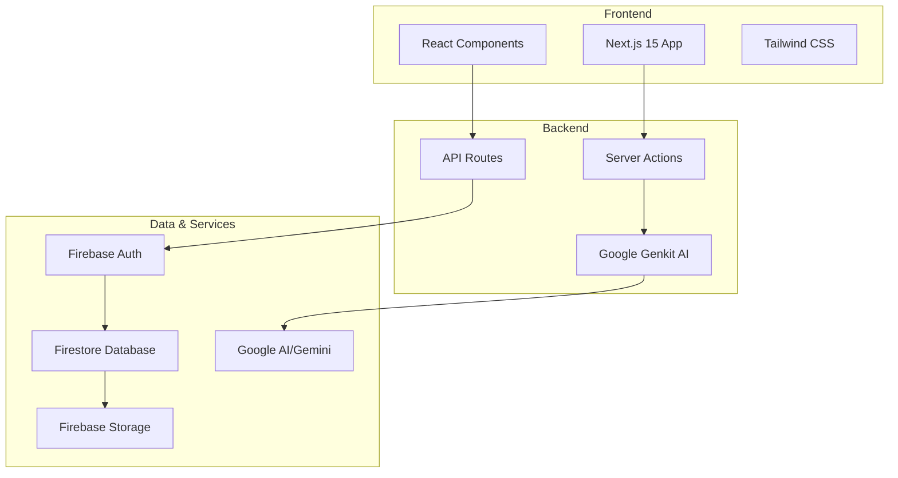

# Light on Campus 🎓

> Your comprehensive digital companion for college success

Light on Campus is a modern web platform that combines AI-powered tools, community features, and educational resources to support students throughout their academic journey. Built with Next.js 15, Firebase, and Google AI.

[](https://lightoncampus.com)
[](https://nextjs.org/)
[](https://firebase.google.com/)
[](https://www.typescriptlang.org/)
[](LICENSE)

## ✨ Features

### 🤖 AI-Powered Tools
- **AI Resume Builder**: Optimize your resume for job applications with Google Gemini 2.0 Flash
- **Flashcard Generator**: Create study cards from any text content using advanced AI
- **Smart Content Analysis**: ATS-friendly resume optimization and intelligent study material processing

### 🎯 Student Life Hub
- **Events Discovery**: Find and register for campus events, workshops, and networking opportunities
- **Resource Library**: Access curated study materials, templates, and educational resources
- **Community Forum**: Connect with peers, ask questions, and share knowledge
- **Student Blog**: Read and contribute stories from the campus community

### 🤝 Professional Development
- **Mentorship Program**: Connect with experienced students for guidance and support
- **Career Resources**: Resume templates, interview guides, and job search strategies
- **Networking Events**: Professional development workshops and career fairs

### 🔒 Enterprise-Grade Security
- **Firebase Authentication**: Secure user management with email/password and social login
- **Role-Based Access Control**: Student, Moderator, and Admin permission levels
- **Data Privacy**: GDPR and FERPA compliant with comprehensive privacy controls
- **Security Monitoring**: Real-time threat detection and incident response

## 🚀 Quick Start

### Prerequisites

- **Node.js** 20+ and npm
- **Firebase CLI** (`npm install -g firebase-tools`)
- **Google AI API Key** (for AI features)
- **Git** for version control

### Installation

1. **Clone the repository**
   ```bash
   git clone https://github.com/your-org/light-on-campus.git
   cd light-on-campus
   ```

2. **Install dependencies**
   ```bash
   npm install
   ```

3. **Environment setup**
   ```bash
   cp .env.example .env.local
   ```
   
   Edit `.env.local` with your configuration:
   ```env
   # Firebase Configuration
   NEXT_PUBLIC_FIREBASE_API_KEY=your_api_key_here
   NEXT_PUBLIC_FIREBASE_AUTH_DOMAIN=your_project.firebaseapp.com
   NEXT_PUBLIC_FIREBASE_PROJECT_ID=your_project_id
   NEXT_PUBLIC_FIREBASE_STORAGE_BUCKET=your_project.appspot.com
   NEXT_PUBLIC_FIREBASE_MESSAGING_SENDER_ID=123456789
   NEXT_PUBLIC_FIREBASE_APP_ID=1:123:web:abc123
   
   # AI Services
   GOOGLE_AI_API_KEY=your_google_ai_api_key
   
   # Application
   NEXT_PUBLIC_APP_URL=http://localhost:3000
   ```

4. **Firebase setup**
   ```bash
   firebase login
   firebase use your-project-id
   ```

5. **Start development server**
   ```bash
   npm run dev
   ```

6. **Start AI development server** (optional)
   ```bash
   npm run genkit:dev
   ```

Open [http://localhost:3000](http://localhost:3000) to view the application.

## 🏗️ Architecture

Light on Campus uses a modern, scalable architecture:



### Tech Stack

**Frontend:**
- **Next.js 15** - Full-stack React framework with App Router
- **React 18** - UI component library with Server Components
- **TypeScript 5** - Type-safe JavaScript development
- **Tailwind CSS** - Utility-first CSS framework
- **shadcn/ui** - Beautiful, accessible UI components

**Backend & AI:**
- **Google Genkit** - AI orchestration framework
- **Gemini 2.0 Flash** - Advanced language model
- **Server Actions** - Type-safe server functions
- **Zod** - Schema validation and type safety

**Database & Auth:**
- **Firebase Auth** - User authentication and management
- **Firestore** - NoSQL document database
- **Firebase Storage** - File storage and CDN
- **Firebase Hosting** - Global web hosting

**Development & Deployment:**
- **GitHub Actions** - CI/CD pipeline
- **Firebase App Hosting** - Production deployment
- **ESLint & Prettier** - Code quality and formatting
- **Jest & Playwright** - Testing framework

## 📖 Documentation

We maintain comprehensive documentation for all aspects of the project:

### 📋 Core Documentation
- **[Architecture Document](docs/architectural_document.md)** - System design and component overview
- **[Technical Specification](docs/technical_specification.md)** - Detailed implementation specifications
- **[Database Design](docs/database_design.md)** - Firestore schema and data models
- **[API Documentation](docs/api_documentation.md)** - Complete API reference with examples

### 🚀 Operations & Deployment
- **[Deployment Guide](docs/deployment_guide.md)** - Production deployment procedures
- **[Operations Manual](docs/operations_manual.md)** - Daily operations and maintenance
- **[Security Documentation](docs/security_documentation.md)** - Security framework and policies

### 👥 Team Resources
- **[Development Workflow](docs/development_workflow.md)** - Git workflow and coding standards
- **[Testing Strategy](docs/testing_strategy.md)** - Comprehensive testing approach
- **[Product Requirements](docs/product_requirements_document.md)** - Business requirements and features

### 📚 User Resources
- **[User Manual](docs/user_manual.md)** - Complete user guide for students

## 🛠️ Development

### Available Scripts

```bash
# Development
npm run dev          # Start development server
npm run build        # Build for production
npm run start        # Start production server
npm run lint         # Run ESLint
npm run typecheck    # Run TypeScript checks

# AI Development
npm run genkit:dev   # Start Genkit development server
npm run genkit:flow  # Run specific AI flow

# Testing
npm run test         # Run unit tests
npm run test:watch   # Run tests in watch mode
npm run test:e2e     # Run end-to-end tests
npm run test:coverage # Generate coverage report

# Deployment
npm run deploy:staging    # Deploy to staging
npm run deploy:production # Deploy to production
```

### Project Structure

```
light-on-campus/
├── src/
│   ├── app/                 # Next.js App Router pages
│   │   ├── (auth)/         # Authentication pages
│   │   ├── api/            # API routes
│   │   ├── resume-builder/ # AI Resume Builder
│   │   ├── flashcards/     # AI Flashcard Generator
│   │   ├── events/         # Events management
│   │   ├── forum/          # Community forum
│   │   └── blog/           # Student blog
│   ├── components/         # Reusable React components
│   │   ├── ui/            # shadcn/ui components
│   │   └── layout/        # Layout components
│   ├── ai/                # Google Genkit AI flows
│   │   ├── flows/         # AI flow definitions
│   │   └── genkit.ts      # Genkit configuration
│   ├── lib/               # Utility functions
│   └── hooks/             # Custom React hooks
├── docs/                  # Comprehensive documentation
├── public/                # Static assets
├── tests/                 # Test files
└── .github/workflows/     # CI/CD configuration
```

### Contributing

We welcome contributions! Please see our [Development Workflow](docs/development_workflow.md) for detailed guidelines.

1. **Fork the repository**
2. **Create a feature branch**: `git checkout -b feature/amazing-feature`
3. **Follow our coding standards** (ESLint + Prettier)
4. **Write tests** for new functionality
5. **Submit a pull request** with clear description

### Code Quality

- **TypeScript** for type safety
- **ESLint** for code quality
- **Prettier** for consistent formatting
- **Husky** for git hooks
- **Conventional Commits** for clear history

## 🚀 Deployment

### Staging Environment
- **URL**: [staging.lightoncampus.com](https://staging.lightoncampus.com)
- **Auto-deploy**: On push to `develop` branch
- **Purpose**: Testing and validation

### Production Environment
- **URL**: [lightoncampus.com](https://lightoncampus.com)
- **Auto-deploy**: On push to `main` branch
- **Hosting**: Firebase App Hosting
- **CDN**: Global Firebase CDN

See our [Deployment Guide](docs/deployment_guide.md) for detailed deployment procedures.

## 📊 Performance

### Core Web Vitals
- **Largest Contentful Paint**: <2.5s
- **First Input Delay**: <100ms
- **Cumulative Layout Shift**: <0.1

### API Performance
- **Average Response Time**: <500ms
- **AI Processing Time**: <30s (95th percentile)
- **Uptime**: 99.9% SLA

### Scalability
- **Auto-scaling**: Based on traffic patterns
- **Database**: Firestore with optimized queries
- **CDN**: Global content distribution

## 🔐 Security

Security is a top priority. We implement:

- **Authentication**: Firebase Auth with MFA support
- **Authorization**: Role-based access control (RBAC)
- **Data Protection**: Encryption at rest and in transit
- **Privacy Compliance**: GDPR and FERPA compliant
- **Security Monitoring**: Real-time threat detection
- **Incident Response**: 24/7 security monitoring

See our [Security Documentation](docs/security_documentation.md) for comprehensive security details.

## 🤝 Community & Support

### Getting Help
- **Documentation**: Comprehensive guides in `/docs`
- **Issues**: [GitHub Issues](https://github.com/your-org/light-on-campus/issues)
- **Discussions**: [GitHub Discussions](https://github.com/your-org/light-on-campus/discussions)
- **Email**: support@lightoncampus.com

### Community Guidelines
- Be respectful and inclusive
- Follow our code of conduct
- Help others learn and grow
- Contribute positively to discussions

### Roadmap
- **Q1 2025**: Mobile app development
- **Q2 2025**: Advanced AI features
- **Q3 2025**: Integration with LMS platforms
- **Q4 2025**: Multi-university support

## 📝 License

This project is licensed under the MIT License - see the [LICENSE](LICENSE) file for details.

## 🙏 Acknowledgments

- **Google AI** for Gemini 2.0 Flash model
- **Firebase Team** for excellent cloud services
- **Next.js Team** for the amazing framework
- **shadcn** for beautiful UI components
- **Our Contributors** for making this project possible

---

<div align="center">

**Built with ❤️ for students, by students**

[Website](https://lightoncampus.com) • [Documentation](docs/) • [Contributing](docs/development_workflow.md) • [Security](docs/security_documentation.md)

</div>
