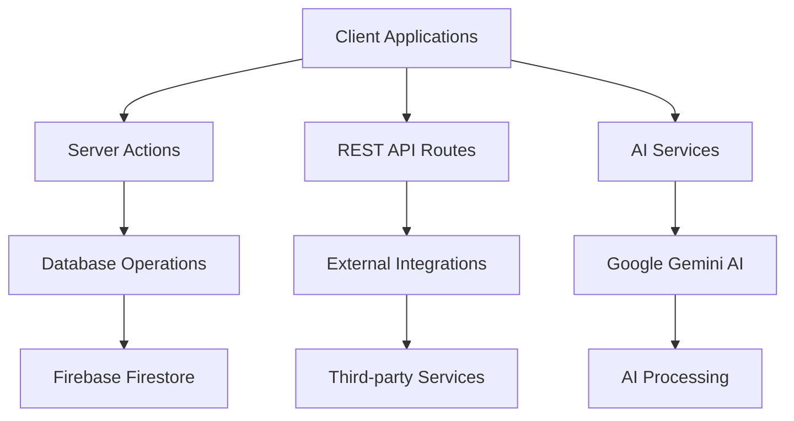

# Light on Campus - API Documentation

**Document Version:** 1.0  
**Date:** January 2025  
**API Version:** v1  
**Base URL:** https://lightoncampus.com

---

## Table of Contents

1. [API Overview](#1-api-overview)
2. [Authentication](#2-authentication)
3. [Server Actions API](#3-server-actions-api)
4. [REST API Endpoints](#4-rest-api-endpoints)
5. [AI Services API](#5-ai-services-api)
6. [Real-time APIs](#6-real-time-apis)
7. [External Integrations](#7-external-integrations)
8. [Error Handling](#8-error-handling)
9. [Rate Limiting](#9-rate-limiting)
10. [SDKs and Examples](#10-sdks-and-examples)

---

## 1. API Overview

### 1.1 Architecture

Light on Campus uses a **hybrid API architecture** combining:
- **Next.js Server Actions**: Type-safe server functions for form submissions and mutations
- **REST API Routes**: Traditional HTTP endpoints for data retrieval and external integrations
- **AI Service Layer**: Specialized endpoints for AI-powered features
- **Real-time Updates**: WebSocket connections for live features (future)

### 1.2 API Types



### 1.3 Response Formats

#### Server Actions Response
```typescript
// Success Response
{
  success: true,
  data: T,
  timestamp: string
}

// Error Response
{
  success: false,
  error: string,
  code?: string,
  timestamp: string
}
```

#### REST API Response
```typescript
// Success Response
{
  data: T,
  meta?: {
    pagination?: PaginationMeta,
    total?: number
  }
}

// Error Response
{
  error: {
    message: string,
    code: string,
    details?: unknown
  },
  timestamp: string
}
```

---

## 2. Authentication

### 2.1 Authentication Methods

#### Firebase Authentication
```typescript
// Client-side authentication
import { signInWithEmailAndPassword, createUserWithEmailAndPassword } from 'firebase/auth';
import { auth } from '@/lib/firebase';

// Sign in
const userCredential = await signInWithEmailAndPassword(auth, email, password);
const idToken = await userCredential.user.getIdToken();

// Use token in API calls
const response = await fetch('/api/protected-endpoint', {
  headers: {
    'Authorization': `Bearer ${idToken}`,
    'Content-Type': 'application/json'
  }
});
```

#### Server-side Token Verification
```typescript
// Verify ID token on server
import { verifyIdToken } from '@/lib/firebase-admin';

export async function getAuthenticatedUser(request: Request) {
  const authHeader = request.headers.get('Authorization');
  const token = authHeader?.split(' ')[1];
  
  if (!token) {
    throw new Error('Authentication required');
  }
  
  const decodedToken = await verifyIdToken(token);
  return {
    uid: decodedToken.uid,
    email: decodedToken.email
  };
}
```

### 2.2 Authentication Headers

#### Required Headers
```http
Authorization: Bearer <firebase_id_token>
Content-Type: application/json
```

#### Optional Headers
```http
X-Client-Version: 1.0.0
X-Platform: web|mobile
X-Request-ID: unique-request-id
```

---

## 3. Server Actions API

### 3.1 AI Resume Builder

#### `aiResumeBuilder`

Improves resume content using AI analysis and optimization.

**Input Schema:**
```typescript
interface AiResumeBuilderInput {
  resumeText: string;           // Minimum 100 characters
  jobDescription?: string;      // Optional job posting for tailoring
}
```

**Output Schema:**
```typescript
interface AiResumeBuilderOutput {
  improvedResume: string;       // Enhanced resume content
  suggestions?: string[];       // Optional improvement suggestions
  keywords?: string[];          // Identified keywords
  processingTime?: number;      // Processing duration (ms)
}
```

**Usage Example:**
```typescript
import { aiResumeBuilder } from '@/ai/flows/ai-resume-builder';

const result = await aiResumeBuilder({
  resumeText: "John Doe\nSoftware Engineer\nExperience: 2 years...",
  jobDescription: "Looking for React developer with Node.js experience..."
});

if (result.success) {
  console.log(result.data.improvedResume);
} else {
  console.error(result.error);
}
```

**Error Codes:**
- `INVALID_INPUT`: Resume text too short or invalid format
- `AI_SERVICE_ERROR`: Google AI service unavailable
- `RATE_LIMIT_EXCEEDED`: Too many requests
- `PROCESSING_TIMEOUT`: AI processing took too long

### 3.2 Flashcard Generator

#### `generateFlashcards`

Creates study flashcards from educational content using AI.

**Input Schema:**
```typescript
interface GenerateFlashcardsInput {
  topic: string;                // Educational content to process
  count?: number;               // Desired number of cards (5-10)
  difficulty?: 'basic' | 'intermediate' | 'advanced';
}
```

**Output Schema:**
```typescript
interface GenerateFlashcardsOutput {
  flashcards: Flashcard[];      // Generated flashcard array
  processingTime: number;       // Generation time (ms)
  metadata?: {
    sourceLength: number;
    conceptsIdentified: number;
  };
}

interface Flashcard {
  id: string;                   // Unique identifier
  term: string;                 // Front of card
  definition: string;           // Back of card
  category?: string;            // Subject categorization
  difficulty?: string;          // Estimated difficulty
}
```

**Usage Example:**
```typescript
import { generateFlashcards } from '@/ai/flows/flashcard-generator-flow';

const result = await generateFlashcards({
  topic: `
    Photosynthesis is the process by which plants convert light energy
    into chemical energy. It occurs in chloroplasts and involves...
  `,
  count: 8,
  difficulty: 'intermediate'
});

if (result.success) {
  result.data.flashcards.forEach(card => {
    console.log(`${card.term}: ${card.definition}`);
  });
}
```

### 3.3 User Management

#### `createUserProfile`

Creates a new user profile with academic information.

**Input Schema:**
```typescript
interface CreateUserProfileInput {
  displayName?: string;
  academicInfo: {
    university?: string;
    major?: string;
    year?: 'freshman' | 'sophomore' | 'junior' | 'senior' | 'graduate';
    interests: string[];
  };
  preferences: {
    notifications: boolean;
    emailUpdates: boolean;
    profileVisible: boolean;
  };
}
```

**Usage Example:**
```typescript
import { createUserProfile } from '@/lib/actions/user-actions';

const result = await createUserProfile({
  displayName: "John Smith",
  academicInfo: {
    university: "State University",
    major: "Computer Science",
    year: "junior",
    interests: ["web development", "machine learning"]
  },
  preferences: {
    notifications: true,
    emailUpdates: false,
    profileVisible: true
  }
});
```

#### `updateUserProfile`

Updates existing user profile information.

**Input Schema:**
```typescript
interface UpdateUserProfileInput {
  displayName?: string;
  academicInfo?: Partial<AcademicInfo>;
  preferences?: Partial<UserPreferences>;
}
```

---

## 4. REST API Endpoints

### 4.1 User Management

#### Get User Profile

```http
GET /api/users/profile
```

**Headers:**
```http
Authorization: Bearer <token>
```

**Response:**
```typescript
{
  data: {
    id: string;
    email: string;
    displayName?: string;
    academicInfo: {
      university?: string;
      major?: string;
      year?: string;
      interests: string[];
    };
    preferences: {
      notifications: boolean;
      emailUpdates: boolean;
      profileVisible: boolean;
    };
    metadata: {
      createdAt: string;
      lastActive: string;
      loginCount: number;
    };
  }
}
```

#### Update User Profile

```http
PUT /api/users/profile
```

**Request Body:**
```typescript
{
  displayName?: string;
  academicInfo?: {
    university?: string;
    major?: string;
    year?: string;
    interests?: string[];
  };
  preferences?: {
    notifications?: boolean;
    emailUpdates?: boolean;
    profileVisible?: boolean;
  };
}
```

### 4.2 Events Management

#### List Events

```http
GET /api/events
```

**Query Parameters:**
```http
?page=1&limit=20&category=academic&search=workshop&upcoming=true
```

**Response:**
```typescript
{
  data: Event[];
  meta: {
    pagination: {
      page: number;
      limit: number;
      total: number;
      totalPages: number;
      hasNext: boolean;
      hasPrev: boolean;
    };
  };
}

interface Event {
  id: string;
  title: string;
  description: string;
  startDate: string;           // ISO 8601
  endDate: string;
  location: {
    type: 'physical' | 'virtual' | 'hybrid';
    address?: string;
    virtualLink?: string;
  };
  category: 'academic' | 'social' | 'professional' | 'wellness';
  capacity: number;
  registeredCount: number;
  isRegistrationOpen: boolean;
  organizer: {
    id: string;
    name: string;
    contact: string;
  };
  tags: string[];
}
```

#### Get Event Details

```http
GET /api/events/:eventId
```

**Response:**
```typescript
{
  data: Event & {
    longDescription?: string;
    agenda?: AgendaItem[];
    speakers?: Speaker[];
    resources?: ResourceLink[];
    registrationDeadline?: string;
  };
}
```

#### Register for Event

```http
POST /api/events/:eventId/register
```

**Headers:**
```http
Authorization: Bearer <token>
```

**Response:**
```typescript
{
  data: {
    registrationId: string;
    status: 'confirmed' | 'waitlist';
    registrationDate: string;
    confirmationCode: string;
  };
}
```

#### Cancel Event Registration

```http
DELETE /api/events/:eventId/register
```

### 4.3 Forum Management

#### List Forum Posts

```http
GET /api/forum/posts
```

**Query Parameters:**
```http
?category=academic&tags=javascript,react&sort=newest&page=1&limit=20
```

**Response:**
```typescript
{
  data: ForumPost[];
  meta: PaginationMeta;
}

interface ForumPost {
  id: string;
  title: string;
  content: string;
  author: {
    userId: string;
    displayName: string;
    avatar?: string;
  };
  category: string;
  tags: string[];
  votes: {
    up: number;
    down: number;
    userVote?: 'up' | 'down';
  };
  replies: number;
  views: number;
  status: 'active' | 'closed' | 'pinned' | 'deleted';
  createdAt: string;
  updatedAt: string;
  lastActivity: string;
}
```

#### Create Forum Post

```http
POST /api/forum/posts
```

**Request Body:**
```typescript
{
  title: string;
  content: string;
  category: string;
  tags: string[];
}
```

#### Get Post Replies

```http
GET /api/forum/posts/:postId/replies
```

**Response:**
```typescript
{
  data: ForumReply[];
  meta: PaginationMeta;
}

interface ForumReply {
  id: string;
  postId: string;
  parentReplyId?: string;
  content: string;
  author: {
    userId: string;
    displayName: string;
    avatar?: string;
  };
  votes: {
    up: number;
    down: number;
    userVote?: 'up' | 'down';
  };
  isAcceptedAnswer: boolean;
  createdAt: string;
  updatedAt: string;
}
```

### 4.4 Resources Management

#### List Resources

```http
GET /api/resources
```

**Query Parameters:**
```http
?category=study-guides&type=pdf&level=undergraduate&search=calculus
```

**Response:**
```typescript
{
  data: Resource[];
  meta: {
    categories: string[];
    contentTypes: string[];
    totalResources: number;
  };
}

interface Resource {
  id: string;
  title: string;
  description: string;
  category: string;
  subcategory?: string;
  contentType: 'pdf' | 'doc' | 'template' | 'guide' | 'video' | 'link';
  fileUrl?: string;
  externalUrl?: string;
  fileSize?: number;
  downloadCount: number;
  rating: number;
  tags: string[];
  targetAudience: string[];
  uploadedBy: string;
  uploadedAt: string;
  lastUpdated: string;
}
```

#### Download Resource

```http
GET /api/resources/:resourceId/download
```

**Headers:**
```http
Authorization: Bearer <token>
```

**Response:**
File download or redirect to external URL

### 4.5 Blog Management

#### List Blog Articles

```http
GET /api/blog/articles
```

**Response:**
```typescript
{
  data: BlogArticle[];
  meta: PaginationMeta;
}

interface BlogArticle {
  id: string;
  title: string;
  excerpt: string;
  content: string;
  author: {
    userId: string;
    displayName: string;
    bio?: string;
    avatar?: string;
  };
  category: string;
  tags: string[];
  featuredImage?: string;
  publishedAt: string;
  updatedAt: string;
  readingTime: number;
  views: number;
  likes: number;
  status: 'draft' | 'published' | 'archived';
}
```

#### Submit Article

```http
POST /api/blog/articles/submit
```

**Request Body:**
```typescript
{
  title: string;
  content: string;
  excerpt?: string;
  category: string;
  tags: string[];
  authorBio?: string;
}
```

---

## 5. AI Services API

### 5.1 Resume Builder API

#### Process Resume

```http
POST /api/ai/resume/improve
```

**Request Body:**
```typescript
{
  resumeText: string;
  jobDescription?: string;
  options?: {
    industry?: string;
    experienceLevel?: 'entry' | 'mid' | 'senior';
    targetRole?: string;
  };
}
```

**Response:**
```typescript
{
  data: {
    improvedResume: string;
    suggestions: string[];
    keywords: string[];
    atsScore: number;           // 0-100 ATS compatibility score
    improvements: {
      category: string;
      before: string;
      after: string;
      impact: 'low' | 'medium' | 'high';
    }[];
    processingTime: number;
  };
}
```

#### Get Resume Analysis

```http
POST /api/ai/resume/analyze
```

**Request Body:**
```typescript
{
  resumeText: string;
  jobDescription?: string;
}
```

**Response:**
```typescript
{
  data: {
    atsScore: number;
    keywordMatch: number;       // Percentage match with job description
    sections: {
      name: string;
      present: boolean;
      quality: 'poor' | 'fair' | 'good' | 'excellent';
      suggestions: string[];
    }[];
    missingKeywords: string[];
    recommendations: string[];
  };
}
```

### 5.2 Flashcard Generator API

#### Generate Flashcards

```http
POST /api/ai/flashcards/generate
```

**Request Body:**
```typescript
{
  content: string;
  options?: {
    count?: number;             // 5-20, default: 8
    difficulty?: 'basic' | 'intermediate' | 'advanced';
    subject?: string;
    format?: 'term-definition' | 'question-answer' | 'concept-example';
  };
}
```

**Response:**
```typescript
{
  data: {
    flashcards: Flashcard[];
    metadata: {
      sourceLength: number;
      conceptsExtracted: number;
      processingTime: number;
      confidence: number;       // 0-100 confidence score
    };
  };
}
```

#### Validate Flashcard Content

```http
POST /api/ai/flashcards/validate
```

**Request Body:**
```typescript
{
  content: string;
}
```

**Response:**
```typescript
{
  data: {
    isValid: boolean;
    quality: 'poor' | 'fair' | 'good' | 'excellent';
    estimatedCards: number;
    suggestions: string[];
    issues: {
      type: 'length' | 'complexity' | 'structure' | 'content';
      message: string;
    }[];
  };
}
```

### 5.3 AI Service Status

#### Health Check

```http
GET /api/ai/health
```

**Response:**
```typescript
{
  data: {
    status: 'healthy' | 'degraded' | 'down';
    services: {
      gemini: {
        status: 'healthy' | 'degraded' | 'down';
        responseTime: number;
        lastCheck: string;
      };
      genkit: {
        status: 'healthy' | 'degraded' | 'down';
        version: string;
        lastCheck: string;
      };
    };
    quotas: {
      requestsRemaining: number;
      resetTime: string;
    };
  };
}
```

#### Usage Statistics

```http
GET /api/ai/usage
```

**Headers:**
```http
Authorization: Bearer <token>
```

**Response:**
```typescript
{
  data: {
    currentPeriod: {
      resumeRequests: number;
      flashcardRequests: number;
      totalTokens: number;
      costEstimate: number;
    };
    limits: {
      dailyRequests: number;
      monthlyTokens: number;
    };
    history: {
      date: string;
      requests: number;
      tokens: number;
    }[];
  };
}
```

---

## 6. Real-time APIs

### 6.1 WebSocket Connection (Future Feature)

#### Connection Endpoint

```
WSS /api/ws
```

**Authentication:**
```
?token=<firebase_id_token>
```

#### Message Format

```typescript
interface WebSocketMessage {
  type: string;
  payload: unknown;
  timestamp: string;
  messageId: string;
}
```

#### Event Types

```typescript
// Forum notifications
{
  type: 'forum:new_reply';
  payload: {
    postId: string;
    replyId: string;
    author: string;
    content: string;
  };
}

// Event updates
{
  type: 'event:registration_update';
  payload: {
    eventId: string;
    availableSpots: number;
    waitlistSize: number;
  };
}

// Mentorship messages
{
  type: 'mentorship:new_message';
  payload: {
    conversationId: string;
    senderId: string;
    message: string;
  };
}
```

---

## 7. External Integrations

### 7.1 Google AI Platform

#### Gemini API Integration

**Endpoint:** `https://generativelanguage.googleapis.com/v1beta/models/gemini-2.0-flash`

**Authentication:**
```http
Authorization: Bearer <google_ai_api_key>
```

**Usage in Application:**
```typescript
import { GoogleGenerativeAI } from '@google/generative-ai';

const genAI = new GoogleGenerativeAI(process.env.GOOGLE_AI_API_KEY);
const model = genAI.getGenerativeModel({ model: 'gemini-2.0-flash' });

const result = await model.generateContent(prompt);
```

### 7.2 Firebase Services

#### Firestore Database

**Connection:**
```typescript
import { getFirestore } from 'firebase-admin/firestore';

const db = getFirestore();
const userDoc = await db.collection('users').doc(userId).get();
```

#### Firebase Authentication

**Token Verification:**
```typescript
import { getAuth } from 'firebase-admin/auth';

const auth = getAuth();
const decodedToken = await auth.verifyIdToken(idToken);
```

#### Firebase Storage

**File Upload:**
```typescript
import { getStorage } from 'firebase-admin/storage';

const bucket = getStorage().bucket();
const file = bucket.file(`uploads/${fileName}`);
await file.save(buffer);
```

### 7.3 Analytics Integration

#### Google Analytics 4

**Event Tracking:**
```typescript
import { gtag } from '@/lib/analytics';

gtag('event', 'resume_generated', {
  event_category: 'ai_services',
  event_label: 'resume_builder',
  value: 1
});
```

#### Custom Analytics

**API Endpoint:**
```http
POST /api/analytics/track
```

**Request Body:**
```typescript
{
  event: string;
  properties: {
    [key: string]: string | number | boolean;
  };
  userId?: string;
  sessionId: string;
}
```

---

## 8. Error Handling

### 8.1 Error Response Format

#### Standard Error Response

```typescript
interface APIError {
  error: {
    message: string;
    code: string;
    details?: unknown;
    timestamp: string;
    requestId?: string;
  };
}
```

### 8.2 HTTP Status Codes

| Status Code | Meaning | Usage |
|-------------|---------|--------|
| **200** | OK | Successful GET requests |
| **201** | Created | Successful POST requests |
| **400** | Bad Request | Invalid request data |
| **401** | Unauthorized | Authentication required |
| **403** | Forbidden | Insufficient permissions |
| **404** | Not Found | Resource not found |
| **409** | Conflict | Resource already exists |
| **422** | Unprocessable Entity | Validation errors |
| **429** | Too Many Requests | Rate limit exceeded |
| **500** | Internal Server Error | Server-side errors |
| **503** | Service Unavailable | Service temporarily down |

### 8.3 Error Codes

#### Authentication Errors
- `AUTH_REQUIRED`: Authentication token required
- `AUTH_INVALID`: Invalid or expired token
- `AUTH_INSUFFICIENT`: Insufficient permissions

#### Validation Errors
- `VALIDATION_FAILED`: Request data validation failed
- `REQUIRED_FIELD`: Required field missing
- `INVALID_FORMAT`: Invalid data format

#### AI Service Errors
- `AI_SERVICE_UNAVAILABLE`: AI service temporarily unavailable
- `AI_QUOTA_EXCEEDED`: API quota exceeded
- `AI_PROCESSING_FAILED`: AI processing failed
- `AI_CONTENT_INVALID`: Content not suitable for AI processing

#### Database Errors
- `DB_CONNECTION_FAILED`: Database connection failed
- `DB_OPERATION_FAILED`: Database operation failed
- `DB_CONSTRAINT_VIOLATION`: Database constraint violated

### 8.4 Error Handling Examples

#### Client-side Error Handling

```typescript
async function callAPI(endpoint: string, data: unknown) {
  try {
    const response = await fetch(endpoint, {
      method: 'POST',
      headers: {
        'Content-Type': 'application/json',
        'Authorization': `Bearer ${token}`
      },
      body: JSON.stringify(data)
    });

    if (!response.ok) {
      const error = await response.json();
      throw new APIError(error.error.message, error.error.code);
    }

    return await response.json();
  } catch (error) {
    if (error instanceof APIError) {
      // Handle specific API errors
      switch (error.code) {
        case 'AUTH_REQUIRED':
          redirectToLogin();
          break;
        case 'VALIDATION_FAILED':
          showValidationErrors(error.details);
          break;
        default:
          showGenericError(error.message);
      }
    } else {
      // Handle network errors
      showNetworkError();
    }
  }
}
```

#### Server-side Error Handling

```typescript
export async function POST(request: Request) {
  try {
    const data = await request.json();
    
    // Validate input
    const validatedData = schema.parse(data);
    
    // Process request
    const result = await processRequest(validatedData);
    
    return Response.json({ data: result });
  } catch (error) {
    if (error instanceof z.ZodError) {
      return Response.json(
        {
          error: {
            message: 'Validation failed',
            code: 'VALIDATION_FAILED',
            details: error.errors,
            timestamp: new Date().toISOString()
          }
        },
        { status: 422 }
      );
    }
    
    if (error instanceof AuthError) {
      return Response.json(
        {
          error: {
            message: error.message,
            code: 'AUTH_REQUIRED',
            timestamp: new Date().toISOString()
          }
        },
        { status: 401 }
      );
    }
    
    // Generic server error
    return Response.json(
      {
        error: {
          message: 'Internal server error',
          code: 'INTERNAL_ERROR',
          timestamp: new Date().toISOString()
        }
      },
      { status: 500 }
    );
  }
}
```

---

## 9. Rate Limiting

### 9.1 Rate Limit Configuration

#### General API Limits
- **Authenticated Users**: 1000 requests/hour
- **Unauthenticated Users**: 100 requests/hour
- **AI Services**: 50 requests/hour per user

#### Specific Endpoint Limits
| Endpoint | Limit | Window |
|----------|-------|--------|
| `/api/ai/resume/*` | 10 requests | 10 minutes |
| `/api/ai/flashcards/*` | 20 requests | 10 minutes |
| `/api/forum/posts` | 5 posts | 1 hour |
| `/api/events/*/register` | 10 registrations | 1 minute |

### 9.2 Rate Limit Headers

#### Response Headers
```http
X-RateLimit-Limit: 1000
X-RateLimit-Remaining: 999
X-RateLimit-Reset: 1640995200
X-RateLimit-Window: 3600
```

#### Rate Limit Exceeded Response
```http
HTTP/1.1 429 Too Many Requests
X-RateLimit-Limit: 1000
X-RateLimit-Remaining: 0
X-RateLimit-Reset: 1640995200

{
  "error": {
    "message": "Rate limit exceeded",
    "code": "RATE_LIMIT_EXCEEDED",
    "retryAfter": 3600,
    "timestamp": "2024-01-01T12:00:00Z"
  }
}
```

### 9.3 Rate Limiting Implementation

```typescript
// Rate limiting middleware
import { Ratelimit } from '@upstash/ratelimit';
import { Redis } from '@upstash/redis';

const ratelimit = new Ratelimit({
  redis: Redis.fromEnv(),
  limiter: Ratelimit.slidingWindow(1000, '1 h'),
});

export async function withRateLimit(
  request: Request,
  identifier: string
) {
  const { success, limit, reset, remaining } = await ratelimit.limit(identifier);
  
  if (!success) {
    return Response.json(
      {
        error: {
          message: 'Rate limit exceeded',
          code: 'RATE_LIMIT_EXCEEDED',
          retryAfter: Math.round((reset - Date.now()) / 1000)
        }
      },
      {
        status: 429,
        headers: {
          'X-RateLimit-Limit': limit.toString(),
          'X-RateLimit-Remaining': remaining.toString(),
          'X-RateLimit-Reset': reset.toString()
        }
      }
    );
  }
  
  return null; // Continue processing
}
```

---

## 10. SDKs and Examples

### 10.1 TypeScript SDK

#### Installation
```bash
npm install @lightoncampus/sdk
```

#### Basic Usage
```typescript
import { LightOnCampusSDK } from '@lightoncampus/sdk';

const sdk = new LightOnCampusSDK({
  apiKey: 'your-api-key',
  baseURL: 'https://lightoncampus.com',
});

// AI Resume Builder
const resumeResult = await sdk.ai.improveResume({
  resumeText: 'Your resume content...',
  jobDescription: 'Job posting content...'
});

// Flashcard Generator
const flashcards = await sdk.ai.generateFlashcards({
  content: 'Educational content...',
  count: 10
});

// User Profile
const profile = await sdk.user.getProfile();
await sdk.user.updateProfile({
  displayName: 'New Name'
});

// Events
const events = await sdk.events.list({
  category: 'academic',
  upcoming: true
});

await sdk.events.register(eventId);
```

### 10.2 JavaScript SDK

#### Browser Usage
```html
<script src="https://cdn.lightoncampus.com/sdk/v1/light-on-campus.min.js"></script>
<script>
const sdk = new LightOnCampus.SDK({
  apiKey: 'your-api-key'
});

sdk.ai.improveResume({
  resumeText: document.getElementById('resume').value
}).then(result => {
  document.getElementById('improved-resume').value = result.data.improvedResume;
});
</script>
```

### 10.3 React Hooks

#### Installation
```bash
npm install @lightoncampus/react-hooks
```

#### Usage Examples
```typescript
import { useResumeBuilder, useFlashcardGenerator, useEvents } from '@lightoncampus/react-hooks';

// Resume Builder Hook
function ResumeBuilderComponent() {
  const { improveResume, isLoading, result, error } = useResumeBuilder();
  
  const handleSubmit = async (resumeText: string, jobDescription?: string) => {
    await improveResume({ resumeText, jobDescription });
  };
  
  return (
    <div>
      {isLoading && <div>Processing...</div>}
      {error && <div>Error: {error.message}</div>}
      {result && <div>{result.improvedResume}</div>}
    </div>
  );
}

// Flashcard Generator Hook
function FlashcardComponent() {
  const { generateCards, isLoading, flashcards } = useFlashcardGenerator();
  
  const handleGenerate = async (content: string) => {
    await generateCards({ content });
  };
  
  return (
    <div>
      {flashcards?.map(card => (
        <div key={card.id}>
          <strong>{card.term}</strong>: {card.definition}
        </div>
      ))}
    </div>
  );
}

// Events Hook
function EventsComponent() {
  const { events, loading, register } = useEvents({
    category: 'academic',
    upcoming: true
  });
  
  return (
    <div>
      {events?.map(event => (
        <div key={event.id}>
          <h3>{event.title}</h3>
          <button onClick={() => register(event.id)}>
            Register
          </button>
        </div>
      ))}
    </div>
  );
}
```

### 10.4 Python SDK

#### Installation
```bash
pip install lightoncampus-sdk
```

#### Usage Example
```python
from lightoncampus import LightOnCampusSDK

sdk = LightOnCampusSDK(api_key='your-api-key')

# Improve resume
result = sdk.ai.improve_resume(
    resume_text="Your resume content...",
    job_description="Job posting content..."
)

print(result.improved_resume)

# Generate flashcards
flashcards = sdk.ai.generate_flashcards(
    content="Educational content...",
    count=10
)

for card in flashcards:
    print(f"{card.term}: {card.definition}")

# List events
events = sdk.events.list(category='academic')
for event in events:
    print(f"{event.title} - {event.start_date}")
```

### 10.5 curl Examples

#### Resume Builder
```bash
curl -X POST https://lightoncampus.com/api/ai/resume/improve \
  -H "Authorization: Bearer $TOKEN" \
  -H "Content-Type: application/json" \
  -d '{
    "resumeText": "John Doe\nSoftware Engineer\nExperience: 2 years...",
    "jobDescription": "Looking for React developer..."
  }'
```

#### Flashcard Generator
```bash
curl -X POST https://lightoncampus.com/api/ai/flashcards/generate \
  -H "Authorization: Bearer $TOKEN" \
  -H "Content-Type: application/json" \
  -d '{
    "content": "Photosynthesis is the process...",
    "options": {
      "count": 8,
      "difficulty": "intermediate"
    }
  }'
```

#### List Events
```bash
curl -X GET "https://lightoncampus.com/api/events?category=academic&upcoming=true" \
  -H "Authorization: Bearer $TOKEN"
```

---

## API Reference Summary

### Base URLs
- **Production**: `https://lightoncampus.com`
- **Staging**: `https://staging.lightoncampus.com`
- **Development**: `http://localhost:3000`

### Authentication
- **Type**: Firebase ID Token
- **Header**: `Authorization: Bearer <token>`
- **Scope**: User-specific operations require authentication

### Rate Limits
- **General**: 1000 requests/hour (authenticated)
- **AI Services**: 50 requests/hour per user
- **Specific endpoints**: Varies by operation

### Response Format
- **Success**: `{ data: T, meta?: Meta }`
- **Error**: `{ error: { message, code, details? } }`
- **Content-Type**: `application/json`

### Support
- **Documentation**: https://docs.lightoncampus.com
- **API Status**: https://status.lightoncampus.com
- **Support Email**: api-support@lightoncampus.com

---

**Last Updated**: January 2025  
**API Version**: v1  
**SDK Version**: 1.0.0 