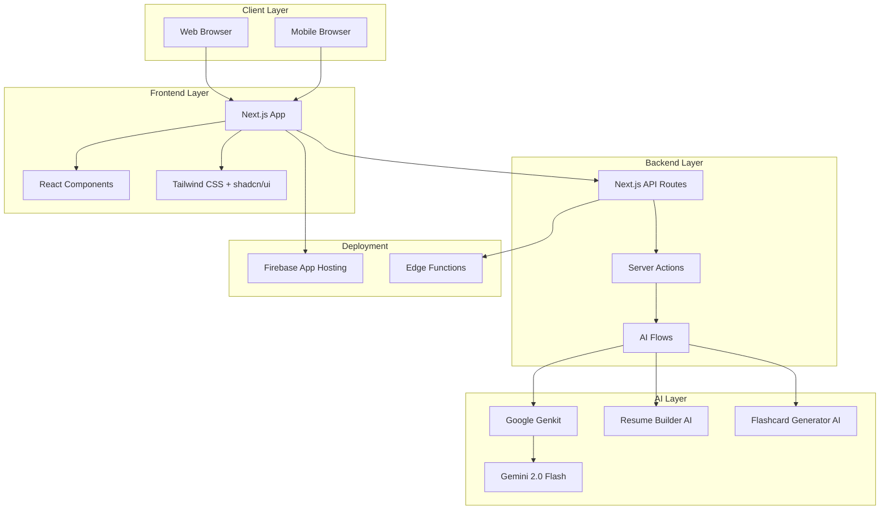
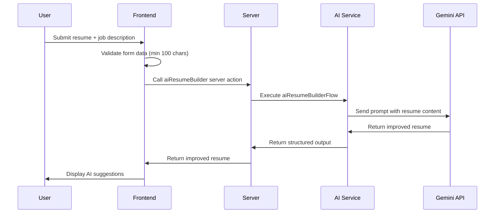
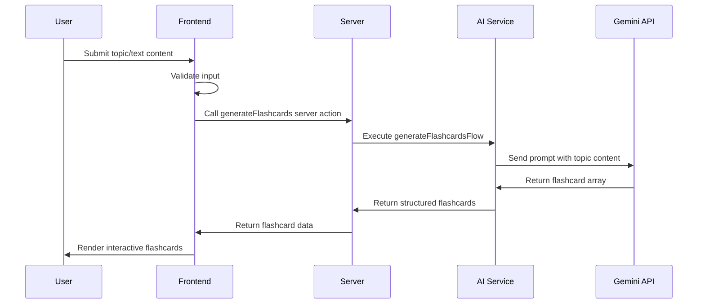
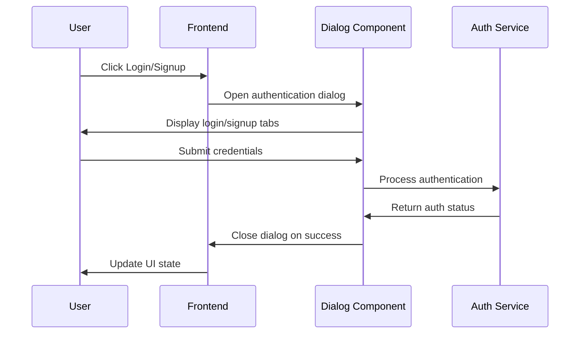
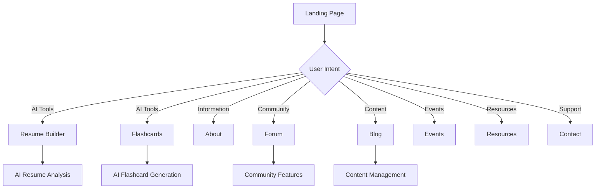
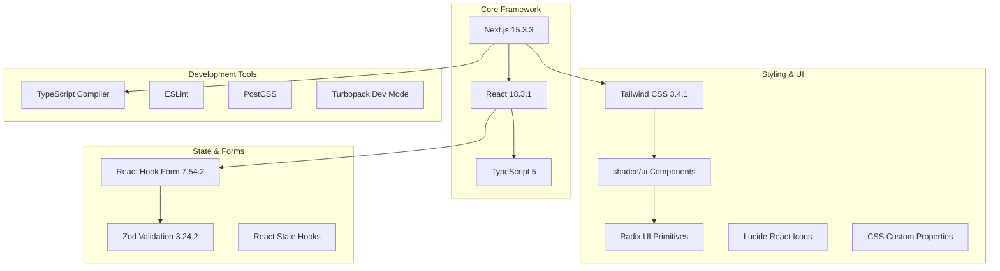
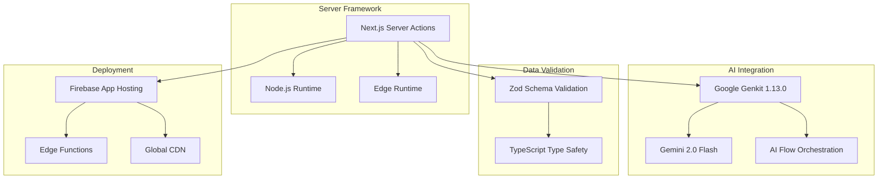
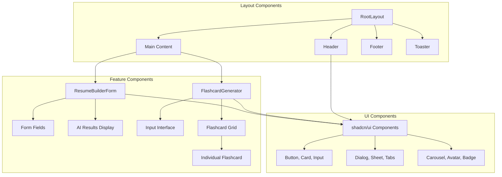
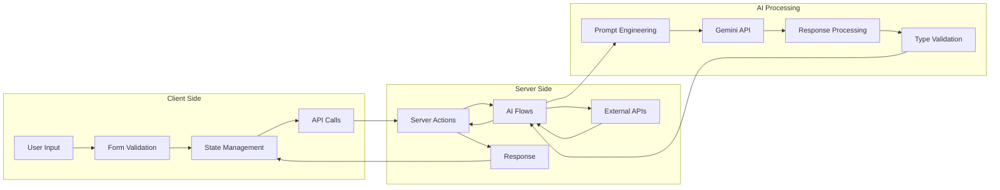
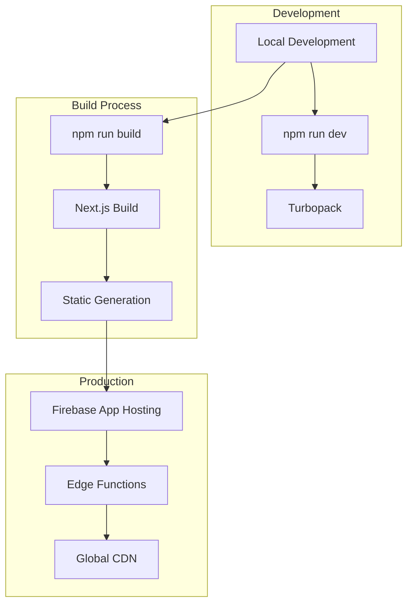

# Light on Campus - Architectural Document

## 1. High-Level Application Overview

### 1.1 Purpose
Light on Campus is a comprehensive student platform designed to support every stage of campus life. The application serves as a "go-to companion" that equips students with practical skills, emotional resilience, and a supportive network to thrive academically and personally.

### 1.2 Vision & Mission
- **Vision**: To light every campus with confident, well-rounded graduates who are ready to make a positive impact on the world
- **Mission**: To equip students with practical life skills, emotional resilience, and a supportive peer network through engaging programs, expert content, and technology-enabled community

### 1.3 Core Values
- **Inclusivity**: Creating a safe, welcoming space for every student
- **Growth-mindset**: Fostering continuous learning and personal development
- **Service**: Empowering students to give back and make a difference
- **Joy**: Celebrating the student journey and fostering positivity

### 1.4 Target Users
- First-year students seeking orientation and community
- Undergraduate students across all majors
- Graduate students and teaching assistants
- Students preparing for professional careers

## 2. Main Components

### 2.1 System Architecture Overview



### 2.2 Frontend Components

#### 2.2.1 Core Layout Components
- **Header**: Navigation, authentication, mobile menu
- **Footer**: Links, social media, contact information
- **Layout**: Root layout with typography setup

#### 2.2.2 Feature Components
- **ResumeBuilderForm**: AI-powered resume optimization interface
- **FlashcardGenerator**: Interactive flashcard creation and study tool
- **UI Components**: Comprehensive shadcn/ui component library (35+ components)

#### 2.2.3 Page Structure
```
/                    - Landing page with features overview
/about              - Organization information and values
/events             - Campus events and workshops
/resume-builder     - AI resume optimization tool
/resources          - Study materials and templates
/forum              - Community discussion platform
/blog               - Student articles and media
/flashcards         - AI-powered study cards
/mentorship         - Mentoring programs
/contact            - Contact and support
/privacy            - Privacy policy
/terms              - Terms of service
```

### 2.3 Backend Components

#### 2.3.1 AI Integration
- **Google Genkit**: AI orchestration framework
- **Gemini 2.0 Flash**: Primary LLM for content generation
- **Flow-based Architecture**: Modular AI workflows

#### 2.3.2 Server Architecture
- **Next.js Server Actions**: Type-safe server functions
- **API Routes**: RESTful endpoints for client-server communication
- **Edge Functions**: Optimized for global distribution

### 2.4 External Integrations

#### 2.4.1 Current Integrations
- **Firebase App Hosting**: Deployment and hosting platform
- **Google Fonts**: Typography (Inter, Merriweather)
- **Lucide React**: Icon library

#### 2.4.2 Planned Integrations
- **Firebase Authentication**: User management system
- **Firebase Firestore**: Document database for user data
- **Firebase Storage**: File uploads and media management

## 3. Key Data Models

### 3.1 AI Resume Builder Data Models

```typescript
interface AiResumeBuilderInput {
  resumeText: string;           // The text content of the resume to be improved
  jobDescription?: string;      // Optional job description for tailoring
}

interface AiResumeBuilderOutput {
  improvedResume: string;       // The improved resume text with suggestions
}
```

### 3.2 Flashcard Generator Data Models

```typescript
interface Flashcard {
  term: string;                 // Key term or concept for the front
  definition: string;           // Definition or explanation for the back
}

interface GenerateFlashcardsInput {
  topic: string;                // Topic or text to generate flashcards from
}

interface GenerateFlashcardsOutput {
  flashcards: Flashcard[];      // Array of generated flashcards
}
```

### 3.3 User Interface Data Models

```typescript
interface NavigationLink {
  href: string;                 // Route path
  label: string;                // Display text
  icon: LucideIcon;            // Associated icon component
}

interface Feature {
  icon: LucideIcon;            // Feature icon
  title: string;               // Feature name
  description: string;         // Feature description
  href: string;                // Feature route
  cta: string;                 // Call-to-action text
}

interface Testimonial {
  name: string;                // Student name
  role: string;                // Student role/year
  testimonial: string;         // Testimonial content
}
```

### 3.4 Form Data Models

```typescript
interface ResumeBuilderForm {
  resumeText: string;          // Minimum 100 characters
  jobDescription?: string;     // Optional job posting
}

interface AuthForm {
  email: string;               // User email address
  password: string;            // User password
}
```

## 4. Core Workflows

### 4.1 AI Resume Builder Workflow



### 4.2 Flashcard Generation Workflow



### 4.3 User Authentication Workflow



### 4.4 Page Navigation Workflow



## 5. Technology Stack

### 5.1 Frontend Technology Stack



### 5.2 Backend Technology Stack



### 5.3 Development & Build Tools

| Category | Technology | Version | Purpose |
|----------|------------|---------|---------|
| **Framework** | Next.js | 15.3.3 | Full-stack React framework |
| **Language** | TypeScript | 5.x | Type-safe JavaScript |
| **Styling** | Tailwind CSS | 3.4.1 | Utility-first CSS framework |
| **UI Components** | shadcn/ui | Latest | Pre-built component library |
| **Icons** | Lucide React | 0.475.0 | Icon component library |
| **Forms** | React Hook Form | 7.54.2 | Form state management |
| **Validation** | Zod | 3.24.2 | Schema validation |
| **AI** | Google Genkit | 1.13.0 | AI orchestration framework |
| **Deployment** | Firebase | 11.9.1 | Cloud hosting platform |

### 5.4 Package Dependencies Analysis

#### 5.4.1 Core Dependencies (15)
- **React Ecosystem**: react, react-dom, next
- **AI Integration**: @genkit-ai/googleai, @genkit-ai/next, genkit
- **Form Management**: react-hook-form, @hookform/resolvers
- **Validation**: zod
- **Utilities**: clsx, class-variance-authority, tailwind-merge

#### 5.4.2 UI Component Dependencies (15)
- **Radix UI Primitives**: 15 different primitive components
- **Styling**: tailwindcss-animate
- **Icons**: lucide-react

#### 5.4.3 Feature Dependencies (5)
- **Date Management**: date-fns, react-day-picker
- **Carousel**: embla-carousel-react
- **Charts**: recharts
- **Environment**: dotenv

## 6. Component Architecture

### 6.1 Component Hierarchy



### 6.2 Data Flow Architecture



## 7. Security Considerations

### 7.1 Current Security Measures
- **Type Safety**: Full TypeScript implementation
- **Input Validation**: Zod schema validation on all inputs
- **Server Actions**: Type-safe server communication
- **Environment Variables**: Secure API key management

### 7.2 Planned Security Enhancements
- **Firebase Authentication**: Secure user management
- **Rate Limiting**: API call throttling
- **Content Security Policy**: XSS protection
- **Data Encryption**: Sensitive data protection

## 8. Performance Optimizations

### 8.1 Current Optimizations
- **Next.js 15**: Latest performance improvements
- **Turbopack**: Fast development builds
- **Edge Runtime**: Global distribution
- **Image Optimization**: Next.js Image component
- **Code Splitting**: Automatic route-based splitting

### 8.2 Planned Optimizations
- **Caching Strategy**: AI response caching
- **Database Optimization**: Firestore query optimization
- **CDN Integration**: Static asset delivery
- **Bundle Analysis**: Dependency optimization

## 9. Deployment Architecture

### 9.1 Current Deployment



### 9.2 Environment Configuration
```yaml
# apphosting.yaml
runConfig:
  maxInstances: 1  # Scalable based on traffic
```

## 10. Future Roadmap

### 10.1 Phase 1: Core Platform Enhancement
- **User Authentication**: Complete Firebase Auth integration
- **Database Integration**: User profiles and content storage
- **Content Management**: Blog and resource management system

### 10.2 Phase 2: Community Features
- **Forum Implementation**: Discussion threads and user interaction
- **Mentorship Platform**: Mentor-mentee matching system
- **Event Management**: Registration and booking system

### 10.3 Phase 3: Advanced AI Features
- **Personalized Recommendations**: AI-driven content suggestions
- **Advanced Analytics**: Learning progress tracking
- **Multi-modal AI**: Image and document processing

### 10.4 Phase 4: Platform Expansion
- **Mobile Application**: Native iOS/Android apps
- **Integration APIs**: Third-party service connections
- **Advanced Reporting**: Analytics and insights dashboard

## 11. Monitoring and Maintenance

### 11.1 Development Practices
- **TypeScript**: Compile-time error detection
- **ESLint**: Code quality enforcement
- **Git Version Control**: Change tracking and collaboration

### 11.2 Planned Monitoring
- **Error Tracking**: Application error monitoring
- **Performance Monitoring**: Page load and API response times
- **User Analytics**: Usage patterns and feature adoption
- **AI Usage Metrics**: AI service consumption and costs

---

**Document Version**: 1.0  
**Last Updated**: January 2025  
**Maintained By**: Development Team  
**Next Review**: Q2 2025 