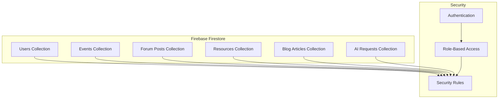

# Light on Campus - Database Design Documentation

**Document Version:** 1.0  
**Date:** January 2025  
**Database Platform:** Firebase Firestore  
**Lead Architect:** [Name]

---

## Table of Contents

1. [Database Overview](#1-database-overview)
2. [Data Models](#2-data-models)
3. [Collection Structure](#3-collection-structure)
4. [Security Rules](#4-security-rules)
5. [Indexing Strategy](#5-indexing-strategy)
6. [Data Access Patterns](#6-data-access-patterns)
7. [Migration & Versioning](#7-migration--versioning)
8. [Performance Optimization](#8-performance-optimization)

---

## 1. Database Overview

### 1.1 Database Architecture



### 1.2 Design Principles

- **NoSQL Document Model**: Utilizing Firestore's document-based structure
- **Denormalization**: Strategic data duplication for read performance
- **Security First**: Comprehensive security rules at database level
- **Scalability**: Designed for horizontal scaling and high read throughput
- **Real-time Updates**: Leveraging Firestore's real-time capabilities

---

## 2. Data Models

### 2.1 User Data Model

```typescript
interface User {
  uid: string;                    // Firebase Auth UID (document ID)
  email: string;
  displayName?: string;
  emailVerified: boolean;
  photoURL?: string;
  
  // Academic Information
  academicInfo: {
    university?: string;
    major?: string;
    year?: 'freshman' | 'sophomore' | 'junior' | 'senior' | 'graduate';
    interests: string[];          // Array of interest tags
    graduationYear?: number;
  };
  
  // User Preferences
  preferences: {
    notifications: boolean;
    emailUpdates: boolean;
    profileVisible: boolean;
    theme: 'light' | 'dark' | 'auto';
  };
  
  // Role and Permissions
  roles: {
    student: boolean;
    moderator: boolean;
    admin: boolean;
  };
  
  // Metadata
  metadata: {
    createdAt: Timestamp;
    lastLoginAt: Timestamp;
    loginCount: number;
    isActive: boolean;
  };
  
  // Stats (denormalized for performance)
  stats: {
    forumPosts: number;
    forumReplies: number;
    aiRequestsCount: number;
    eventsAttended: number;
  };
}
```

### 2.2 Event Data Model

```typescript
interface Event {
  id: string;                     // Document ID
  title: string;
  description: string;
  longDescription?: string;
  
  // Event Details
  category: 'academic' | 'social' | 'professional' | 'wellness';
  tags: string[];
  
  // Scheduling
  startDate: Timestamp;
  endDate: Timestamp;
  timezone: string;
  
  // Location
  location: {
    type: 'physical' | 'virtual' | 'hybrid';
    address?: string;
    virtualLink?: string;
    room?: string;
    building?: string;
  };
  
  // Registration
  registration: {
    isOpen: boolean;
    capacity: number;
    registeredCount: number;
    waitlistCount: number;
    deadline?: Timestamp;
    requiresApproval: boolean;
  };
  
  // Organizer Information
  organizer: {
    uid: string;                  // Reference to user
    name: string;                 // Denormalized for performance
    contact: string;
    organization?: string;
  };
  
  // Content
  agenda?: AgendaItem[];
  speakers?: Speaker[];
  resources?: ResourceLink[];
  
  // Metadata
  metadata: {
    createdAt: Timestamp;
    updatedAt: Timestamp;
    createdBy: string;            // User UID
    status: 'draft' | 'published' | 'cancelled';
    featured: boolean;
  };
}

interface AgendaItem {
  time: string;
  title: string;
  description?: string;
  speaker?: string;
}

interface Speaker {
  name: string;
  title?: string;
  bio?: string;
  photo?: string;
  contact?: string;
}

interface ResourceLink {
  title: string;
  url: string;
  type: 'document' | 'video' | 'website' | 'other';
}
```

### 2.3 Forum Data Model

```typescript
interface ForumPost {
  id: string;                     // Document ID
  title: string;
  content: string;                // Rich text content
  contentPreview: string;         // First 200 chars for listings
  
  // Categorization
  category: 'academic' | 'career' | 'social' | 'general';
  tags: string[];
  
  // Author Information (denormalized)
  author: {
    uid: string;
    displayName: string;
    avatar?: string;
    isVerified: boolean;
  };
  
  // Engagement Metrics
  metrics: {
    views: number;
    replies: number;
    upvotes: number;
    downvotes: number;
    score: number;               // Calculated score for ranking
  };
  
  // Status and Moderation
  status: 'active' | 'closed' | 'pinned' | 'deleted' | 'flagged';
  moderationFlags: string[];
  
  // Timestamps
  timestamps: {
    createdAt: Timestamp;
    updatedAt: Timestamp;
    lastActivity: Timestamp;      // Last reply or vote
  };
  
  // Best Answer (for Q&A posts)
  bestAnswer?: {
    replyId: string;
    selectedBy: string;           // User UID
    selectedAt: Timestamp;
  };
}

interface ForumReply {
  id: string;                     // Document ID
  postId: string;                 // Parent post reference
  parentReplyId?: string;         // For nested replies
  
  content: string;
  contentPreview: string;
  
  // Author Information (denormalized)
  author: {
    uid: string;
    displayName: string;
    avatar?: string;
    isVerified: boolean;
  };
  
  // Engagement
  metrics: {
    upvotes: number;
    downvotes: number;
    score: number;
  };
  
  // Status
  status: 'active' | 'deleted' | 'flagged';
  isAcceptedAnswer: boolean;
  moderationFlags: string[];
  
  // Timestamps
  timestamps: {
    createdAt: Timestamp;
    updatedAt: Timestamp;
  };
}
```

### 2.4 AI Request Data Model

```typescript
interface AIRequest {
  id: string;                     // Document ID
  userId: string;                 // User who made the request
  
  // Request Details
  service: 'resume_builder' | 'flashcard_generator';
  input: {
    resumeText?: string;          // For resume builder
    jobDescription?: string;      // For resume builder
    topic?: string;               // For flashcard generator
    contentLength?: number;       // Input size tracking
  };
  
  // Processing Information
  processing: {
    status: 'pending' | 'processing' | 'completed' | 'failed';
    startedAt?: Timestamp;
    completedAt?: Timestamp;
    duration?: number;            // Processing time in ms
    modelUsed: string;            // AI model version
  };
  
  // Results
  output?: {
    improvedResume?: string;      // Resume builder output
    suggestions?: string[];       // Resume improvements
    keywords?: string[];          // Identified keywords
    flashcards?: Flashcard[];     // Flashcard generator output
    processingTime?: number;
  };
  
  // Metadata
  metadata: {
    createdAt: Timestamp;
    ipAddress?: string;           // For rate limiting
    userAgent?: string;
    apiVersion: string;
  };
  
  // Usage Tracking
  usage: {
    tokensUsed?: number;
    cost?: number;
    quotaConsumed: number;
  };
  
  // Quality and Feedback
  quality?: {
    userRating?: number;          // 1-5 star rating
    feedback?: string;
    reportedIssues?: string[];
  };
}

interface Flashcard {
  term: string;
  definition: string;
  category?: string;
  difficulty?: 'easy' | 'medium' | 'hard';
}
```

---

## 3. Collection Structure

### 3.1 Root Collections

```typescript
// Firestore Collection Structure
const collections = {
  // User Management
  users: 'users/{userId}',
  userPrivate: 'users/{userId}/private/{document}',
  userStats: 'users/{userId}/stats/{statType}',
  
  // Events
  events: 'events/{eventId}',
  eventRegistrations: 'events/{eventId}/registrations/{userId}',
  
  // Forum System
  forumPosts: 'forum_posts/{postId}',
  forumReplies: 'forum_posts/{postId}/replies/{replyId}',
  forumVotes: 'forum_votes/{voteId}',
  
  // Content Management
  resources: 'resources/{resourceId}',
  blogArticles: 'blog_articles/{articleId}',
  blogComments: 'blog_articles/{articleId}/comments/{commentId}',
  
  // AI Services
  aiRequests: 'ai_requests/{requestId}',
  aiUsageStats: 'ai_usage_stats/{userId}/{period}',
  
  // System Collections
  settings: 'settings/{settingKey}',
  auditLogs: 'audit_logs/{logId}',
  notifications: 'notifications/{notificationId}',
  
  // Moderation
  reportedContent: 'reported_content/{reportId}',
  moderationActions: 'moderation_actions/{actionId}',
};
```

### 3.2 Subcollections Strategy

```typescript
// Subcollection Examples

// User Private Data (sensitive information)
interface UserPrivate {
  personalInfo: {
    phoneNumber?: string;
    address?: string;
    emergencyContact?: string;
  };
  preferences: {
    privateSettings: object;
    savedSearches: string[];
    bookmarks: string[];
  };
  security: {
    loginHistory: LoginRecord[];
    securityFlags: string[];
  };
}

// Event Registrations
interface EventRegistration {
  userId: string;
  eventId: string;
  status: 'registered' | 'waitlist' | 'cancelled';
  registeredAt: Timestamp;
  attendanceStatus?: 'attended' | 'no_show';
  notes?: string;
}

// Forum Votes (separate collection for scalability)
interface ForumVote {
  userId: string;
  targetId: string;              // Post or reply ID
  targetType: 'post' | 'reply';
  voteType: 'upvote' | 'downvote';
  createdAt: Timestamp;
}
```

---

## 4. Security Rules

### 4.1 Core Security Rules

```javascript
// firestore.rules
rules_version = '2';
service cloud.firestore {
  match /databases/{database}/documents {
    
    // Helper Functions
    function isAuthenticated() {
      return request.auth != null;
    }
    
    function isOwner(userId) {
      return isAuthenticated() && request.auth.uid == userId;
    }
    
    function hasRole(role) {
      return isAuthenticated() && 
        get(/databases/$(database)/documents/users/$(request.auth.uid)).data.roles[role] == true;
    }
    
    function isModeratorOrAbove() {
      return hasRole('moderator') || hasRole('admin');
    }
    
    // Users Collection
    match /users/{userId} {
      allow read: if isOwner(userId) || hasRole('admin');
      allow create: if isOwner(userId) && validateUserData();
      allow update: if isOwner(userId) && validateUserUpdate();
      allow delete: if hasRole('admin');
      
      // Private subcollection
      match /private/{document} {
        allow read, write: if isOwner(userId);
      }
      
      // Stats subcollection (read-only for users)
      match /stats/{statType} {
        allow read: if isOwner(userId) || hasRole('admin');
        allow write: if false; // Only system can write
      }
    }
    
    // Events Collection
    match /events/{eventId} {
      allow read: if true; // Public read access
      allow create: if isAuthenticated() && validateEventData();
      allow update: if isAuthenticated() && 
        (isOwner(resource.data.organizer.uid) || hasRole('admin'));
      allow delete: if hasRole('admin');
      
      // Event registrations
      match /registrations/{userId} {
        allow read: if isOwner(userId) || isOwner(getEventOrganizer(eventId)) || hasRole('admin');
        allow create: if isOwner(userId) && canRegisterForEvent(eventId);
        allow update: if isOwner(userId);
        allow delete: if isOwner(userId) || hasRole('admin');
      }
    }
    
    // Forum Posts
    match /forum_posts/{postId} {
      allow read: if true; // Public read access
      allow create: if isAuthenticated() && validatePostData();
      allow update: if isAuthenticated() && 
        (isOwner(resource.data.author.uid) || isModeratorOrAbove());
      allow delete: if isModeratorOrAbove();
      
      // Forum replies
      match /replies/{replyId} {
        allow read: if true;
        allow create: if isAuthenticated() && validateReplyData();
        allow update: if isAuthenticated() && 
          (isOwner(resource.data.author.uid) || isModeratorOrAbove());
        allow delete: if isModeratorOrAbove();
      }
    }
    
    // AI Requests (private to user)
    match /ai_requests/{requestId} {
      allow read, write: if isAuthenticated() && 
        isOwner(resource.data.userId);
      allow create: if isAuthenticated() && 
        request.resource.data.userId == request.auth.uid;
    }
    
    // Resources (public read, admin write)
    match /resources/{resourceId} {
      allow read: if true;
      allow write: if hasRole('admin');
    }
    
    // Blog Articles
    match /blog_articles/{articleId} {
      allow read: if resource.data.status == 'published' || hasRole('admin');
      allow create: if isAuthenticated() && validateArticleData();
      allow update: if isAuthenticated() && 
        (isOwner(resource.data.author.uid) || hasRole('admin'));
      allow delete: if hasRole('admin');
    }
    
    // Validation Functions
    function validateUserData() {
      let data = request.resource.data;
      return data.keys().hasAll(['uid', 'email', 'metadata']) &&
        data.uid == request.auth.uid &&
        data.email == request.auth.token.email;
    }
    
    function validateUserUpdate() {
      let data = request.resource.data;
      // Prevent changing immutable fields
      return data.uid == resource.data.uid &&
        data.email == resource.data.email;
    }
    
    function validatePostData() {
      let data = request.resource.data;
      return data.keys().hasAll(['title', 'content', 'author']) &&
        data.author.uid == request.auth.uid &&
        data.title.size() <= 200 &&
        data.content.size() <= 10000;
    }
    
    function validateEventData() {
      let data = request.resource.data;
      return data.keys().hasAll(['title', 'description', 'organizer']) &&
        data.organizer.uid == request.auth.uid;
    }
    
    function canRegisterForEvent(eventId) {
      let event = get(/databases/$(database)/documents/events/$(eventId)).data;
      return event.registration.isOpen == true &&
        event.registration.registeredCount < event.registration.capacity;
    }
  }
}
```

### 4.2 Advanced Security Patterns

```javascript
// Rate limiting pattern
function checkRateLimit(action) {
  let now = request.time;
  let userActions = get(/databases/$(database)/documents/rate_limits/$(request.auth.uid)).data;
  
  // Check if user has exceeded rate limit for specific action
  return userActions[action + '_count'] < getUserRateLimit(action) ||
    userActions[action + '_reset_time'] < now;
}

// Content validation
function validateContent(content) {
  // Check for prohibited content patterns
  return !content.matches('.*<script.*') && // No script tags
    !content.matches('.*javascript:.*') && // No javascript protocols
    content.size() > 10 && // Minimum content length
    content.size() < 50000; // Maximum content length
}

// Moderation flags
function canModerateContent(targetUserId) {
  return hasRole('moderator') || hasRole('admin') ||
    (hasRole('community_leader') && 
     get(/databases/$(database)/documents/users/$(targetUserId)).data.metadata.trustLevel < 5);
}
```

---

## 5. Indexing Strategy

### 5.1 Composite Indexes

```yaml
# firestore.indexes.json
{
  "indexes": [
    {
      "collectionGroup": "forum_posts",
      "queryScope": "COLLECTION",
      "fields": [
        { "fieldPath": "category", "order": "ASCENDING" },
        { "fieldPath": "timestamps.lastActivity", "order": "DESCENDING" }
      ]
    },
    {
      "collectionGroup": "forum_posts",
      "queryScope": "COLLECTION",
      "fields": [
        { "fieldPath": "status", "order": "ASCENDING" },
        { "fieldPath": "metrics.score", "order": "DESCENDING" }
      ]
    },
    {
      "collectionGroup": "events",
      "queryScope": "COLLECTION",
      "fields": [
        { "fieldPath": "category", "order": "ASCENDING" },
        { "fieldPath": "startDate", "order": "ASCENDING" }
      ]
    },
    {
      "collectionGroup": "events",
      "queryScope": "COLLECTION",
      "fields": [
        { "fieldPath": "registration.isOpen", "order": "ASCENDING" },
        { "fieldPath": "startDate", "order": "ASCENDING" }
      ]
    },
    {
      "collectionGroup": "ai_requests",
      "queryScope": "COLLECTION",
      "fields": [
        { "fieldPath": "userId", "order": "ASCENDING" },
        { "fieldPath": "metadata.createdAt", "order": "DESCENDING" }
      ]
    },
    {
      "collectionGroup": "ai_requests",
      "queryScope": "COLLECTION",
      "fields": [
        { "fieldPath": "service", "order": "ASCENDING" },
        { "fieldPath": "processing.status", "order": "ASCENDING" },
        { "fieldPath": "metadata.createdAt", "order": "DESCENDING" }
      ]
    }
  ],
  "fieldOverrides": [
    {
      "collectionGroup": "forum_posts",
      "fieldPath": "tags",
      "indexes": [
        { "queryScope": "COLLECTION", "order": "ASCENDING" },
        { "queryScope": "COLLECTION", "arrayConfig": "CONTAINS" }
      ]
    },
    {
      "collectionGroup": "users",
      "fieldPath": "academicInfo.interests",
      "indexes": [
        { "queryScope": "COLLECTION", "arrayConfig": "CONTAINS" }
      ]
    }
  ]
}
```

### 5.2 Query Optimization Guidelines

```typescript
// Optimized query patterns
export class DatabaseQueries {
  // Forum posts with pagination
  static async getForumPosts(
    category?: string,
    limit: number = 20,
    lastDoc?: DocumentSnapshot
  ) {
    let query = db.collection('forum_posts')
      .where('status', '==', 'active')
      .orderBy('timestamps.lastActivity', 'desc')
      .limit(limit);
    
    if (category) {
      query = query.where('category', '==', category);
    }
    
    if (lastDoc) {
      query = query.startAfter(lastDoc);
    }
    
    return query.get();
  }
  
  // Events by date range
  static async getUpcomingEvents(
    category?: string,
    startDate: Date = new Date(),
    limit: number = 10
  ) {
    let query = db.collection('events')
      .where('startDate', '>=', Timestamp.fromDate(startDate))
      .orderBy('startDate', 'asc')
      .limit(limit);
    
    if (category) {
      query = query.where('category', '==', category);
    }
    
    return query.get();
  }
  
  // User AI request history
  static async getUserAIRequests(
    userId: string,
    service?: string,
    limit: number = 50
  ) {
    let query = db.collection('ai_requests')
      .where('userId', '==', userId)
      .orderBy('metadata.createdAt', 'desc')
      .limit(limit);
    
    if (service) {
      query = query.where('service', '==', service);
    }
    
    return query.get();
  }
}
```

---

## 6. Data Access Patterns

### 6.1 Read Patterns

```typescript
// Data Access Layer (DAL)
export class UserDAL {
  // Get user profile with caching
  static async getUserProfile(userId: string): Promise<User | null> {
    // Check cache first
    const cached = await this.getCachedUser(userId);
    if (cached && !this.isCacheExpired(cached)) {
      return cached.data;
    }
    
    // Fetch from database
    const doc = await db.collection('users').doc(userId).get();
    if (!doc.exists) return null;
    
    const userData = doc.data() as User;
    
    // Cache the result
    await this.cacheUser(userId, userData);
    
    return userData;
  }
  
  // Batch read for performance
  static async getUserProfiles(userIds: string[]): Promise<User[]> {
    const chunks = this.chunkArray(userIds, 10); // Firestore limit
    const promises = chunks.map(chunk => 
      db.getAll(...chunk.map(id => db.collection('users').doc(id)))
    );
    
    const results = await Promise.all(promises);
    return results.flat()
      .filter(doc => doc.exists)
      .map(doc => doc.data() as User);
  }
}

export class EventDAL {
  // Get events with registration status
  static async getEventsWithRegistration(
    userId: string,
    category?: string
  ): Promise<EventWithRegistration[]> {
    // Get events
    let eventsQuery = db.collection('events')
      .where('metadata.status', '==', 'published')
      .orderBy('startDate', 'asc');
    
    if (category) {
      eventsQuery = eventsQuery.where('category', '==', category);
    }
    
    const eventsSnapshot = await eventsQuery.get();
    const events = eventsSnapshot.docs.map(doc => ({
      id: doc.id,
      ...doc.data()
    })) as Event[];
    
    // Get user registrations in batch
    const registrationPromises = events.map(event =>
      db.collection('events')
        .doc(event.id)
        .collection('registrations')
        .doc(userId)
        .get()
    );
    
    const registrations = await Promise.all(registrationPromises);
    
    // Combine data
    return events.map((event, index) => ({
      ...event,
      userRegistration: registrations[index].exists 
        ? registrations[index].data() 
        : null
    }));
  }
}
```

### 6.2 Write Patterns

```typescript
// Transaction patterns for data consistency
export class ForumDAL {
  // Create forum post with stats update
  static async createForumPost(
    postData: Partial<ForumPost>,
    authorId: string
  ): Promise<string> {
    return db.runTransaction(async (transaction) => {
      // Create post document
      const postRef = db.collection('forum_posts').doc();
      const post: ForumPost = {
        id: postRef.id,
        ...postData,
        author: {
          uid: authorId,
          displayName: '', // Will be populated from user data
          avatar: '',
          isVerified: false,
        },
        metrics: {
          views: 0,
          replies: 0,
          upvotes: 0,
          downvotes: 0,
          score: 0,
        },
        status: 'active',
        moderationFlags: [],
        timestamps: {
          createdAt: Timestamp.now(),
          updatedAt: Timestamp.now(),
          lastActivity: Timestamp.now(),
        },
      } as ForumPost;
      
      // Get user data for denormalization
      const userRef = db.collection('users').doc(authorId);
      const userDoc = await transaction.get(userRef);
      
      if (!userDoc.exists) {
        throw new Error('User not found');
      }
      
      const userData = userDoc.data() as User;
      post.author.displayName = userData.displayName || 'Anonymous';
      post.author.avatar = userData.photoURL || '';
      post.author.isVerified = userData.roles.moderator || userData.roles.admin;
      
      // Create post
      transaction.set(postRef, post);
      
      // Update user stats
      transaction.update(userRef, {
        'stats.forumPosts': FieldValue.increment(1),
        'metadata.lastActivity': Timestamp.now(),
      });
      
      return postRef.id;
    });
  }
  
  // Vote on post with score calculation
  static async voteOnPost(
    postId: string,
    userId: string,
    voteType: 'upvote' | 'downvote'
  ): Promise<void> {
    return db.runTransaction(async (transaction) => {
      const postRef = db.collection('forum_posts').doc(postId);
      const voteRef = db.collection('forum_votes').doc(`${postId}_${userId}`);
      
      // Get current post and vote
      const [postDoc, voteDoc] = await Promise.all([
        transaction.get(postRef),
        transaction.get(voteRef),
      ]);
      
      if (!postDoc.exists) {
        throw new Error('Post not found');
      }
      
      const post = postDoc.data() as ForumPost;
      const existingVote = voteDoc.exists ? voteDoc.data() : null;
      
      // Calculate vote changes
      let upvoteChange = 0;
      let downvoteChange = 0;
      
      if (existingVote) {
        // Remove existing vote
        if (existingVote.voteType === 'upvote') upvoteChange -= 1;
        if (existingVote.voteType === 'downvote') downvoteChange -= 1;
        
        // If same vote type, just remove (toggle off)
        if (existingVote.voteType === voteType) {
          transaction.delete(voteRef);
        } else {
          // Change vote type
          if (voteType === 'upvote') upvoteChange += 1;
          if (voteType === 'downvote') downvoteChange += 1;
          
          transaction.set(voteRef, {
            userId,
            targetId: postId,
            targetType: 'post',
            voteType,
            createdAt: Timestamp.now(),
          });
        }
      } else {
        // New vote
        if (voteType === 'upvote') upvoteChange += 1;
        if (voteType === 'downvote') downvoteChange += 1;
        
        transaction.set(voteRef, {
          userId,
          targetId: postId,
          targetType: 'post',
          voteType,
          createdAt: Timestamp.now(),
        });
      }
      
      // Update post metrics
      const newUpvotes = post.metrics.upvotes + upvoteChange;
      const newDownvotes = post.metrics.downvotes + downvoteChange;
      const newScore = this.calculateScore(newUpvotes, newDownvotes);
      
      transaction.update(postRef, {
        'metrics.upvotes': newUpvotes,
        'metrics.downvotes': newDownvotes,
        'metrics.score': newScore,
        'timestamps.lastActivity': Timestamp.now(),
      });
    });
  }
  
  private static calculateScore(upvotes: number, downvotes: number): number {
    // Reddit-style scoring algorithm
    const totalVotes = upvotes + downvotes;
    if (totalVotes === 0) return 0;
    
    const ratio = upvotes / totalVotes;
    const confidence = this.confidenceInterval(upvotes, totalVotes);
    
    return Math.round((ratio - confidence) * 1000);
  }
  
  private static confidenceInterval(positive: number, total: number): number {
    if (total === 0) return 0;
    
    // Wilson score interval
    const z = 1.96; // 95% confidence
    const p = positive / total;
    
    return (z * Math.sqrt((p * (1 - p) + z * z / (4 * total)) / total)) / (1 + z * z / total);
  }
}
```

---

## 7. Migration & Versioning

### 7.1 Schema Migration Strategy

```typescript
// Migration framework
interface Migration {
  version: string;
  description: string;
  up: () => Promise<void>;
  down: () => Promise<void>;
  rollback?: () => Promise<void>;
}

// Migration registry
const migrations: Migration[] = [
  {
    version: '1.1.0',
    description: 'Add user stats denormalization',
    up: async () => {
      const batch = db.batch();
      const users = await db.collection('users').get();
      
      for (const userDoc of users.docs) {
        const userData = userDoc.data();
        
        // Calculate stats from existing data
        const [forumPosts, aiRequests, eventRegistrations] = await Promise.all([
          db.collection('forum_posts')
            .where('author.uid', '==', userDoc.id)
            .get(),
          db.collection('ai_requests')
            .where('userId', '==', userDoc.id)
            .get(),
          db.collectionGroup('registrations')
            .where('userId', '==', userDoc.id)
            .get(),
        ]);
        
        // Add stats field
        batch.update(userDoc.ref, {
          stats: {
            forumPosts: forumPosts.size,
            forumReplies: 0, // Will be calculated separately
            aiRequestsCount: aiRequests.size,
            eventsAttended: eventRegistrations.size,
          },
        });
      }
      
      await batch.commit();
    },
    down: async () => {
      const batch = db.batch();
      const users = await db.collection('users').get();
      
      for (const userDoc of users.docs) {
        batch.update(userDoc.ref, {
          stats: FieldValue.delete(),
        });
      }
      
      await batch.commit();
    },
  },
  
  {
    version: '1.2.0',
    description: 'Restructure event location data',
    up: async () => {
      const events = await db.collection('events').get();
      const batch = db.batch();
      
      for (const eventDoc of events.docs) {
        const eventData = eventDoc.data();
        
        // Migrate old location format to new structure
        const newLocation = {
          type: eventData.isVirtual ? 'virtual' : 'physical',
          address: eventData.address || null,
          virtualLink: eventData.virtualLink || null,
          room: eventData.room || null,
          building: eventData.building || null,
        };
        
        batch.update(eventDoc.ref, {
          location: newLocation,
          // Remove old fields
          isVirtual: FieldValue.delete(),
          address: FieldValue.delete(),
          virtualLink: FieldValue.delete(),
          room: FieldValue.delete(),
          building: FieldValue.delete(),
        });
      }
      
      await batch.commit();
    },
    down: async () => {
      const events = await db.collection('events').get();
      const batch = db.batch();
      
      for (const eventDoc of events.docs) {
        const eventData = eventDoc.data();
        
        // Revert to old structure
        batch.update(eventDoc.ref, {
          isVirtual: eventData.location.type === 'virtual',
          address: eventData.location.address || FieldValue.delete(),
          virtualLink: eventData.location.virtualLink || FieldValue.delete(),
          room: eventData.location.room || FieldValue.delete(),
          building: eventData.location.building || FieldValue.delete(),
          location: FieldValue.delete(),
        });
      }
      
      await batch.commit();
    },
  },
];

// Migration runner
export class MigrationRunner {
  static async runMigrations(): Promise<void> {
    // Get current schema version
    const versionDoc = await db.collection('settings')
      .doc('schema_version')
      .get();
    
    const currentVersion = versionDoc.exists 
      ? versionDoc.data()?.version || '1.0.0'
      : '1.0.0';
    
    // Find migrations to run
    const migrationsToRun = migrations.filter(migration =>
      this.isVersionGreater(migration.version, currentVersion)
    );
    
    // Run migrations in order
    for (const migration of migrationsToRun) {
      console.log(`Running migration ${migration.version}: ${migration.description}`);
      
      try {
        await migration.up();
        
        // Update schema version
        await db.collection('settings')
          .doc('schema_version')
          .set({
            version: migration.version,
            appliedAt: Timestamp.now(),
            description: migration.description,
          });
        
        console.log(`Migration ${migration.version} completed successfully`);
      } catch (error) {
        console.error(`Migration ${migration.version} failed:`, error);
        
        // Attempt rollback
        if (migration.rollback) {
          try {
            await migration.rollback();
            console.log(`Rollback for ${migration.version} completed`);
          } catch (rollbackError) {
            console.error(`Rollback for ${migration.version} failed:`, rollbackError);
          }
        }
        
        throw error;
      }
    }
  }
  
  private static isVersionGreater(version1: string, version2: string): boolean {
    const v1Parts = version1.split('.').map(Number);
    const v2Parts = version2.split('.').map(Number);
    
    for (let i = 0; i < Math.max(v1Parts.length, v2Parts.length); i++) {
      const v1Part = v1Parts[i] || 0;
      const v2Part = v2Parts[i] || 0;
      
      if (v1Part > v2Part) return true;
      if (v1Part < v2Part) return false;
    }
    
    return false;
  }
}
```

---

## 8. Performance Optimization

### 8.1 Query Optimization

```typescript
// Performance monitoring and optimization
export class DatabasePerformance {
  // Measure query performance
  static async measureQueryPerformance<T>(
    queryName: string,
    queryFn: () => Promise<T>
  ): Promise<T> {
    const startTime = Date.now();
    
    try {
      const result = await queryFn();
      const duration = Date.now() - startTime;
      
      // Log performance metrics
      await this.logQueryPerformance(queryName, duration, true);
      
      // Alert if query is slow
      if (duration > 1000) {
        console.warn(`Slow query detected: ${queryName} took ${duration}ms`);
      }
      
      return result;
    } catch (error) {
      const duration = Date.now() - startTime;
      await this.logQueryPerformance(queryName, duration, false);
      throw error;
    }
  }
  
  // Batch operations for efficiency
  static async batchUpdate(
    updates: Array<{ ref: DocumentReference; data: any }>
  ): Promise<void> {
    const batches = this.chunkArray(updates, 500); // Firestore batch limit
    
    const batchPromises = batches.map(async (batch) => {
      const writeBatch = db.batch();
      
      batch.forEach(({ ref, data }) => {
        writeBatch.update(ref, data);
      });
      
      return writeBatch.commit();
    });
    
    await Promise.all(batchPromises);
  }
  
  // Efficient pagination
  static async getPaginatedResults<T>(
    query: Query,
    pageSize: number = 20,
    lastDoc?: DocumentSnapshot
  ): Promise<PaginatedResult<T>> {
    let paginatedQuery = query.limit(pageSize + 1); // Get one extra to check for next page
    
    if (lastDoc) {
      paginatedQuery = paginatedQuery.startAfter(lastDoc);
    }
    
    const snapshot = await paginatedQuery.get();
    const docs = snapshot.docs;
    
    const hasNextPage = docs.length > pageSize;
    const results = docs.slice(0, pageSize);
    
    return {
      data: results.map(doc => ({ id: doc.id, ...doc.data() })) as T[],
      hasNextPage,
      lastDoc: results.length > 0 ? results[results.length - 1] : null,
      total: null, // Would require a separate count query
    };
  }
}

// Caching layer
export class DatabaseCache {
  private static cache = new Map<string, CacheEntry>();
  private static readonly TTL = 5 * 60 * 1000; // 5 minutes
  
  static async get<T>(key: string, fetcher: () => Promise<T>): Promise<T> {
    const cached = this.cache.get(key);
    
    if (cached && Date.now() - cached.timestamp < this.TTL) {
      return cached.data as T;
    }
    
    const data = await fetcher();
    
    this.cache.set(key, {
      data,
      timestamp: Date.now(),
    });
    
    return data;
  }
  
  static invalidate(key: string): void {
    this.cache.delete(key);
  }
  
  static invalidatePattern(pattern: RegExp): void {
    for (const key of this.cache.keys()) {
      if (pattern.test(key)) {
        this.cache.delete(key);
      }
    }
  }
}
```

### 8.2 Monitoring and Alerts

```typescript
// Database monitoring
export class DatabaseMonitoring {
  static async checkDatabaseHealth(): Promise<HealthStatus> {
    const checks = await Promise.allSettled([
      this.checkConnectionLatency(),
      this.checkQueryPerformance(),
      this.checkQuotaUsage(),
      this.checkErrorRates(),
    ]);
    
    const results = checks.map((check, index) => ({
      check: ['connection', 'performance', 'quota', 'errors'][index],
      status: check.status === 'fulfilled' ? 'healthy' : 'unhealthy',
      details: check.status === 'rejected' ? check.reason : 'OK',
    }));
    
    const overallHealth = results.every(r => r.status === 'healthy') 
      ? 'healthy' 
      : 'degraded';
    
    return {
      status: overallHealth,
      checks: results,
      timestamp: new Date().toISOString(),
    };
  }
  
  // Set up performance alerts
  static setupPerformanceAlerts(): void {
    // Alert on slow queries
    this.alertOnSlowQueries(1000); // 1 second threshold
    
    // Alert on high error rates
    this.alertOnErrorRate(5); // 5% error rate threshold
    
    // Alert on quota usage
    this.alertOnQuotaUsage(80); // 80% quota usage threshold
  }
}
```

---

## Appendix

### A. Data Type Definitions

```typescript
interface Timestamp {
  seconds: number;
  nanoseconds: number;
}

interface FieldValue {
  increment(value: number): FieldValue;
  arrayUnion(...elements: any[]): FieldValue;
  arrayRemove(...elements: any[]): FieldValue;
  delete(): FieldValue;
  serverTimestamp(): FieldValue;
}

interface DocumentReference {
  id: string;
  path: string;
  collection(collectionPath: string): CollectionReference;
  get(): Promise<DocumentSnapshot>;
  set(data: any): Promise<void>;
  update(data: any): Promise<void>;
  delete(): Promise<void>;
}

interface PaginatedResult<T> {
  data: T[];
  hasNextPage: boolean;
  lastDoc: DocumentSnapshot | null;
  total: number | null;
}

interface CacheEntry {
  data: any;
  timestamp: number;
}

interface HealthStatus {
  status: 'healthy' | 'degraded' | 'unhealthy';
  checks: Array<{
    check: string;
    status: string;
    details: string;
  }>;
  timestamp: string;
}
```

---

**Document Classification:** Internal Technical  
**Last Updated:** January 2025  
**Version:** 1.0  
**Next Review:** Q2 2025  
**Database Version:** Firestore (Native Mode)  
**Approval:** Database Team Lead, Solution Architect 