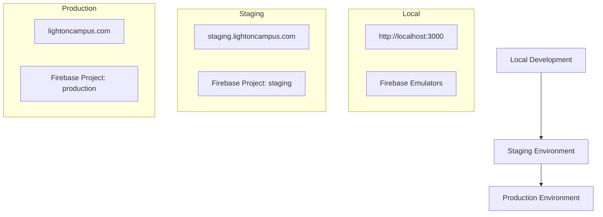

# Light on Campus - Deployment Guide

**Document Version:** 1.0  
**Date:** January 2025  
**DevOps Lead:** [Name]  
**Platform:** Firebase App Hosting  
**Framework:** Next.js 15

---

## Table of Contents

1. [Deployment Overview](#1-deployment-overview)
2. [Prerequisites](#2-prerequisites)
3. [Environment Setup](#3-environment-setup)
4. [Firebase Configuration](#4-firebase-configuration)
5. [Local Development](#5-local-development)
6. [Staging Deployment](#6-staging-deployment)
7. [Production Deployment](#7-production-deployment)
8. [CI/CD Pipeline](#8-cicd-pipeline)
9. [Environment Variables](#9-environment-variables)
10. [Monitoring & Maintenance](#10-monitoring--maintenance)
11. [Troubleshooting](#11-troubleshooting)
12. [Security Considerations](#12-security-considerations)

---

## 1. Deployment Overview

### 1.1 Architecture Summary

Light on Campus is deployed using **Firebase App Hosting**, a modern hosting solution that provides:
- **Full-stack hosting** for Next.js applications
- **Edge distribution** with global CDN
- **Automatic scaling** based on traffic
- **Integrated Firebase services** (Auth, Firestore, Storage)
- **CI/CD integration** with GitHub Actions

### 1.2 Deployment Environments



### 1.3 Deployment Strategy

| Environment | Branch | Trigger | Auto-Deploy |
|-------------|--------|---------|-------------|
| **Local** | Any | Manual | No |
| **Staging** | `develop` | Push to branch | Yes |
| **Production** | `main` | Push to branch | Yes |

---

## 2. Prerequisites

### 2.1 Required Accounts

#### Firebase Account
1. **Google Account**: Gmail or Google Workspace account
2. **Firebase Console Access**: [console.firebase.google.com](https://console.firebase.google.com)
3. **Billing Account**: Required for App Hosting (Pay-as-you-go plan)

#### GitHub Account
1. **Repository Access**: Admin access to the repository
2. **GitHub Actions**: Enabled for the repository
3. **Secrets Management**: Ability to manage repository secrets

### 2.2 Required Tools

```bash
# Node.js (v20 or higher)
node --version  # Should be v20.x.x or higher
npm --version   # Should be 10.x.x or higher

# Firebase CLI
npm install -g firebase-tools
firebase --version  # Should be latest version

# Git
git --version  # Any recent version

# Optional: GitHub CLI
gh --version
```

### 2.3 System Requirements

#### Development Machine
- **OS**: Windows 10+, macOS 10.15+, or Linux
- **RAM**: 8GB minimum, 16GB recommended
- **Storage**: 10GB free space
- **Network**: Stable internet connection

#### Browser Requirements
- **Chrome** 90+ (recommended for development)
- **Firefox** 88+
- **Safari** 14+
- **Edge** 90+

---

## 3. Environment Setup

### 3.1 Project Structure

```
light-on-campus/
├── .env.local                  # Local environment variables
├── .env.example               # Environment variable template
├── apphosting.yaml            # Firebase App Hosting config
├── firebase.json              # Firebase project config
├── next.config.ts             # Next.js configuration
├── package.json               # Dependencies and scripts
├── src/                       # Application source code
├── public/                    # Static assets
└── .github/workflows/         # CI/CD workflows
```

### 3.2 Initial Setup

#### Clone Repository
```bash
# Clone the repository
git clone https://github.com/your-org/light-on-campus.git
cd light-on-campus

# Install dependencies
npm install

# Copy environment template
cp .env.example .env.local
```

#### Environment Configuration
```bash
# .env.local (edit with your values)
# Firebase Configuration
NEXT_PUBLIC_FIREBASE_API_KEY=your_api_key_here
NEXT_PUBLIC_FIREBASE_AUTH_DOMAIN=your_project.firebaseapp.com
NEXT_PUBLIC_FIREBASE_PROJECT_ID=your_project_id
NEXT_PUBLIC_FIREBASE_STORAGE_BUCKET=your_project.appspot.com
NEXT_PUBLIC_FIREBASE_MESSAGING_SENDER_ID=123456789
NEXT_PUBLIC_FIREBASE_APP_ID=1:123:web:abc123

# AI Services
GOOGLE_AI_API_KEY=your_google_ai_api_key

# Application
NODE_ENV=development
NEXT_PUBLIC_APP_URL=http://localhost:3000
```

### 3.3 Firebase CLI Setup

```bash
# Login to Firebase
firebase login

# List available projects
firebase projects:list

# Set project for directory
firebase use your-project-id

# Verify configuration
firebase projects:list
```

---

## 4. Firebase Configuration

### 4.1 Creating Firebase Projects

#### Development Project
```bash
# Create new Firebase project (via console)
# 1. Go to https://console.firebase.google.com
# 2. Click "Create a project"
# 3. Name: "light-on-campus-dev"
# 4. Enable Google Analytics (optional)
# 5. Create project

# Initialize in your project
firebase init
```

#### Production Project
```bash
# Create production project
# 1. Go to Firebase Console
# 2. Create new project: "light-on-campus-prod"
# 3. Enable required services
# 4. Configure billing (required for App Hosting)
```

### 4.2 Firebase Services Setup

#### Authentication
```bash
# Enable Authentication
# 1. Go to Firebase Console → Authentication
# 2. Click "Get Started"
# 3. Enable Sign-in methods:
#    - Email/Password
#    - Google (optional)
# 4. Configure authorized domains
```

#### Firestore Database
```bash
# Create Firestore database
# 1. Go to Firebase Console → Firestore Database
# 2. Click "Create database"
# 3. Choose "Start in test mode" for development
# 4. Select location (us-central1 recommended)
```

#### Storage
```bash
# Enable Firebase Storage
# 1. Go to Firebase Console → Storage
# 2. Click "Get started"
# 3. Choose security rules mode
# 4. Select location (same as Firestore)
```

### 4.3 App Hosting Configuration

```yaml
# apphosting.yaml
runConfig:
  # CPU allocation
  cpu: 1
  
  # Memory allocation
  memory: 2Gi
  
  # Scaling configuration
  minInstances: 0
  maxInstances: 10
  
  # Concurrency per instance
  concurrency: 100
  
  # Request timeout
  maxRequestTimeout: 60s
  
  # Environment variables
  env:
    - variable: NODE_ENV
      value: production
    - variable: GOOGLE_AI_API_KEY
      secret: google-ai-api-key

# Build configuration
buildConfig:
  runtime: nodejs20
  
  # Build environment variables
  buildEnv:
    - variable: NODE_ENV
      value: production
  
  # Build command
  buildScript: |
    npm ci --only=production
    npm run build
  
  # Output directory
  outputDir: .next
```

---

## 5. Local Development

### 5.1 Development Server

```bash
# Start development server
npm run dev

# Start with specific port
npm run dev -- --port 3001

# Start with Turbopack (faster)
npm run dev --turbo
```

#### Development URLs
- **Main App**: http://localhost:3000
- **AI Development**: http://localhost:4000 (Genkit UI)

### 5.2 Firebase Emulators

```bash
# Start Firebase emulators
firebase emulators:start

# Start specific emulators
firebase emulators:start --only firestore,auth

# Start with UI
firebase emulators:start --import ./emulator-data

# Export data after testing
firebase emulators:export ./emulator-data
```

#### Emulator Ports
- **Authentication**: http://localhost:9099
- **Firestore**: http://localhost:8080
- **Storage**: http://localhost:9199
- **Emulator UI**: http://localhost:4000

### 5.3 AI Development

```bash
# Start AI development server
npm run genkit:dev

# Start with watch mode
npm run genkit:watch

# Access Genkit UI
# Open http://localhost:4000 in browser
```

### 5.4 Development Workflow

```bash
# Daily development routine
git pull origin develop
npm install  # If package.json changed
npm run dev  # Start development server

# Before committing
npm run lint        # Check code style
npm run typecheck   # Verify TypeScript
npm run test        # Run tests
npm run build       # Verify build works

# Commit changes
git add .
git commit -m "feat: add new feature"
git push origin feature/branch-name
```

---

## 6. Staging Deployment

### 6.1 Staging Environment Setup

#### Create Staging Project
```bash
# Create Firebase project for staging
firebase projects:create light-on-campus-staging

# Use staging project
firebase use light-on-campus-staging

# Deploy to staging
firebase deploy --only hosting
```

#### Staging Configuration
```bash
# Configure staging environment variables
firebase functions:secrets:set GOOGLE_AI_API_KEY

# Set staging-specific configs
firebase database:settings:set \
  --project light-on-campus-staging \
  databaseURL https://light-on-campus-staging.firebaseio.com
```

### 6.2 Manual Staging Deployment

```bash
# Build for staging
NODE_ENV=production npm run build

# Deploy to staging
firebase use staging
firebase deploy --only hosting

# Deploy specific functions
firebase deploy --only functions:aiResumeBuilder

# Deploy with message
firebase deploy -m "Deploy v1.2.0 to staging"
```

### 6.3 Automated Staging Deployment

```yaml
# .github/workflows/deploy-staging.yml
name: Deploy to Staging

on:
  push:
    branches: [develop]

jobs:
  deploy-staging:
    runs-on: ubuntu-latest
    environment: staging
    
    steps:
      - uses: actions/checkout@v4
      
      - name: Setup Node.js
        uses: actions/setup-node@v4
        with:
          node-version: '20'
          cache: 'npm'
      
      - name: Install dependencies
        run: npm ci
      
      - name: Build application
        run: npm run build
        env:
          NODE_ENV: production
          NEXT_PUBLIC_FIREBASE_PROJECT_ID: ${{ secrets.STAGING_PROJECT_ID }}
          GOOGLE_AI_API_KEY: ${{ secrets.STAGING_AI_API_KEY }}
      
      - name: Deploy to Firebase Staging
        uses: firebase-tools-action@v13.11.1
        with:
          args: deploy --only hosting --project staging
        env:
          FIREBASE_TOKEN: ${{ secrets.FIREBASE_TOKEN }}
```

### 6.4 Staging Testing

#### Automated Testing
```bash
# Run tests against staging
npm run test:staging

# Run E2E tests
npm run test:e2e -- --baseURL https://staging.lightoncampus.com

# Performance testing
npm run test:performance -- --url https://staging.lightoncampus.com
```

#### Manual Testing Checklist
- [ ] User registration and login
- [ ] AI Resume Builder functionality
- [ ] Flashcard Generator working
- [ ] Event registration process
- [ ] Forum posting and replies
- [ ] Mobile responsiveness
- [ ] Performance benchmarks met

---

## 7. Production Deployment

### 7.1 Pre-Deployment Checklist

#### Code Quality
- [ ] All tests passing
- [ ] Code review completed
- [ ] Security scan passed
- [ ] Performance tests met targets
- [ ] Documentation updated

#### Environment Verification
- [ ] Production secrets configured
- [ ] Database migrations ready
- [ ] CDN settings configured
- [ ] Monitoring alerts set up
- [ ] Backup procedures tested

#### Deployment Readiness
- [ ] Deployment window scheduled
- [ ] Team notified of deployment
- [ ] Rollback plan prepared
- [ ] Health check endpoints ready
- [ ] Load testing completed

### 7.2 Production Deployment Process

#### Manual Deployment
```bash
# Switch to production project
firebase use production

# Verify configuration
firebase projects:list
firebase target:list

# Build for production
NODE_ENV=production npm run build

# Deploy to production
firebase deploy --only hosting

# Verify deployment
curl -I https://lightoncampus.com
```

#### Automated Production Deployment
```yaml
# .github/workflows/deploy-production.yml
name: Deploy to Production

on:
  push:
    branches: [main]
  workflow_dispatch:

jobs:
  deploy-production:
    runs-on: ubuntu-latest
    environment: production
    
    steps:
      - uses: actions/checkout@v4
      
      - name: Setup Node.js
        uses: actions/setup-node@v4
        with:
          node-version: '20'
          cache: 'npm'
      
      - name: Install dependencies
        run: npm ci
      
      - name: Run tests
        run: npm run test
      
      - name: Build application
        run: npm run build
        env:
          NODE_ENV: production
          NEXT_PUBLIC_FIREBASE_PROJECT_ID: ${{ secrets.PROD_PROJECT_ID }}
          GOOGLE_AI_API_KEY: ${{ secrets.PROD_AI_API_KEY }}
      
      - name: Deploy to Firebase Production
        uses: firebase-tools-action@v13.11.1
        with:
          args: deploy --only hosting --project production
        env:
          FIREBASE_TOKEN: ${{ secrets.FIREBASE_TOKEN }}
      
      - name: Health check
        run: |
          sleep 30
          curl -f https://lightoncampus.com/api/health
      
      - name: Create release
        uses: actions/create-release@v1
        env:
          GITHUB_TOKEN: ${{ secrets.GITHUB_TOKEN }}
        with:
          tag_name: v${{ github.run_number }}
          release_name: Release v${{ github.run_number }}
```

### 7.3 Post-Deployment Verification

#### Health Checks
```bash
# Application health
curl https://lightoncampus.com/api/health

# AI services health
curl https://lightoncampus.com/api/ai/health

# Database connectivity
curl https://lightoncampus.com/api/db/health

# Performance check
curl -w "%{time_total}" https://lightoncampus.com
```

#### Monitoring Verification
```bash
# Check application metrics
# - Response times < 2 seconds
# - Error rate < 1%
# - CPU usage < 70%
# - Memory usage < 80%

# Verify logs
firebase functions:log

# Check user analytics
# - Active users count
# - Feature usage rates
# - Error tracking
```

---

## 8. CI/CD Pipeline

### 8.1 GitHub Actions Setup

#### Repository Secrets
```bash
# Required secrets in GitHub repository settings
FIREBASE_TOKEN=your_firebase_ci_token
GOOGLE_AI_API_KEY=your_google_ai_api_key
STAGING_PROJECT_ID=light-on-campus-staging
PROD_PROJECT_ID=light-on-campus-prod
CODECOV_TOKEN=your_codecov_token
```

#### Getting Firebase Token
```bash
# Generate CI token
firebase login:ci

# Copy the token and add to GitHub secrets
# Go to: Repository → Settings → Secrets → Actions
# Add new secret: FIREBASE_TOKEN
```

### 8.2 Complete CI/CD Workflow

```yaml
# .github/workflows/ci-cd.yml
name: CI/CD Pipeline

on:
  push:
    branches: [main, develop]
  pull_request:
    branches: [main, develop]

jobs:
  test:
    runs-on: ubuntu-latest
    
    steps:
      - uses: actions/checkout@v4
      
      - name: Setup Node.js
        uses: actions/setup-node@v4
        with:
          node-version: '20'
          cache: 'npm'
      
      - name: Install dependencies
        run: npm ci
      
      - name: Lint code
        run: npm run lint
      
      - name: Type check
        run: npm run typecheck
      
      - name: Run tests
        run: npm run test:coverage
      
      - name: Upload coverage
        uses: codecov/codecov-action@v3
        with:
          token: ${{ secrets.CODECOV_TOKEN }}

  build:
    needs: test
    runs-on: ubuntu-latest
    
    steps:
      - uses: actions/checkout@v4
      
      - name: Setup Node.js
        uses: actions/setup-node@v4
        with:
          node-version: '20'
          cache: 'npm'
      
      - name: Install dependencies
        run: npm ci
      
      - name: Build application
        run: npm run build
        env:
          NODE_ENV: production
      
      - name: Upload build artifacts
        uses: actions/upload-artifact@v4
        with:
          name: build-files
          path: .next/

  deploy-staging:
    needs: [test, build]
    runs-on: ubuntu-latest
    if: github.ref == 'refs/heads/develop'
    environment: staging
    
    steps:
      - uses: actions/checkout@v4
      
      - name: Setup Node.js
        uses: actions/setup-node@v4
        with:
          node-version: '20'
          cache: 'npm'
      
      - name: Install dependencies
        run: npm ci
      
      - name: Build for staging
        run: npm run build
        env:
          NODE_ENV: production
          NEXT_PUBLIC_FIREBASE_PROJECT_ID: ${{ secrets.STAGING_PROJECT_ID }}
          GOOGLE_AI_API_KEY: ${{ secrets.STAGING_AI_API_KEY }}
      
      - name: Deploy to staging
        uses: firebase-tools-action@v13.11.1
        with:
          args: deploy --only hosting --project staging
        env:
          FIREBASE_TOKEN: ${{ secrets.FIREBASE_TOKEN }}

  deploy-production:
    needs: [test, build]
    runs-on: ubuntu-latest
    if: github.ref == 'refs/heads/main'
    environment: production
    
    steps:
      - uses: actions/checkout@v4
      
      - name: Setup Node.js
        uses: actions/setup-node@v4
        with:
          node-version: '20'
          cache: 'npm'
      
      - name: Install dependencies
        run: npm ci
      
      - name: Build for production
        run: npm run build
        env:
          NODE_ENV: production
          NEXT_PUBLIC_FIREBASE_PROJECT_ID: ${{ secrets.PROD_PROJECT_ID }}
          GOOGLE_AI_API_KEY: ${{ secrets.PROD_AI_API_KEY }}
      
      - name: Deploy to production
        uses: firebase-tools-action@v13.11.1
        with:
          args: deploy --only hosting --project production
        env:
          FIREBASE_TOKEN: ${{ secrets.FIREBASE_TOKEN }}
      
      - name: Health check
        run: |
          sleep 30
          curl -f https://lightoncampus.com/api/health
```

### 8.3 Branch Protection Rules

```bash
# Configure branch protection for main and develop
# Repository → Settings → Branches → Add rule

# Main branch protection:
- Require pull request reviews (2 reviewers)
- Require status checks to pass
- Require branches to be up to date
- Require conversation resolution
- Include administrators

# Develop branch protection:
- Require pull request reviews (1 reviewer)
- Require status checks to pass
- Require branches to be up to date
```

---

## 9. Environment Variables

### 9.1 Environment Variable Categories

#### Public Variables (NEXT_PUBLIC_*)
```bash
# Client-side accessible variables
NEXT_PUBLIC_FIREBASE_API_KEY=your_firebase_api_key
NEXT_PUBLIC_FIREBASE_AUTH_DOMAIN=your_project.firebaseapp.com
NEXT_PUBLIC_FIREBASE_PROJECT_ID=your_project_id
NEXT_PUBLIC_FIREBASE_STORAGE_BUCKET=your_project.appspot.com
NEXT_PUBLIC_FIREBASE_MESSAGING_SENDER_ID=123456789
NEXT_PUBLIC_FIREBASE_APP_ID=1:123:web:abc123
NEXT_PUBLIC_APP_URL=https://lightoncampus.com
```

#### Private Variables (Server-only)
```bash
# Server-side only variables
GOOGLE_AI_API_KEY=your_google_ai_api_key
FIREBASE_SERVICE_ACCOUNT_KEY=your_service_account_json
NEXTAUTH_SECRET=your_nextauth_secret
SENTRY_DSN=your_sentry_dsn
```

### 9.2 Firebase Secrets Management

#### Setting Secrets
```bash
# Set secret values
firebase functions:secrets:set GOOGLE_AI_API_KEY
# Enter secret value when prompted

# Set from file
firebase functions:secrets:set SERVICE_ACCOUNT_KEY --data-file service-account.json

# List secrets
firebase functions:secrets:list

# Access secret in code
const secret = await functions.secrets.getSecret('GOOGLE_AI_API_KEY');
```

#### Environment-Specific Secrets
```bash
# Development secrets
firebase use development
firebase functions:secrets:set GOOGLE_AI_API_KEY_DEV

# Staging secrets
firebase use staging
firebase functions:secrets:set GOOGLE_AI_API_KEY_STAGING

# Production secrets
firebase use production
firebase functions:secrets:set GOOGLE_AI_API_KEY_PROD
```

### 9.3 Environment Configuration

#### Development (.env.local)
```bash
NODE_ENV=development
NEXT_PUBLIC_APP_URL=http://localhost:3000
NEXT_PUBLIC_FIREBASE_PROJECT_ID=light-on-campus-dev
GOOGLE_AI_API_KEY=dev_api_key
```

#### Staging (.env.staging)
```bash
NODE_ENV=production
NEXT_PUBLIC_APP_URL=https://staging.lightoncampus.com
NEXT_PUBLIC_FIREBASE_PROJECT_ID=light-on-campus-staging
GOOGLE_AI_API_KEY=staging_api_key
```

#### Production (.env.production)
```bash
NODE_ENV=production
NEXT_PUBLIC_APP_URL=https://lightoncampus.com
NEXT_PUBLIC_FIREBASE_PROJECT_ID=light-on-campus-prod
GOOGLE_AI_API_KEY=prod_api_key
```

---

## 10. Monitoring & Maintenance

### 10.1 Application Monitoring

#### Firebase Analytics
```bash
# Enable Firebase Analytics
# 1. Go to Firebase Console → Analytics
# 2. Enable Google Analytics
# 3. Create or link Analytics account
# 4. Configure events tracking
```

#### Performance Monitoring
```bash
# Enable Firebase Performance
# 1. Go to Firebase Console → Performance
# 2. Enable Performance Monitoring
# 3. Add SDK to application
# 4. Monitor metrics in console
```

#### Error Tracking
```typescript
// Sentry integration for error tracking
import * as Sentry from '@sentry/nextjs';

Sentry.init({
  dsn: process.env.SENTRY_DSN,
  tracesSampleRate: 0.1,
  environment: process.env.NODE_ENV,
});
```

### 10.2 Health Monitoring

#### Health Check Endpoints
```typescript
// app/api/health/route.ts
export async function GET() {
  const checks = await Promise.allSettled([
    checkDatabaseConnection(),
    checkAIServiceHealth(),
    checkExternalDependencies(),
  ]);
  
  const results = checks.map((check, index) => ({
    service: ['database', 'ai-service', 'external'][index],
    status: check.status === 'fulfilled' ? 'healthy' : 'unhealthy',
    timestamp: new Date().toISOString(),
  }));
  
  const allHealthy = results.every(result => result.status === 'healthy');
  
  return Response.json(
    { status: allHealthy ? 'healthy' : 'degraded', checks: results },
    { status: allHealthy ? 200 : 503 }
  );
}
```

#### Uptime Monitoring
```bash
# Set up external uptime monitoring
# 1. Use services like UptimeRobot, Pingdom, or StatusCake
# 2. Monitor main application URL
# 3. Monitor API health endpoints
# 4. Set up alerts for downtime
```

### 10.3 Performance Monitoring

#### Key Metrics
| Metric | Target | Alert Threshold |
|--------|--------|-----------------|
| **Page Load Time** | <3s | >5s |
| **API Response Time** | <1s | >2s |
| **AI Processing Time** | <30s | >45s |
| **Error Rate** | <1% | >5% |
| **Uptime** | >99.5% | <99% |

#### Monitoring Setup
```bash
# Set up monitoring dashboards
# 1. Firebase Console → Performance
# 2. Google Cloud Console → Monitoring
# 3. Custom dashboards for business metrics
# 4. Alert policies for critical thresholds
```

### 10.4 Maintenance Tasks

#### Daily Tasks
- [ ] Review error logs and fix critical issues
- [ ] Monitor performance metrics
- [ ] Check deployment status
- [ ] Review user feedback and support tickets

#### Weekly Tasks
- [ ] Update dependencies (security patches)
- [ ] Review and optimize database queries
- [ ] Analyze usage patterns and performance
- [ ] Backup critical data and configurations

#### Monthly Tasks
- [ ] Security audit and vulnerability assessment
- [ ] Performance optimization review
- [ ] Update documentation
- [ ] Review and update monitoring alerts
- [ ] Capacity planning and scaling review

---

## 11. Troubleshooting

### 11.1 Common Deployment Issues

#### Build Failures
```bash
# Issue: npm install fails
# Solution: Clear npm cache
npm cache clean --force
rm -rf node_modules package-lock.json
npm install

# Issue: TypeScript errors
# Solution: Check type definitions
npm run typecheck
# Fix type errors before deploying

# Issue: Build timeout
# Solution: Increase build timeout in apphosting.yaml
buildConfig:
  buildTimeout: 1200s  # 20 minutes
```

#### Firebase Deployment Issues
```bash
# Issue: Authentication failed
# Solution: Re-authenticate
firebase logout
firebase login
firebase use your-project-id

# Issue: Insufficient permissions
# Solution: Check IAM roles
# Go to Google Cloud Console → IAM
# Ensure service account has required roles:
# - Firebase Admin
# - App Engine Admin
# - Cloud Functions Admin

# Issue: Quota exceeded
# Solution: Check quotas and billing
# Go to Google Cloud Console → Quotas
# Review usage and increase limits if needed
```

### 11.2 Runtime Issues

#### Performance Problems
```bash
# Issue: Slow page loads
# Debugging steps:
1. Check Core Web Vitals in Firebase Performance
2. Analyze bundle size: npm run analyze
3. Review network requests in DevTools
4. Check CDN caching configuration

# Issue: AI processing timeouts
# Solutions:
1. Check Google AI API quota usage
2. Implement retry logic with exponential backoff
3. Add request queuing for high traffic
4. Optimize prompt size and complexity
```

#### Database Issues
```bash
# Issue: Firestore connection errors
# Debugging:
1. Check Firestore security rules
2. Verify service account permissions
3. Monitor quota usage
4. Check network connectivity

# Issue: Data inconsistency
# Solutions:
1. Review transaction usage
2. Check concurrent write patterns
3. Implement proper error handling
4. Use Firestore batch operations
```

### 11.3 Security Issues

#### Authentication Problems
```bash
# Issue: Users can't log in
# Debugging:
1. Check Firebase Auth configuration
2. Verify authorized domains
3. Review security rules
4. Check for blocked IP addresses

# Issue: Unauthorized access
# Solutions:
1. Review Firebase security rules
2. Check user role assignments
3. Audit access logs
4. Update authentication flow
```

#### API Security
```bash
# Issue: API abuse or attacks
# Solutions:
1. Implement rate limiting
2. Add request validation
3. Enable DDoS protection
4. Monitor suspicious activity
5. Update security headers
```

### 11.4 Rollback Procedures

#### Quick Rollback
```bash
# Rollback to previous deployment
firebase hosting:rollback

# Rollback to specific version
firebase hosting:rollback --version VERSION_ID

# Verify rollback
curl -I https://lightoncampus.com
```

#### Emergency Procedures
```bash
# 1. Immediate traffic redirect
# Update DNS to maintenance page if needed

# 2. Database rollback (if needed)
# Restore from backup
firebase firestore:restore

# 3. Notify stakeholders
# Send status updates to users and team

# 4. Post-incident review
# Document issue and prevention measures
```

---

## 12. Security Considerations

### 12.1 Infrastructure Security

#### Firebase Security
```bash
# Security rules for Firestore
rules_version = '2';
service cloud.firestore {
  match /databases/{database}/documents {
    // Users can only access their own data
    match /users/{userId} {
      allow read, write: if request.auth != null && request.auth.uid == userId;
    }
    
    // Public read access for events
    match /events/{eventId} {
      allow read: if true;
      allow write: if request.auth != null && hasRole('admin');
    }
  }
}

# Security rules for Storage
rules_version = '2';
service firebase.storage {
  match /b/{bucket}/o {
    match /{allPaths=**} {
      allow read, write: if request.auth != null;
    }
  }
}
```

#### Environment Security
```bash
# Secure environment variables
# 1. Use Firebase secrets for sensitive data
# 2. Rotate API keys regularly
# 3. Limit secret access to necessary services
# 4. Monitor secret usage

# Network security
# 1. Enable HTTPS only
# 2. Configure security headers
# 3. Use Firebase hosting SSL certificates
# 4. Enable HSTS
```

### 12.2 Application Security

#### Input Validation
```typescript
// Validate all user inputs
import { z } from 'zod';

const userInputSchema = z.object({
  resumeText: z.string().min(100).max(10000),
  jobDescription: z.string().max(5000).optional(),
});

export async function validateInput(input: unknown) {
  return userInputSchema.parse(input);
}
```

#### Authentication Security
```typescript
// Implement proper authentication checks
export async function requireAuth(request: Request) {
  const token = request.headers.get('Authorization')?.split(' ')[1];
  
  if (!token) {
    throw new Error('Authentication required');
  }
  
  const decodedToken = await admin.auth().verifyIdToken(token);
  return decodedToken;
}
```

### 12.3 Data Security

#### Data Encryption
```bash
# Encryption in transit
# - All data transmitted over HTTPS
# - Firebase uses TLS 1.2+
# - API calls encrypted

# Encryption at rest
# - Firebase encrypts all stored data
# - Database backups encrypted
# - File uploads encrypted
```

#### Privacy Compliance
```bash
# GDPR/CCPA compliance
# 1. Implement data export functionality
# 2. Provide data deletion capabilities
# 3. Document data collection practices
# 4. Obtain proper user consent
# 5. Regular privacy audits
```

### 12.4 Security Monitoring

#### Security Alerts
```bash
# Set up security monitoring
# 1. Failed authentication attempts
# 2. Unusual access patterns
# 3. API rate limit violations
# 4. Suspicious file uploads
# 5. Database security rule violations
```

#### Incident Response
```bash
# Security incident response plan
# 1. Immediate containment procedures
# 2. Evidence preservation
# 3. User notification requirements
# 4. Regulatory reporting obligations
# 5. Post-incident security improvements
```

---

## Best Practices Summary

### 12.5 Deployment Best Practices

1. **Test Thoroughly**: Always test in staging before production
2. **Automate Everything**: Use CI/CD for consistent deployments
3. **Monitor Continuously**: Set up comprehensive monitoring
4. **Secure by Default**: Implement security from the start
5. **Document Changes**: Maintain clear deployment documentation
6. **Plan for Failure**: Have rollback and recovery procedures
7. **Regular Updates**: Keep dependencies and infrastructure updated

### 12.6 Performance Optimization

1. **Optimize Bundle Size**: Regular analysis and optimization
2. **Implement Caching**: Use CDN and browser caching effectively
3. **Monitor Core Web Vitals**: Track and improve performance metrics
4. **Database Optimization**: Efficient queries and indexing
5. **AI Service Optimization**: Manage API quotas and response times

---

## Support and Resources

### Contact Information
- **DevOps Team**: devops@lightoncampus.com
- **Emergency Hotline**: [Emergency Contact]
- **Documentation**: [Internal Wiki URL]

### External Resources
- **Firebase Documentation**: https://firebase.google.com/docs
- **Next.js Documentation**: https://nextjs.org/docs
- **GitHub Actions**: https://docs.github.com/en/actions

---

**Last Updated**: January 2025  
**Version**: 1.0  
**Next Review**: Q2 2025 