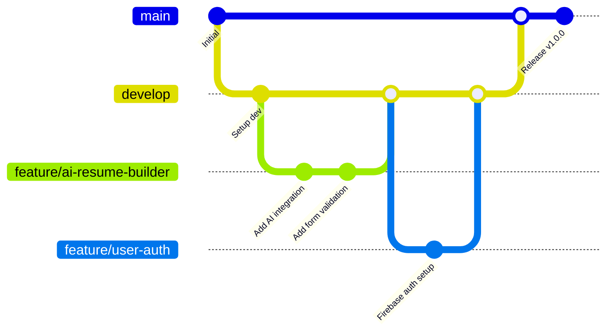
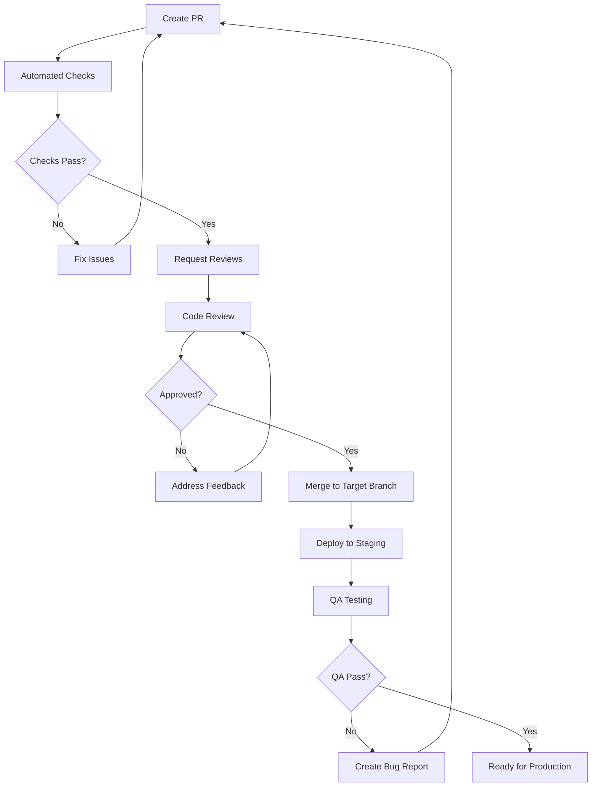
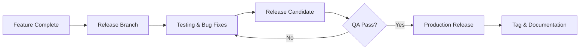
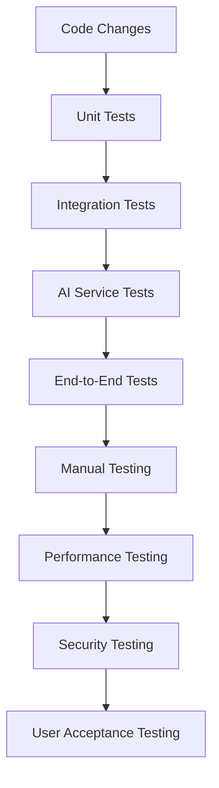

# Light on Campus - Development Workflow

**Document Version:** 1.0  
**Date:** January 2025  
**Engineering Lead:** [Name]  
**DevOps Lead:** [Name]  
**Quality Assurance Lead:** [Name]

---

## Table of Contents

1. [Development Environment Setup](#1-development-environment-setup)
2. [Git Workflow & Branching Strategy](#2-git-workflow--branching-strategy)
3. [Code Standards & Guidelines](#3-code-standards--guidelines)
4. [Code Review Process](#4-code-review-process)
5. [CI/CD Pipeline](#5-cicd-pipeline)
6. [Release Management](#6-release-management)
7. [Development Practices](#7-development-practices)
8. [Quality Assurance](#8-quality-assurance)
9. [Monitoring & Debugging](#9-monitoring--debugging)
10. [Team Collaboration](#10-team-collaboration)

---

## 1. Development Environment Setup

### 1.1 Prerequisites

#### Required Software
- **Node.js**: v20.x or higher
- **npm**: v10.x or higher (comes with Node.js)
- **Git**: v2.40+ 
- **VS Code**: Latest version (recommended)
- **Firebase CLI**: Latest version

#### VS Code Extensions
```json
{
  "recommendations": [
    "esbenp.prettier-vscode",
    "bradlc.vscode-tailwindcss",
    "ms-vscode.vscode-typescript-next",
    "firebase.vscode-firebase-explorer",
    "ms-vscode.vscode-eslint",
    "streetsidesoftware.code-spell-checker",
    "yzhang.markdown-all-in-one",
    "ms-vscode.vscode-json"
  ]
}
```

### 1.2 Project Setup

```bash
# Clone the repository
git clone https://github.com/your-org/light-on-campus.git
cd light-on-campus

# Install dependencies
npm install

# Set up environment variables
cp .env.example .env.local
# Edit .env.local with your configuration

# Install Firebase CLI globally
npm install -g firebase-tools

# Login to Firebase
firebase login

# Start development server
npm run dev

# In another terminal, start AI development server
npm run genkit:dev
```

### 1.3 Environment Configuration

```bash
# .env.local (required for development)
# Firebase Configuration
NEXT_PUBLIC_FIREBASE_API_KEY=your_api_key
NEXT_PUBLIC_FIREBASE_AUTH_DOMAIN=your_domain
NEXT_PUBLIC_FIREBASE_PROJECT_ID=your_project_id
NEXT_PUBLIC_FIREBASE_STORAGE_BUCKET=your_bucket
NEXT_PUBLIC_FIREBASE_MESSAGING_SENDER_ID=your_sender_id
NEXT_PUBLIC_FIREBASE_APP_ID=your_app_id

# AI Services
GOOGLE_AI_API_KEY=your_google_ai_key

# Development
NODE_ENV=development
NEXT_PUBLIC_APP_URL=http://localhost:3000

# Optional
SENTRY_DSN=your_sentry_dsn
ANALYTICS_ID=your_analytics_id
```

### 1.4 Development Server Commands

| Command | Purpose | Description |
|---------|---------|-------------|
| `npm run dev` | Development | Start Next.js dev server with Turbopack |
| `npm run genkit:dev` | AI Development | Start Genkit development server |
| `npm run genkit:watch` | AI Watch Mode | Watch mode for AI flow development |
| `npm run build` | Production Build | Build for production deployment |
| `npm run start` | Production Server | Start production server locally |
| `npm run lint` | Code Quality | Run ESLint for code quality checks |
| `npm run typecheck` | Type Safety | Run TypeScript compiler checks |

---

## 2. Git Workflow & Branching Strategy

### 2.1 Branch Structure



### 2.2 Branch Naming Conventions

#### Branch Types
- **`main`**: Production-ready code, always deployable
- **`develop`**: Integration branch for features
- **`feature/*`**: New features or enhancements
- **`bugfix/*`**: Bug fixes for develop branch
- **`hotfix/*`**: Critical fixes for production
- **`release/*`**: Release preparation branches

#### Naming Examples
```bash
# Feature branches
feature/ai-resume-builder
feature/user-authentication
feature/forum-implementation

# Bug fix branches
bugfix/login-validation-error
bugfix/mobile-navigation-issue

# Hotfix branches
hotfix/security-vulnerability
hotfix/critical-ai-service-error

# Release branches
release/v1.0.0
release/v1.1.0
```

### 2.3 Commit Message Standards

#### Conventional Commits Format
```
<type>[optional scope]: <description>

[optional body]

[optional footer(s)]
```

#### Commit Types
- **feat**: New feature for the user
- **fix**: Bug fix for the user
- **docs**: Documentation only changes
- **style**: Formatting, missing semicolons, etc.
- **refactor**: Code refactoring without feature changes
- **perf**: Performance improvements
- **test**: Adding or updating tests
- **chore**: Updating build tasks, package manager configs, etc.

#### Examples
```bash
feat(ai): add resume builder with Gemini integration

fix(auth): resolve Firebase authentication timeout issue

docs(api): update AI service documentation

style(ui): improve button component styling consistency

refactor(components): extract common form validation logic

perf(ai): optimize flashcard generation processing time

test(auth): add unit tests for login functionality

chore(deps): update Next.js to version 15.3.3
```

### 2.4 Pull Request Workflow

#### Creating a Pull Request

1. **Create Feature Branch**
   ```bash
   git checkout develop
   git pull origin develop
   git checkout -b feature/new-feature
   ```

2. **Development & Testing**
   ```bash
   # Make changes
   # Run tests locally
   npm run lint
   npm run typecheck
   npm run test
   npm run build
   ```

3. **Commit Changes**
   ```bash
   git add .
   git commit -m "feat(feature): add new functionality"
   git push origin feature/new-feature
   ```

4. **Create Pull Request**
   - Use GitHub UI or CLI
   - Fill out PR template
   - Request appropriate reviewers
   - Link related issues

#### Pull Request Template
```markdown
## Description
Brief description of changes and motivation.

## Type of Change
- [ ] Bug fix (non-breaking change which fixes an issue)
- [ ] New feature (non-breaking change which adds functionality)
- [ ] Breaking change (fix or feature that would cause existing functionality to not work as expected)
- [ ] Documentation update

## Testing
- [ ] Unit tests pass
- [ ] Integration tests pass
- [ ] Manual testing completed
- [ ] AI services tested (if applicable)

## Screenshots/Videos
<!-- Add screenshots or videos demonstrating the changes -->

## Checklist
- [ ] Code follows project style guidelines
- [ ] Self-review of code completed
- [ ] Code is commented where necessary
- [ ] Documentation updated (if needed)
- [ ] No new linting errors introduced
- [ ] Tests added/updated for new functionality

## Related Issues
Closes #[issue_number]
```

---

## 3. Code Standards & Guidelines

### 3.1 TypeScript Standards

#### File Structure
```typescript
// 1. External imports (libraries)
import React from 'react';
import { NextRequest, NextResponse } from 'next/server';

// 2. Internal imports (app modules)
import { Button } from '@/components/ui/button';
import { aiResumeBuilder } from '@/ai/flows/ai-resume-builder';

// 3. Type definitions
interface ComponentProps {
  title: string;
  description?: string;
  onSubmit: (data: FormData) => void;
}

// 4. Component/function implementation
export function Component({ title, description, onSubmit }: ComponentProps) {
  // Implementation
}
```

#### Naming Conventions
```typescript
// Components: PascalCase
export function ResumeBuilderForm() {}

// Variables/functions: camelCase
const userName = 'john';
function getUserProfile() {}

// Constants: SCREAMING_SNAKE_CASE
const API_BASE_URL = 'https://api.example.com';
const MAX_RETRY_ATTEMPTS = 3;

// Types/Interfaces: PascalCase
interface UserProfile {}
type ApiResponse<T> = {};

// Enums: PascalCase
enum UserRole {
  STUDENT = 'student',
  ADMIN = 'admin',
  MODERATOR = 'moderator',
}
```

#### Type Definitions
```typescript
// Use interfaces for object shapes
interface User {
  id: string;
  email: string;
  profile: UserProfile;
}

// Use types for unions, primitives, computed types
type Theme = 'light' | 'dark';
type UserWithoutId = Omit<User, 'id'>;

// Prefer readonly for immutable data
interface ReadonlyConfig {
  readonly apiKey: string;
  readonly features: readonly string[];
}

// Use generics appropriately
interface ApiResponse<T> {
  data: T;
  success: boolean;
  errors?: string[];
}
```

### 3.2 React/Next.js Standards

#### Component Structure
```typescript
'use client'; // Only when needed

import { useState, useEffect } from 'react';
import { Button } from '@/components/ui/button';

interface ComponentProps {
  title: string;
  onAction?: () => void;
}

export function ExampleComponent({ title, onAction }: ComponentProps) {
  // 1. Hooks (useState, useEffect, custom hooks)
  const [isLoading, setIsLoading] = useState(false);
  
  // 2. Event handlers
  const handleSubmit = async () => {
    setIsLoading(true);
    try {
      await onAction?.();
    } finally {
      setIsLoading(false);
    }
  };
  
  // 3. Effects
  useEffect(() => {
    // Effect logic
  }, []);
  
  // 4. Render
  return (
    <div className="component-container">
      <h1>{title}</h1>
      <Button onClick={handleSubmit} disabled={isLoading}>
        {isLoading ? 'Loading...' : 'Submit'}
      </Button>
    </div>
  );
}
```

#### Server Components vs Client Components
```typescript
// Server Component (default)
export default async function ServerPage() {
  const data = await fetchData(); // Server-side data fetching
  
  return (
    <div>
      <h1>Server Rendered Content</h1>
      <ClientComponent data={data} />
    </div>
  );
}

// Client Component (explicit directive)
'use client';

import { useState } from 'react';

export function ClientComponent({ data }: { data: Data }) {
  const [state, setState] = useState();
  
  return (
    <div>
      {/* Interactive content */}
    </div>
  );
}
```

### 3.3 Styling Standards

#### Tailwind CSS Guidelines
```typescript
// Use semantic class grouping
<div className="
  flex items-center justify-between
  px-4 py-2
  bg-white border border-gray-200 rounded-lg
  hover:bg-gray-50 transition-colors
">

// Use clsx for conditional classes
import { clsx } from 'clsx';

const buttonClasses = clsx(
  'px-4 py-2 rounded-md font-medium transition-colors',
  {
    'bg-blue-500 text-white': variant === 'primary',
    'bg-gray-200 text-gray-900': variant === 'secondary',
    'opacity-50 cursor-not-allowed': disabled,
  }
);

// Extract complex styling to utility functions
function getCardVariantClasses(variant: 'default' | 'bordered' | 'filled') {
  const baseClasses = 'rounded-lg p-6';
  const variantClasses = {
    default: 'bg-white shadow-sm',
    bordered: 'bg-white border border-gray-200',
    filled: 'bg-gray-50',
  };
  
  return clsx(baseClasses, variantClasses[variant]);
}
```

### 3.4 Error Handling Standards

```typescript
// Server Actions Error Handling
export async function serverActionWithErrorHandling(input: Input) {
  try {
    const result = await processInput(input);
    return { success: true, data: result };
  } catch (error) {
    console.error('Server action error:', error);
    
    if (error instanceof ValidationError) {
      return { success: false, error: 'Invalid input provided' };
    }
    
    if (error instanceof AIServiceError) {
      return { success: false, error: 'AI service temporarily unavailable' };
    }
    
    return { success: false, error: 'An unexpected error occurred' };
  }
}

// Client-side Error Handling
function ComponentWithErrorHandling() {
  const [error, setError] = useState<string | null>(null);
  
  const handleAction = async () => {
    try {
      setError(null);
      const result = await serverAction();
      
      if (!result.success) {
        setError(result.error);
        return;
      }
      
      // Handle success
    } catch (error) {
      setError('Network error occurred');
      console.error('Action error:', error);
    }
  };
  
  return (
    <div>
      {error && (
        <Alert variant="destructive">
          <AlertDescription>{error}</AlertDescription>
        </Alert>
      )}
      {/* Component content */}
    </div>
  );
}
```

---

## 4. Code Review Process

### 4.1 Review Requirements

#### Mandatory Reviews
- **All code changes** require at least one approval
- **AI-related changes** require AI team member review
- **Security-sensitive changes** require security team review
- **Database schema changes** require architecture review
- **UI/UX changes** require design team review

#### Review Checklist

**Functionality**
- [ ] Code implements requirements correctly
- [ ] Edge cases are handled appropriately
- [ ] Error handling is comprehensive
- [ ] Performance considerations addressed

**Code Quality**
- [ ] Code follows project style guidelines
- [ ] TypeScript types are properly defined
- [ ] Functions are properly documented
- [ ] No code duplication without justification

**Testing**
- [ ] Appropriate tests are included
- [ ] Tests cover edge cases
- [ ] Manual testing performed
- [ ] AI services tested (if applicable)

**Security**
- [ ] Input validation implemented
- [ ] Authentication/authorization checked
- [ ] No sensitive data exposed
- [ ] Security best practices followed

### 4.2 Review Process Flow



### 4.3 Review Guidelines

#### For Authors
1. **Self-review first**: Review your own code before requesting reviews
2. **Small PRs**: Keep changes focused and reasonably sized
3. **Clear descriptions**: Explain what changed and why
4. **Test thoroughly**: Ensure all tests pass and manual testing completed
5. **Be responsive**: Address feedback promptly and professionally

#### For Reviewers
1. **Be constructive**: Provide specific, actionable feedback
2. **Focus on important issues**: Prioritize functionality, security, and maintainability
3. **Ask questions**: If something is unclear, ask for clarification
4. **Approve decisively**: If code is good, approve promptly
5. **Be respectful**: Maintain professional and supportive tone

#### Review Comments Format
```markdown
<!-- Suggestion -->
**Suggestion**: Consider extracting this logic into a separate function for reusability.

<!-- Issue -->
**Issue**: This could cause a null pointer exception if `user` is undefined.

<!-- Question -->
**Question**: Is there a specific reason for using `any` type here instead of a more specific type?

<!-- Praise -->
**Nice**: Great use of TypeScript generics here!
```

---

## 5. CI/CD Pipeline

### 5.1 GitHub Actions Workflow

```yaml
# .github/workflows/ci.yml
name: Continuous Integration

on:
  push:
    branches: [main, develop]
  pull_request:
    branches: [main, develop]

jobs:
  lint-and-typecheck:
    runs-on: ubuntu-latest
    
    steps:
      - name: Checkout code
        uses: actions/checkout@v4
        
      - name: Setup Node.js
        uses: actions/setup-node@v4
        with:
          node-version: '20'
          cache: 'npm'
          
      - name: Install dependencies
        run: npm ci
        
      - name: Run ESLint
        run: npm run lint
        
      - name: Run TypeScript check
        run: npm run typecheck

  test:
    runs-on: ubuntu-latest
    
    steps:
      - name: Checkout code
        uses: actions/checkout@v4
        
      - name: Setup Node.js
        uses: actions/setup-node@v4
        with:
          node-version: '20'
          cache: 'npm'
          
      - name: Install dependencies
        run: npm ci
        
      - name: Run tests
        run: npm run test:ci
        env:
          NODE_ENV: test
          
      - name: Upload coverage reports
        uses: codecov/codecov-action@v3
        with:
          file: ./coverage/lcov.info

  build:
    runs-on: ubuntu-latest
    needs: [lint-and-typecheck, test]
    
    steps:
      - name: Checkout code
        uses: actions/checkout@v4
        
      - name: Setup Node.js
        uses: actions/setup-node@v4
        with:
          node-version: '20'
          cache: 'npm'
          
      - name: Install dependencies
        run: npm ci
        
      - name: Build application
        run: npm run build
        env:
          NODE_ENV: production
          
      - name: Upload build artifacts
        uses: actions/upload-artifact@v4
        with:
          name: build-files
          path: .next/
```

### 5.2 Deployment Pipeline

```yaml
# .github/workflows/deploy.yml
name: Deploy to Firebase

on:
  push:
    branches: [main]
  workflow_dispatch:

jobs:
  deploy-staging:
    runs-on: ubuntu-latest
    environment: staging
    
    steps:
      - name: Checkout code
        uses: actions/checkout@v4
        
      - name: Setup Node.js
        uses: actions/setup-node@v4
        with:
          node-version: '20'
          cache: 'npm'
          
      - name: Install dependencies
        run: npm ci
        
      - name: Build for staging
        run: npm run build
        env:
          NODE_ENV: production
          NEXT_PUBLIC_FIREBASE_PROJECT_ID: ${{ secrets.STAGING_PROJECT_ID }}
          GOOGLE_AI_API_KEY: ${{ secrets.STAGING_AI_API_KEY }}
          
      - name: Deploy to Firebase Staging
        uses: firebase-tools-action@v13.11.1
        with:
          args: hosting:channel:deploy staging --project staging
        env:
          FIREBASE_TOKEN: ${{ secrets.FIREBASE_TOKEN }}

  deploy-production:
    runs-on: ubuntu-latest
    environment: production
    needs: [deploy-staging]
    if: github.ref == 'refs/heads/main'
    
    steps:
      - name: Checkout code
        uses: actions/checkout@v4
        
      - name: Setup Node.js
        uses: actions/setup-node@v4
        with:
          node-version: '20'
          cache: 'npm'
          
      - name: Install dependencies
        run: npm ci
        
      - name: Build for production
        run: npm run build
        env:
          NODE_ENV: production
          NEXT_PUBLIC_FIREBASE_PROJECT_ID: ${{ secrets.PROD_PROJECT_ID }}
          GOOGLE_AI_API_KEY: ${{ secrets.PROD_AI_API_KEY }}
          
      - name: Deploy to Firebase Production
        uses: firebase-tools-action@v13.11.1
        with:
          args: hosting:channel:deploy live --project production
        env:
          FIREBASE_TOKEN: ${{ secrets.FIREBASE_TOKEN }}
          
      - name: Create GitHub Release
        uses: actions/create-release@v1
        env:
          GITHUB_TOKEN: ${{ secrets.GITHUB_TOKEN }}
        with:
          tag_name: v${{ github.run_number }}
          release_name: Release v${{ github.run_number }}
          body: |
            Automated release from main branch
            Commit: ${{ github.sha }}
```

### 5.3 Quality Gates

#### Automated Checks
```yaml
# Required status checks for branch protection
required_status_checks:
  - lint-and-typecheck
  - test
  - build
  - security-scan

# Branch protection rules
branch_protection:
  main:
    required_reviews: 2
    dismiss_stale_reviews: true
    require_code_owner_reviews: true
    require_up_to_date_branch: true
  develop:
    required_reviews: 1
    require_up_to_date_branch: true
```

#### Security Scanning
```yaml
# .github/workflows/security.yml
name: Security Scan

on:
  push:
    branches: [main, develop]
  schedule:
    - cron: '0 2 * * 1' # Weekly on Monday

jobs:
  security-scan:
    runs-on: ubuntu-latest
    
    steps:
      - name: Checkout code
        uses: actions/checkout@v4
        
      - name: Run npm audit
        run: npm audit --audit-level moderate
        
      - name: Run Snyk security scan
        uses: snyk/actions/node@master
        env:
          SNYK_TOKEN: ${{ secrets.SNYK_TOKEN }}
```

---

## 6. Release Management

### 6.1 Release Strategy

#### Semantic Versioning
- **MAJOR** (x.0.0): Breaking changes
- **MINOR** (x.y.0): New features, backward compatible
- **PATCH** (x.y.z): Bug fixes, backward compatible

#### Release Types


### 6.2 Release Process

#### 1. Release Planning
```bash
# Create release branch from develop
git checkout develop
git pull origin develop
git checkout -b release/v1.1.0

# Update version numbers
npm version minor # or patch/major

# Update changelog
# Update documentation
```

#### 2. Release Testing
```bash
# Run full test suite
npm run test:full

# Build and test production build
npm run build
npm run start

# Manual testing checklist
- [ ] Core features functional
- [ ] AI services working
- [ ] Authentication flow
- [ ] Mobile responsiveness
- [ ] Performance benchmarks met
```

#### 3. Release Deployment
```bash
# Merge to main
git checkout main
git merge release/v1.1.0

# Tag release
git tag -a v1.1.0 -m "Release version 1.1.0"
git push origin main --tags

# Merge back to develop
git checkout develop
git merge main
git push origin develop

# Clean up release branch
git branch -d release/v1.1.0
git push origin --delete release/v1.1.0
```

### 6.3 Changelog Management

```markdown
# CHANGELOG.md

## [1.1.0] - 2025-01-15

### Added
- AI-powered flashcard generator
- User authentication with Firebase
- Mobile responsive navigation

### Changed
- Improved resume builder AI accuracy
- Updated UI component library
- Enhanced error handling

### Fixed
- Fixed login redirect issue
- Resolved mobile menu accessibility
- Corrected AI service timeout handling

### Security
- Updated authentication token handling
- Enhanced input validation
- Improved XSS protection

## [1.0.0] - 2025-01-01

### Added
- Initial release
- AI resume builder
- Basic user interface
- Firebase integration
```

---

## 7. Development Practices

### 7.1 Local Development Workflow

#### Daily Development Routine
```bash
# Start of day
git checkout develop
git pull origin develop

# Create feature branch
git checkout -b feature/new-feature

# Development cycle
npm run dev          # Start development server
npm run genkit:dev   # Start AI development (if needed)

# Before committing
npm run lint         # Check code style
npm run typecheck    # Verify TypeScript
npm run test         # Run relevant tests
npm run build        # Verify build works

# Commit and push
git add .
git commit -m "feat: add new feature"
git push origin feature/new-feature
```

#### Development Best Practices
1. **Pull frequently**: Sync with develop branch regularly
2. **Commit often**: Make small, logical commits
3. **Test locally**: Verify changes before pushing
4. **Document changes**: Update relevant documentation
5. **Review own code**: Self-review before requesting reviews

### 7.2 AI Development Workflow

#### AI Flow Development
```bash
# Start AI development server
npm run genkit:dev

# Open Genkit UI (usually http://localhost:4000)
# Test AI flows interactively

# Watch mode for rapid development
npm run genkit:watch

# Test specific AI flows
npm run test:ai
```

#### AI Testing Process
```typescript
// ai/flows/__tests__/resume-builder.test.ts
import { aiResumeBuilder } from '../ai-resume-builder';

describe('AI Resume Builder', () => {
  it('should improve basic resume content', async () => {
    const input = {
      resumeText: 'John Doe\nSoftware Engineer\nWorked at company',
    };
    
    const result = await aiResumeBuilder(input);
    
    expect(result.improvedResume).toBeDefined();
    expect(result.improvedResume.length).toBeGreaterThan(input.resumeText.length);
  });
  
  it('should handle job description tailoring', async () => {
    const input = {
      resumeText: 'Basic resume content...',
      jobDescription: 'Looking for React developer...',
    };
    
    const result = await aiResumeBuilder(input);
    
    expect(result.improvedResume).toContain('React');
  });
});
```

### 7.3 Database Development

#### Firestore Local Development
```bash
# Start Firestore emulator
firebase emulators:start --only firestore

# Run application with emulator
npm run dev:emulator

# Import/export data for testing
firebase emulators:export ./firestore-data
firebase emulators:start --import ./firestore-data
```

#### Database Migration Process
```typescript
// scripts/migrate-data.ts
import { getFirestore } from 'firebase-admin/firestore';

export async function migrateUserProfiles() {
  const db = getFirestore();
  const users = await db.collection('users').get();
  
  const batch = db.batch();
  
  users.docs.forEach(doc => {
    const userData = doc.data();
    
    // Migration logic
    const updatedData = {
      ...userData,
      version: 2,
      // Add new fields or transform existing ones
    };
    
    batch.update(doc.ref, updatedData);
  });
  
  await batch.commit();
  console.log(`Migrated ${users.size} user profiles`);
}
```

---

## 8. Quality Assurance

### 8.1 Testing Strategy Overview



### 8.2 Automated Testing

#### Unit Tests
```typescript
// __tests__/components/resume-builder-form.test.tsx
import { render, screen, fireEvent, waitFor } from '@testing-library/react';
import { ResumeBuilderForm } from '@/components/resume-builder-form';

// Mock AI service
jest.mock('@/ai/flows/ai-resume-builder', () => ({
  aiResumeBuilder: jest.fn(),
}));

describe('ResumeBuilderForm', () => {
  it('should validate minimum resume text length', async () => {
    render(<ResumeBuilderForm />);
    
    const textarea = screen.getByPlaceholderText(/paste your full resume/i);
    const submitButton = screen.getByRole('button', { name: /improve my resume/i });
    
    fireEvent.change(textarea, { target: { value: 'Too short' } });
    fireEvent.click(submitButton);
    
    await waitFor(() => {
      expect(screen.getByText(/at least 100 characters/i)).toBeInTheDocument();
    });
  });
  
  it('should submit form with valid data', async () => {
    const mockAiResponse = { improvedResume: 'Improved resume content...' };
    (aiResumeBuilder as jest.Mock).mockResolvedValue(mockAiResponse);
    
    render(<ResumeBuilderForm />);
    
    const textarea = screen.getByPlaceholderText(/paste your full resume/i);
    const validResume = 'A'.repeat(150); // Valid length
    
    fireEvent.change(textarea, { target: { value: validResume } });
    fireEvent.click(screen.getByRole('button', { name: /improve my resume/i }));
    
    await waitFor(() => {
      expect(screen.getByText(mockAiResponse.improvedResume)).toBeInTheDocument();
    });
  });
});
```

#### Integration Tests
```typescript
// __tests__/integration/ai-flows.test.ts
import { testAIFlow } from '@/lib/test-utils';
import { aiResumeBuilder } from '@/ai/flows/ai-resume-builder';

describe('AI Flow Integration', () => {
  it('should process resume builder flow end-to-end', async () => {
    const input = {
      resumeText: `
        John Doe
        Software Engineer
        Experience: Worked at ABC Company for 2 years
        Skills: JavaScript, React, Node.js
      `,
      jobDescription: 'Looking for a senior React developer...',
    };
    
    const result = await testAIFlow(aiResumeBuilder, input);
    
    expect(result.improvedResume).toBeDefined();
    expect(result.improvedResume).toContain('React');
    expect(result.improvedResume.length).toBeGreaterThan(input.resumeText.length);
  });
});
```

### 8.3 Manual Testing Procedures

#### Feature Testing Checklist

**AI Resume Builder**
- [ ] Form accepts resume text input (>100 characters)
- [ ] Optional job description field works
- [ ] Loading state displays during processing
- [ ] Results display improved resume content
- [ ] Error handling for AI service failures
- [ ] Mobile responsiveness
- [ ] Accessibility (screen reader, keyboard navigation)

**User Authentication**
- [ ] Sign up flow with email verification
- [ ] Login with valid credentials
- [ ] Login error handling for invalid credentials
- [ ] Password reset functionality
- [ ] Session persistence
- [ ] Logout functionality
- [ ] Protected route access control

**Flashcard Generator**
- [ ] Text input accepts various content types
- [ ] AI generates relevant flashcards (minimum 5)
- [ ] Card flip animation works smoothly
- [ ] Keyboard navigation (Enter/Space to flip)
- [ ] Reset functionality creates new set
- [ ] Mobile touch interactions
- [ ] Performance with large card sets

### 8.4 Performance Testing

#### Metrics to Monitor
```typescript
// Performance test configuration
const performanceThresholds = {
  pageLoad: {
    firstContentfulPaint: 1500, // ms
    largestContentfulPaint: 2500, // ms
    firstInputDelay: 100, // ms
    cumulativeLayoutShift: 0.1,
  },
  api: {
    responseTime: 1000, // ms (95th percentile)
    aiProcessing: 30000, // ms (AI services)
  },
  bundle: {
    initialJavaScript: 500 * 1024, // 500KB
    initialCSS: 50 * 1024, // 50KB
  },
};
```

#### Load Testing
```bash
# Install load testing tool
npm install -g artillery

# Run load test
artillery run performance-tests/load-test.yml

# Monitor during test
npm run monitor:performance
```

---

## 9. Monitoring & Debugging

### 9.1 Development Debugging

#### VS Code Debug Configuration
```json
// .vscode/launch.json
{
  "version": "0.2.0",
  "configurations": [
    {
      "name": "Next.js: debug server-side",
      "type": "node",
      "request": "attach",
      "port": 9229,
      "skipFiles": ["<node_internals>/**"]
    },
    {
      "name": "Next.js: debug client-side",
      "type": "pwa-chrome",
      "request": "launch",
      "url": "http://localhost:3000"
    }
  ]
}
```

#### Debugging Commands
```bash
# Debug Next.js server
NODE_OPTIONS='--inspect' npm run dev

# Debug AI flows
npm run genkit:dev --debug

# Debug with specific environment
DEBUG=* npm run dev

# Profile performance
npm run dev:profile
```

### 9.2 Logging Standards

```typescript
// Structured logging utility
import winston from 'winston';

const logger = winston.createLogger({
  level: process.env.LOG_LEVEL || 'info',
  format: winston.format.combine(
    winston.format.timestamp(),
    winston.format.errors({ stack: true }),
    winston.format.json()
  ),
  transports: [
    new winston.transports.Console(),
    new winston.transports.File({ filename: 'logs/error.log', level: 'error' }),
    new winston.transports.File({ filename: 'logs/combined.log' }),
  ],
});

// Usage in application
export function logAIRequest(userId: string, service: string, duration: number) {
  logger.info('AI request completed', {
    userId,
    service,
    duration,
    timestamp: new Date().toISOString(),
  });
}

export function logError(error: Error, context?: Record<string, unknown>) {
  logger.error('Application error', {
    error: error.message,
    stack: error.stack,
    context,
    timestamp: new Date().toISOString(),
  });
}
```

### 9.3 Error Tracking

#### Sentry Integration
```typescript
// sentry.client.config.ts
import * as Sentry from '@sentry/nextjs';

Sentry.init({
  dsn: process.env.SENTRY_DSN,
  tracesSampleRate: 0.1,
  debug: false,
  environment: process.env.NODE_ENV,
  
  beforeSend(event) {
    // Filter out development errors
    if (process.env.NODE_ENV === 'development') {
      return null;
    }
    
    return event;
  },
});

// Usage in components
function ComponentWithErrorTracking() {
  const handleError = (error: Error) => {
    Sentry.captureException(error, {
      tags: {
        component: 'ResumeBuilder',
        feature: 'ai-processing',
      },
      extra: {
        userId: 'user-id',
        timestamp: new Date().toISOString(),
      },
    });
  };
}
```

---

## 10. Team Collaboration

### 10.1 Communication Channels

#### Development Communication
- **Daily Standups**: Progress updates and blockers
- **Code Reviews**: Technical discussions on PRs
- **Architecture Discussions**: Major technical decisions
- **Bug Triage**: Issue prioritization and assignment
- **Sprint Planning**: Feature planning and estimation

#### Documentation Standards
```markdown
# Feature Documentation Template

## Overview
Brief description of the feature and its purpose.

## Implementation Details
- Technical approach
- Key components
- Data flow
- API contracts

## Testing Strategy
- Unit tests coverage
- Integration tests
- Manual testing steps

## Deployment Notes
- Environment variables needed
- Database migrations required
- Third-party service configuration

## Monitoring & Alerts
- Key metrics to monitor
- Error conditions to alert on
- Performance benchmarks
```

### 10.2 Knowledge Sharing

#### Tech Talks Schedule
- **Weekly Tech Talks**: Team members present on new technologies, patterns, or lessons learned
- **Monthly Architecture Reviews**: Deep dive into system design decisions
- **Quarterly Retrospectives**: Process improvements and team feedback

#### Documentation Practices
- **Code Comments**: Explain complex logic and business rules
- **README Files**: Setup instructions and project overview
- **API Documentation**: Endpoint specifications and examples
- **Architecture Decisions**: Record significant technical choices

### 10.3 Onboarding Process

#### New Developer Checklist
- [ ] Development environment setup completed
- [ ] Access to repositories and tools granted
- [ ] Code style guide reviewed
- [ ] First feature assignment (starter task)
- [ ] Pair programming session scheduled
- [ ] Architecture overview session completed
- [ ] Testing practices explained
- [ ] Deployment process walkthrough

#### Mentor Assignment
- Each new team member assigned an experienced mentor
- Regular check-ins for first 30 days
- Code review partnership
- Knowledge transfer sessions

---

## Conclusion

This development workflow ensures consistent, high-quality code delivery while maintaining team collaboration and efficient processes. Regular review and updates of these practices help the team stay aligned and productive.

### Key Success Metrics
- **Code Quality**: Maintain >90% test coverage, <5% bug rate
- **Development Velocity**: Consistent sprint completion, predictable delivery
- **Team Satisfaction**: High code review ratings, positive retrospectives
- **System Reliability**: >99.5% uptime, fast incident resolution

---

**Document Maintenance:**
- Review quarterly for process improvements
- Update tool configurations as needed
- Incorporate team feedback from retrospectives
- Align with industry best practices evolution 