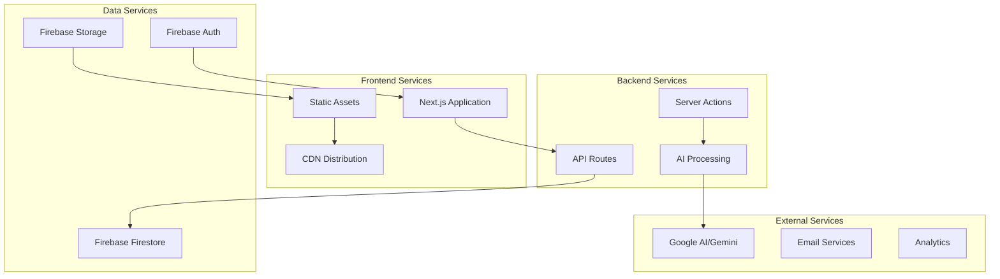

# Light on Campus - Operations Manual

**Document Version:** 1.0  
**Date:** January 2025  
**Operations Team:** [Team Name]  
**On-Call Rotation:** [Contact Info]  
**Emergency Contact:** [Emergency Info]

---

## Table of Contents

1. [Operations Overview](#1-operations-overview)
2. [System Monitoring](#2-system-monitoring)
3. [Daily Operations](#3-daily-operations)
4. [Incident Response](#4-incident-response)
5. [Maintenance Procedures](#5-maintenance-procedures)
6. [Backup & Recovery](#6-backup--recovery)
7. [Performance Management](#7-performance-management)
8. [Capacity Planning](#8-capacity-planning)
9. [Troubleshooting Guide](#9-troubleshooting-guide)
10. [Runbooks](#10-runbooks)
11. [Change Management](#11-change-management)
12. [Documentation & Reporting](#12-documentation--reporting)

---

## 1. Operations Overview

### 1.1 Service Overview

Light on Campus operates as a modern web application with the following key components:



### 1.2 Service Level Objectives (SLOs)

| Service | Availability | Response Time | Error Rate |
|---------|--------------|---------------|------------|
| **Web Application** | 99.5% | <3s (95th percentile) | <1% |
| **API Endpoints** | 99.9% | <1s (95th percentile) | <0.5% |
| **AI Services** | 99.0% | <30s (95th percentile) | <2% |
| **Authentication** | 99.9% | <500ms (95th percentile) | <0.1% |
| **Database** | 99.99% | <100ms (95th percentile) | <0.01% |

### 1.3 Operational Responsibilities

#### Primary Responsibilities
- **System Monitoring**: 24/7 monitoring of all services
- **Incident Response**: Immediate response to system alerts
- **Performance Management**: Maintain performance within SLO targets
- **Capacity Planning**: Ensure adequate resources for growth
- **Backup Management**: Regular backups and recovery testing
- **Security Monitoring**: Watch for security threats and incidents
- **Change Management**: Coordinate deployments and updates

#### On-Call Schedule
```
Primary On-Call: Weekdays 8 AM - 6 PM
Secondary On-Call: Evenings, weekends, holidays
Escalation: Manager and Senior Engineers
```

---

## 2. System Monitoring

### 2.1 Monitoring Stack

#### Core Monitoring Tools
```typescript
// Monitoring configuration
const monitoringConfig = {
  // Application Performance Monitoring
  apm: {
    provider: 'Firebase Performance',
    metrics: [
      'page_load_time',
      'api_response_time',
      'error_rate',
      'throughput',
    ],
    alerting: true,
  },
  
  // Infrastructure Monitoring
  infrastructure: {
    provider: 'Google Cloud Monitoring',
    metrics: [
      'cpu_utilization',
      'memory_usage',
      'disk_usage',
      'network_throughput',
    ],
    alerting: true,
  },
  
  // Application Logs
  logging: {
    provider: 'Google Cloud Logging',
    retention: '30 days',
    alerting: true,
  },
  
  // User Experience Monitoring
  ux: {
    provider: 'Firebase Analytics',
    metrics: [
      'user_engagement',
      'feature_usage',
      'conversion_rates',
    ],
  },
};
```

#### Key Metrics Dashboard
```typescript
// Primary monitoring dashboard metrics
interface DashboardMetrics {
  system: {
    uptime: number;
    responseTime: number;
    errorRate: number;
    throughput: number;
  };
  business: {
    activeUsers: number;
    aiRequestsPerHour: number;
    registrationRate: number;
    featureUsage: Record<string, number>;
  };
  technical: {
    deploymentStatus: string;
    buildStatus: string;
    testResults: string;
    securityAlerts: number;
  };
}

// Real-time metrics collection
export class MetricsCollector {
  static async collectSystemMetrics(): Promise<SystemMetrics> {
    const metrics = await Promise.all([
      this.getUptimeMetrics(),
      this.getPerformanceMetrics(),
      this.getErrorMetrics(),
      this.getThroughputMetrics(),
    ]);
    
    return {
      uptime: metrics[0],
      performance: metrics[1],
      errors: metrics[2],
      throughput: metrics[3],
      timestamp: new Date().toISOString(),
    };
  }
  
  static async getPerformanceMetrics(): Promise<PerformanceMetrics> {
    const performanceData = await firebase.performance().getMetrics();
    
    return {
      pageLoadTime: performanceData.pageLoadTime.p95,
      apiResponseTime: performanceData.apiResponseTime.p95,
      firstContentfulPaint: performanceData.fcp.p95,
      largestContentfulPaint: performanceData.lcp.p95,
      cumulativeLayoutShift: performanceData.cls.avg,
      firstInputDelay: performanceData.fid.p95,
    };
  }
}
```

### 2.2 Alerting Configuration

#### Alert Categories
```typescript
enum AlertSeverity {
  INFO = 'info',
  WARNING = 'warning',
  ERROR = 'error',
  CRITICAL = 'critical',
}

interface AlertRule {
  name: string;
  description: string;
  condition: string;
  severity: AlertSeverity;
  channels: string[];
  escalation: EscalationPolicy;
}

const alertRules: AlertRule[] = [
  {
    name: 'High Error Rate',
    description: 'API error rate exceeds 5%',
    condition: 'error_rate > 0.05 for 5 minutes',
    severity: AlertSeverity.CRITICAL,
    channels: ['slack', 'email', 'pagerduty'],
    escalation: {
      level1: { delay: 0, contacts: ['oncall-primary'] },
      level2: { delay: 15, contacts: ['oncall-secondary'] },
      level3: { delay: 30, contacts: ['manager'] },
    },
  },
  {
    name: 'Slow Response Time',
    description: 'API response time exceeds 2 seconds',
    condition: 'response_time_p95 > 2000ms for 10 minutes',
    severity: AlertSeverity.WARNING,
    channels: ['slack'],
    escalation: {
      level1: { delay: 0, contacts: ['oncall-primary'] },
    },
  },
  {
    name: 'AI Service Failure',
    description: 'AI service requests failing',
    condition: 'ai_service_error_rate > 0.1 for 5 minutes',
    severity: AlertSeverity.ERROR,
    channels: ['slack', 'email'],
    escalation: {
      level1: { delay: 0, contacts: ['oncall-primary'] },
      level2: { delay: 20, contacts: ['ai-team'] },
    },
  },
  {
    name: 'Database Connection Issues',
    description: 'Database connectivity problems',
    condition: 'database_connection_errors > 10 for 2 minutes',
    severity: AlertSeverity.CRITICAL,
    channels: ['slack', 'email', 'pagerduty'],
    escalation: {
      level1: { delay: 0, contacts: ['oncall-primary'] },
      level2: { delay: 10, contacts: ['database-team'] },
    },
  },
];
```

#### Alert Response Procedures
```typescript
// Alert handling workflow
export class AlertHandler {
  static async handleAlert(alert: Alert): Promise<void> {
    // Log alert reception
    await this.logAlert(alert);
    
    // Execute automated remediation if available
    const autoRemediation = await this.getAutoRemediation(alert.type);
    if (autoRemediation) {
      await this.executeRemediation(autoRemediation, alert);
    }
    
    // Notify on-call team
    await this.notifyOnCall(alert);
    
    // Create incident if critical
    if (alert.severity === AlertSeverity.CRITICAL) {
      await this.createIncident(alert);
    }
    
    // Start escalation timer
    await this.startEscalation(alert);
  }
  
  // Automated remediation actions
  private static async executeRemediation(
    remediation: RemediationAction,
    alert: Alert
  ): Promise<void> {
    switch (remediation.type) {
      case 'restart_service':
        await this.restartService(remediation.service);
        break;
      case 'scale_up':
        await this.scaleService(remediation.service, remediation.replicas);
        break;
      case 'clear_cache':
        await this.clearCache(remediation.cache);
        break;
      case 'failover':
        await this.triggerFailover(remediation.service);
        break;
    }
    
    // Log remediation action
    await this.logRemediation(alert, remediation);
  }
}
```

### 2.3 Health Checks

#### Application Health Endpoints
```typescript
// Health check implementation
export async function GET() {
  const healthChecks = await Promise.allSettled([
    checkDatabaseHealth(),
    checkAIServiceHealth(),
    checkExternalDependencies(),
    checkMemoryUsage(),
    checkDiskSpace(),
  ]);
  
  const results = healthChecks.map((check, index) => ({
    service: ['database', 'ai_service', 'external', 'memory', 'disk'][index],
    status: check.status === 'fulfilled' ? 'healthy' : 'unhealthy',
    details: check.status === 'rejected' ? check.reason : 'OK',
    timestamp: new Date().toISOString(),
  }));
  
  const overallHealth = results.every(r => r.status === 'healthy') 
    ? 'healthy' 
    : 'degraded';
  
  const statusCode = overallHealth === 'healthy' ? 200 : 503;
  
  return Response.json(
    {
      status: overallHealth,
      services: results,
      uptime: process.uptime(),
      timestamp: new Date().toISOString(),
    },
    { status: statusCode }
  );
}

// Individual health check functions
async function checkDatabaseHealth(): Promise<void> {
  const db = getFirestore();
  const testDoc = await db.collection('health').doc('test').get();
  
  if (!testDoc.exists) {
    // Create test document if it doesn't exist
    await db.collection('health').doc('test').set({
      lastCheck: new Date().toISOString(),
    });
  }
}

async function checkAIServiceHealth(): Promise<void> {
  const testPrompt = 'Health check test';
  const response = await fetch('https://generativelanguage.googleapis.com/v1beta/models/gemini-2.0-flash:generateContent', {
    method: 'POST',
    headers: {
      'Authorization': `Bearer ${process.env.GOOGLE_AI_API_KEY}`,
      'Content-Type': 'application/json',
    },
    body: JSON.stringify({
      contents: [{ parts: [{ text: testPrompt }] }],
    }),
  });
  
  if (!response.ok) {
    throw new Error(`AI service health check failed: ${response.status}`);
  }
}

async function checkMemoryUsage(): Promise<void> {
  const memUsage = process.memoryUsage();
  const memoryThreshold = 1024 * 1024 * 1024; // 1GB
  
  if (memUsage.heapUsed > memoryThreshold) {
    throw new Error(`High memory usage: ${memUsage.heapUsed / 1024 / 1024}MB`);
  }
}
```

---

## 3. Daily Operations

### 3.1 Daily Operational Tasks

#### Morning Checklist (Start of Day)
```markdown
## Daily Operations Checklist

### System Health Review (15 minutes)
- [ ] Review overnight alerts and incidents
- [ ] Check system performance dashboards
- [ ] Verify backup completion status
- [ ] Review error logs for anomalies
- [ ] Check resource utilization trends

### Service Status Verification (10 minutes)
- [ ] Test main application functionality
- [ ] Verify AI services are responsive
- [ ] Check authentication flow
- [ ] Test critical user journeys
- [ ] Validate API endpoints

### Monitoring and Alerts (10 minutes)
- [ ] Review active alerts
- [ ] Update incident status
- [ ] Check alert rule effectiveness
- [ ] Verify monitoring coverage

### Capacity and Performance (10 minutes)
- [ ] Review resource consumption trends
- [ ] Check database performance metrics
- [ ] Analyze API response times
- [ ] Review user traffic patterns

### Security Review (10 minutes)
- [ ] Check security event logs
- [ ] Review failed authentication attempts
- [ ] Verify SSL certificate status
- [ ] Check for security updates
```

#### Automated Daily Reports
```typescript
// Daily operations report generator
export class DailyReportGenerator {
  static async generateDailyReport(): Promise<DailyOperationsReport> {
    const reportData = await Promise.all([
      this.getSystemHealthSummary(),
      this.getPerformanceMetrics(),
      this.getIncidentSummary(),
      this.getCapacityMetrics(),
      this.getSecuritySummary(),
    ]);
    
    const report: DailyOperationsReport = {
      date: new Date().toISOString().split('T')[0],
      systemHealth: reportData[0],
      performance: reportData[1],
      incidents: reportData[2],
      capacity: reportData[3],
      security: reportData[4],
      recommendations: this.generateRecommendations(reportData),
      nextDayFocus: this.identifyFocusAreas(reportData),
    };
    
    // Send report to operations team
    await this.sendDailyReport(report);
    
    return report;
  }
  
  private static async getSystemHealthSummary(): Promise<SystemHealthSummary> {
    return {
      uptime: await this.calculateUptime(),
      serviceAvailability: await this.getServiceAvailability(),
      errorRates: await this.getErrorRates(),
      responseTimeP95: await this.getResponseTimeP95(),
      activeAlerts: await this.getActiveAlerts(),
    };
  }
  
  private static generateRecommendations(
    reportData: any[]
  ): string[] {
    const recommendations = [];
    
    // Performance recommendations
    if (reportData[1].apiResponseTime > 1000) {
      recommendations.push('API response times trending high - investigate performance bottlenecks');
    }
    
    // Capacity recommendations
    if (reportData[3].cpuUtilization > 70) {
      recommendations.push('CPU utilization high - consider scaling up instances');
    }
    
    // Security recommendations
    if (reportData[4].failedLogins > 100) {
      recommendations.push('High number of failed login attempts - review security logs');
    }
    
    return recommendations;
  }
}
```

### 3.2 Weekly Operations Tasks

#### Weekly Review Checklist
```markdown
## Weekly Operations Review

### Performance Analysis
- [ ] Review weekly performance trends
- [ ] Analyze slow queries and optimize
- [ ] Check for memory leaks or performance degradation
- [ ] Update performance baselines

### Capacity Planning
- [ ] Review resource utilization trends
- [ ] Forecast capacity needs for next month
- [ ] Check auto-scaling configurations
- [ ] Plan for peak usage periods

### Security Review
- [ ] Review security incident reports
- [ ] Check for security updates and patches
- [ ] Audit user access and permissions
- [ ] Review backup and recovery procedures

### Maintenance Planning
- [ ] Schedule routine maintenance windows
- [ ] Plan security updates and patches
- [ ] Review change requests
- [ ] Update operational documentation

### Cost Optimization
- [ ] Review cloud service costs
- [ ] Identify unused resources
- [ ] Optimize instance sizes and configurations
- [ ] Review backup retention policies
```

### 3.3 Monthly Operations Tasks

#### Monthly Review Process
```typescript
// Monthly operations review
export class MonthlyReview {
  static async generateMonthlyReport(): Promise<MonthlyOperationsReport> {
    const month = new Date().getMonth();
    const year = new Date().getFullYear();
    
    const reportData = await Promise.all([
      this.getSLOCompliance(month, year),
      this.getIncidentAnalysis(month, year),
      this.getPerformanceTrends(month, year),
      this.getCapacityAnalysis(month, year),
      this.getCostAnalysis(month, year),
      this.getSecurityMetrics(month, year),
    ]);
    
    return {
      period: { month, year },
      sloCompliance: reportData[0],
      incidents: reportData[1],
      performance: reportData[2],
      capacity: reportData[3],
      costs: reportData[4],
      security: reportData[5],
      improvements: this.identifyImprovements(reportData),
      nextMonthGoals: this.setNextMonthGoals(reportData),
    };
  }
  
  private static async getSLOCompliance(
    month: number, 
    year: number
  ): Promise<SLOComplianceReport> {
    const slos = [
      { name: 'API Availability', target: 99.9, actual: 99.95 },
      { name: 'Response Time', target: 1000, actual: 850 },
      { name: 'Error Rate', target: 0.5, actual: 0.3 },
    ];
    
    return {
      period: { month, year },
      slos: slos.map(slo => ({
        ...slo,
        compliant: slo.actual >= slo.target,
        trend: 'improving', // Calculate from historical data
      })),
      overallCompliance: slos.every(slo => slo.actual >= slo.target),
    };
  }
}
```

---

## 4. Incident Response

### 4.1 Incident Classification

#### Severity Levels
```typescript
enum IncidentSeverity {
  SEV1 = 'sev1', // Critical - Total service outage
  SEV2 = 'sev2', // High - Major feature unavailable
  SEV3 = 'sev3', // Medium - Minor feature impact
  SEV4 = 'sev4', // Low - Minimal user impact
}

interface IncidentDefinition {
  severity: IncidentSeverity;
  description: string;
  examples: string[];
  responseTime: number; // minutes
  escalation: string[];
  communication: string[];
}

const incidentDefinitions: IncidentDefinition[] = [
  {
    severity: IncidentSeverity.SEV1,
    description: 'Complete service outage affecting all users',
    examples: [
      'Website completely down',
      'Database unavailable',
      'Authentication system failure',
      'Major security breach',
    ],
    responseTime: 5,
    escalation: ['on-call', 'manager', 'director'],
    communication: ['status-page', 'email', 'social-media'],
  },
  {
    severity: IncidentSeverity.SEV2,
    description: 'Major feature unavailable or severely degraded',
    examples: [
      'AI services down',
      'File upload not working',
      'Email notifications failing',
      'Performance severely degraded',
    ],
    responseTime: 15,
    escalation: ['on-call', 'manager'],
    communication: ['status-page', 'email'],
  },
  {
    severity: IncidentSeverity.SEV3,
    description: 'Minor feature impact or workaround available',
    examples: [
      'Search functionality slow',
      'Some images not loading',
      'Minor UI bugs',
      'Performance slightly degraded',
    ],
    responseTime: 60,
    escalation: ['on-call'],
    communication: ['internal-slack'],
  },
  {
    severity: IncidentSeverity.SEV4,
    description: 'Minimal user impact, cosmetic issues',
    examples: [
      'Styling issues',
      'Typos in UI',
      'Minor performance issues',
      'Non-critical feature bugs',
    ],
    responseTime: 240,
    escalation: [],
    communication: ['internal-slack'],
  },
];
```

### 4.2 Incident Response Procedures

#### Incident Response Workflow
```typescript
// Incident response management
export class IncidentManager {
  static async createIncident(
    title: string,
    description: string,
    severity: IncidentSeverity,
    reportedBy: string
  ): Promise<Incident> {
    const incident: Incident = {
      id: generateIncidentId(),
      title,
      description,
      severity,
      status: 'investigating',
      reportedBy,
      reportedAt: new Date().toISOString(),
      assignedTo: await this.getOnCallEngineer(),
      timeline: [{
        timestamp: new Date().toISOString(),
        event: 'incident_created',
        description: 'Incident reported and assigned',
        actor: 'system',
      }],
      affectedServices: [],
      rootCause: '',
      resolution: '',
      postMortemRequired: severity === IncidentSeverity.SEV1 || severity === IncidentSeverity.SEV2,
    };
    
    // Store incident
    await this.storeIncident(incident);
    
    // Start response process
    await this.initiateResponse(incident);
    
    return incident;
  }
  
  private static async initiateResponse(incident: Incident): Promise<void> {
    // Notify on-call team
    await this.notifyOnCall(incident);
    
    // Create incident channel
    await this.createIncidentChannel(incident);
    
    // Start status page updates
    if (this.requiresStatusPageUpdate(incident.severity)) {
      await this.updateStatusPage(incident);
    }
    
    // Set escalation timer
    await this.setEscalationTimer(incident);
    
    // Begin investigation
    await this.startInvestigation(incident);
  }
  
  // Incident status updates
  static async updateIncidentStatus(
    incidentId: string,
    status: IncidentStatus,
    update: string,
    actor: string
  ): Promise<void> {
    const incident = await this.getIncident(incidentId);
    
    incident.status = status;
    incident.timeline.push({
      timestamp: new Date().toISOString(),
      event: 'status_update',
      description: update,
      actor,
    });
    
    await this.storeIncident(incident);
    
    // Notify stakeholders
    await this.notifyStakeholders(incident, update);
    
    // Update status page
    if (this.requiresStatusPageUpdate(incident.severity)) {
      await this.updateStatusPage(incident);
    }
  }
  
  // Incident resolution
  static async resolveIncident(
    incidentId: string,
    resolution: string,
    rootCause: string,
    actor: string
  ): Promise<void> {
    const incident = await this.getIncident(incidentId);
    
    incident.status = 'resolved';
    incident.resolution = resolution;
    incident.rootCause = rootCause;
    incident.resolvedAt = new Date().toISOString();
    
    incident.timeline.push({
      timestamp: new Date().toISOString(),
      event: 'incident_resolved',
      description: `Incident resolved: ${resolution}`,
      actor,
    });
    
    await this.storeIncident(incident);
    
    // Close incident channel
    await this.closeIncidentChannel(incident);
    
    // Schedule post-mortem if required
    if (incident.postMortemRequired) {
      await this.schedulePostMortem(incident);
    }
    
    // Final status page update
    if (this.requiresStatusPageUpdate(incident.severity)) {
      await this.resolveStatusPageIncident(incident);
    }
  }
}
```

### 4.3 Communication Templates

#### Incident Communication Templates
```typescript
const incidentCommunicationTemplates = {
  initial: {
    statusPage: `
      We are currently investigating reports of {issue_description}. 
      We will provide updates as more information becomes available.
      
      Status: Investigating
      Started: {start_time}
    `,
    email: `
      Subject: [INCIDENT] {incident_title}
      
      We are aware of an issue affecting {affected_services}.
      
      Impact: {impact_description}
      Status: Investigating
      Started: {start_time}
      
      We are working to resolve this as quickly as possible and will 
      provide updates every 30 minutes until resolved.
    `,
  },
  
  update: {
    statusPage: `
      Update: {update_description}
      
      Status: {current_status}
      Next update: {next_update_time}
    `,
    email: `
      Subject: [UPDATE] {incident_title}
      
      Update: {update_description}
      
      Current Status: {current_status}
      Duration: {incident_duration}
      
      Next update in 30 minutes or when resolved.
    `,
  },
  
  resolved: {
    statusPage: `
      This incident has been resolved.
      
      Resolution: {resolution_description}
      Total Duration: {total_duration}
      Resolved: {resolution_time}
    `,
    email: `
      Subject: [RESOLVED] {incident_title}
      
      This incident has been resolved.
      
      Resolution: {resolution_description}
      Root Cause: {root_cause}
      Total Duration: {total_duration}
      
      We apologize for any inconvenience this may have caused.
      If you continue to experience issues, please contact support.
    `,
  },
};

// Communication manager
export class IncidentCommunication {
  static async sendInitialNotification(incident: Incident): Promise<void> {
    const channels = incidentDefinitions
      .find(def => def.severity === incident.severity)
      ?.communication || [];
    
    for (const channel of channels) {
      await this.sendNotification(channel, 'initial', incident);
    }
  }
  
  static async sendUpdate(incident: Incident, updateMessage: string): Promise<void> {
    const channels = incidentDefinitions
      .find(def => def.severity === incident.severity)
      ?.communication || [];
    
    for (const channel of channels) {
      await this.sendNotification(channel, 'update', incident, updateMessage);
    }
  }
  
  private static async sendNotification(
    channel: string,
    type: string,
    incident: Incident,
    customMessage?: string
  ): Promise<void> {
    const template = incidentCommunicationTemplates[type][channel];
    const message = this.renderTemplate(template, incident, customMessage);
    
    switch (channel) {
      case 'status-page':
        await this.updateStatusPage(message);
        break;
      case 'email':
        await this.sendEmailNotification(message);
        break;
      case 'slack':
        await this.sendSlackNotification(message);
        break;
      case 'social-media':
        await this.postToSocialMedia(message);
        break;
    }
  }
}
```

---

## 5. Maintenance Procedures

### 5.1 Scheduled Maintenance

#### Maintenance Windows
```typescript
// Maintenance scheduling system
interface MaintenanceWindow {
  id: string;
  title: string;
  description: string;
  type: 'security' | 'performance' | 'feature' | 'infrastructure';
  severity: 'low' | 'medium' | 'high';
  scheduledStart: string;
  scheduledEnd: string;
  affectedServices: string[];
  maintenanceProcedure: string[];
  rollbackProcedure: string[];
  approvals: Approval[];
  communicationPlan: CommunicationPlan;
}

const maintenanceTypes = {
  security: {
    description: 'Security patches and updates',
    approvalRequired: true,
    notificationPeriod: 72, // hours
    preferredWindow: 'weekend',
  },
  performance: {
    description: 'Performance improvements and optimizations',
    approvalRequired: false,
    notificationPeriod: 24,
    preferredWindow: 'off-peak',
  },
  feature: {
    description: 'New feature deployments',
    approvalRequired: true,
    notificationPeriod: 48,
    preferredWindow: 'business-hours',
  },
  infrastructure: {
    description: 'Infrastructure updates and changes',
    approvalRequired: true,
    notificationPeriod: 168, // 1 week
    preferredWindow: 'weekend',
  },
};

// Maintenance scheduler
export class MaintenanceScheduler {
  static async scheduleMaintenanceWindow(
    maintenance: Partial<MaintenanceWindow>
  ): Promise<string> {
    // Validate maintenance window
    await this.validateMaintenanceWindow(maintenance);
    
    // Create maintenance record
    const maintenanceId = generateMaintenanceId();
    const maintenanceWindow: MaintenanceWindow = {
      id: maintenanceId,
      ...maintenance,
      approvals: [],
    } as MaintenanceWindow;
    
    // Store maintenance window
    await this.storeMaintenanceWindow(maintenanceWindow);
    
    // Request approvals if required
    const maintenanceType = maintenanceTypes[maintenance.type!];
    if (maintenanceType.approvalRequired) {
      await this.requestApprovals(maintenanceWindow);
    }
    
    // Schedule notifications
    await this.scheduleNotifications(maintenanceWindow);
    
    return maintenanceId;
  }
  
  static async executeMaintenanceWindow(
    maintenanceId: string
  ): Promise<MaintenanceResult> {
    const maintenance = await this.getMaintenanceWindow(maintenanceId);
    const startTime = Date.now();
    
    try {
      // Pre-maintenance checks
      await this.runPreMaintenanceChecks(maintenance);
      
      // Start maintenance notification
      await this.notifyMaintenanceStart(maintenance);
      
      // Execute maintenance procedures
      const results = [];
      for (const procedure of maintenance.maintenanceProcedure) {
        const result = await this.executeProcedure(procedure);
        results.push(result);
        
        if (!result.success) {
          // Initiate rollback
          await this.initiateRollback(maintenance, results);
          throw new Error(`Maintenance failed at step: ${procedure}`);
        }
      }
      
      // Post-maintenance verification
      await this.runPostMaintenanceChecks(maintenance);
      
      // Complete maintenance
      await this.completeMaintenanceWindow(maintenance);
      
      return {
        success: true,
        duration: Date.now() - startTime,
        procedures: results,
        message: 'Maintenance completed successfully',
      };
      
    } catch (error) {
      // Handle maintenance failure
      await this.handleMaintenanceFailure(maintenance, error);
      
      return {
        success: false,
        duration: Date.now() - startTime,
        error: error.message,
        message: 'Maintenance failed - rollback initiated',
      };
    }
  }
}
```

#### Common Maintenance Procedures
```bash
#!/bin/bash
# Maintenance procedure scripts

# Security update procedure
security_update() {
    echo "Starting security update procedure..."
    
    # 1. Create backup
    echo "Creating pre-update backup..."
    npm run backup:create
    
    # 2. Update dependencies
    echo "Updating security dependencies..."
    npm audit fix --force
    
    # 3. Run security tests
    echo "Running security tests..."
    npm run test:security
    
    # 4. Build and test
    echo "Building application..."
    npm run build
    
    # 5. Deploy to staging
    echo "Deploying to staging..."
    npm run deploy:staging
    
    # 6. Run smoke tests
    echo "Running smoke tests..."
    npm run test:smoke -- --env staging
    
    echo "Security update completed successfully"
}

# Performance optimization procedure
performance_optimization() {
    echo "Starting performance optimization..."
    
    # 1. Baseline performance metrics
    echo "Capturing baseline metrics..."
    npm run metrics:capture -- --label pre-optimization
    
    # 2. Database optimization
    echo "Optimizing database..."
    npm run db:optimize
    
    # 3. Cache optimization
    echo "Optimizing cache..."
    npm run cache:optimize
    
    # 4. Bundle optimization
    echo "Optimizing bundles..."
    npm run build:optimize
    
    # 5. Deploy optimizations
    echo "Deploying optimizations..."
    npm run deploy:production
    
    # 6. Verify performance improvements
    echo "Measuring performance improvements..."
    npm run metrics:capture -- --label post-optimization
    npm run metrics:compare
    
    echo "Performance optimization completed"
}

# Database maintenance procedure
database_maintenance() {
    echo "Starting database maintenance..."
    
    # 1. Backup database
    echo "Creating database backup..."
    npm run db:backup
    
    # 2. Analyze performance
    echo "Analyzing database performance..."
    npm run db:analyze
    
    # 3. Optimize indexes
    echo "Optimizing database indexes..."
    npm run db:optimize-indexes
    
    # 4. Clean up old data
    echo "Cleaning up old data..."
    npm run db:cleanup
    
    # 5. Verify integrity
    echo "Verifying database integrity..."
    npm run db:verify
    
    echo "Database maintenance completed"
}
```

### 5.2 Emergency Maintenance

#### Emergency Maintenance Procedures
```typescript
// Emergency maintenance protocols
export class EmergencyMaintenance {
  static async declareEmergencyMaintenance(
    reason: string,
    severity: 'critical' | 'urgent',
    estimatedDuration: number
  ): Promise<string> {
    const emergencyId = generateEmergencyId();
    
    // Create emergency maintenance record
    const emergency: EmergencyMaintenance = {
      id: emergencyId,
      reason,
      severity,
      declaredAt: new Date().toISOString(),
      declaredBy: 'on-call-engineer',
      estimatedDuration,
      status: 'active',
      procedures: [],
    };
    
    // Immediate notifications
    await this.sendEmergencyNotifications(emergency);
    
    // Enable maintenance mode
    await this.enableMaintenanceMode(emergency);
    
    // Start incident tracking
    await this.createEmergencyIncident(emergency);
    
    return emergencyId;
  }
  
  private static async enableMaintenanceMode(
    emergency: EmergencyMaintenance
  ): Promise<void> {
    // Enable maintenance page
    await this.deployMaintenancePage({
      message: `We're currently performing emergency maintenance: ${emergency.reason}`,
      estimatedCompletion: new Date(
        Date.now() + emergency.estimatedDuration * 60000
      ).toISOString(),
      updates: '/status',
    });
    
    // Disable non-essential services
    await this.disableNonEssentialServices();
    
    // Route traffic to maintenance page
    await this.routeToMaintenancePage();
  }
  
  static async completeEmergencyMaintenance(
    emergencyId: string,
    outcome: 'successful' | 'failed',
    summary: string
  ): Promise<void> {
    const emergency = await this.getEmergencyMaintenance(emergencyId);
    
    // Update emergency record
    emergency.status = 'completed';
    emergency.outcome = outcome;
    emergency.summary = summary;
    emergency.completedAt = new Date().toISOString();
    
    // Disable maintenance mode
    await this.disableMaintenanceMode();
    
    // Restore services
    await this.restoreServices();
    
    // Send completion notifications
    await this.sendCompletionNotifications(emergency);
    
    // Schedule post-emergency review
    await this.schedulePostEmergencyReview(emergency);
  }
}
```

---

## 6. Backup & Recovery

### 6.1 Backup Strategy

#### Backup Configuration
```typescript
// Backup management system
interface BackupPolicy {
  service: string;
  frequency: 'hourly' | 'daily' | 'weekly' | 'monthly';
  retention: {
    daily: number;
    weekly: number;
    monthly: number;
    yearly: number;
  };
  encryption: boolean;
  compression: boolean;
  verification: boolean;
}

const backupPolicies: BackupPolicy[] = [
  {
    service: 'firestore_database',
    frequency: 'daily',
    retention: {
      daily: 7,
      weekly: 4,
      monthly: 12,
      yearly: 3,
    },
    encryption: true,
    compression: true,
    verification: true,
  },
  {
    service: 'user_uploads',
    frequency: 'daily',
    retention: {
      daily: 30,
      weekly: 12,
      monthly: 24,
      yearly: 5,
    },
    encryption: true,
    compression: false,
    verification: true,
  },
  {
    service: 'configuration',
    frequency: 'weekly',
    retention: {
      daily: 0,
      weekly: 8,
      monthly: 6,
      yearly: 2,
    },
    encryption: true,
    compression: true,
    verification: true,
  },
  {
    service: 'application_logs',
    frequency: 'daily',
    retention: {
      daily: 14,
      weekly: 0,
      monthly: 0,
      yearly: 0,
    },
    encryption: false,
    compression: true,
    verification: false,
  },
];

// Backup execution system
export class BackupManager {
  static async executeBackup(service: string): Promise<BackupResult> {
    const policy = backupPolicies.find(p => p.service === service);
    if (!policy) {
      throw new Error(`No backup policy found for service: ${service}`);
    }
    
    const backupId = generateBackupId();
    const startTime = Date.now();
    
    try {
      // Create backup
      const backupData = await this.createBackup(service);
      
      // Compress if required
      let processedData = backupData;
      if (policy.compression) {
        processedData = await this.compressBackup(backupData);
      }
      
      // Encrypt if required
      if (policy.encryption) {
        processedData = await this.encryptBackup(processedData);
      }
      
      // Store backup
      const backupLocation = await this.storeBackup(backupId, processedData);
      
      // Verify backup if required
      if (policy.verification) {
        await this.verifyBackup(backupId, backupLocation);
      }
      
      // Record backup metadata
      const backup: BackupRecord = {
        id: backupId,
        service,
        createdAt: new Date().toISOString(),
        size: processedData.length,
        location: backupLocation,
        encrypted: policy.encryption,
        compressed: policy.compression,
        verified: policy.verification,
        status: 'completed',
      };
      
      await this.recordBackup(backup);
      
      // Clean up old backups
      await this.cleanupOldBackups(service, policy.retention);
      
      return {
        success: true,
        backupId,
        duration: Date.now() - startTime,
        size: processedData.length,
      };
      
    } catch (error) {
      // Record failed backup
      await this.recordFailedBackup(backupId, service, error.message);
      
      return {
        success: false,
        backupId,
        duration: Date.now() - startTime,
        error: error.message,
      };
    }
  }
  
  // Backup verification
  static async verifyBackup(
    backupId: string,
    location: string
  ): Promise<boolean> {
    try {
      // Download backup
      const backupData = await this.downloadBackup(location);
      
      // Verify integrity
      const checksumValid = await this.verifyChecksum(backupId, backupData);
      
      // Verify content structure
      const structureValid = await this.verifyStructure(backupData);
      
      return checksumValid && structureValid;
    } catch (error) {
      console.error(`Backup verification failed for ${backupId}:`, error);
      return false;
    }
  }
}
```

### 6.2 Disaster Recovery

#### Recovery Procedures
```typescript
// Disaster recovery management
export class DisasterRecovery {
  static async initiateRecovery(
    scenario: RecoveryScenario,
    targetTime: string
  ): Promise<RecoveryResult> {
    const recoveryId = generateRecoveryId();
    
    try {
      // Create recovery plan
      const recoveryPlan = await this.createRecoveryPlan(scenario, targetTime);
      
      // Execute recovery steps
      const results = [];
      for (const step of recoveryPlan.steps) {
        const stepResult = await this.executeRecoveryStep(step);
        results.push(stepResult);
        
        if (!stepResult.success) {
          throw new Error(`Recovery failed at step: ${step.name}`);
        }
      }
      
      // Verify recovery
      const verificationResult = await this.verifyRecovery(recoveryPlan);
      
      return {
        success: true,
        recoveryId,
        plan: recoveryPlan,
        results,
        verification: verificationResult,
        duration: Date.now() - recoveryPlan.startTime,
      };
      
    } catch (error) {
      return {
        success: false,
        recoveryId,
        error: error.message,
        duration: Date.now() - Date.now(),
      };
    }
  }
  
  // Point-in-time recovery
  static async recoverToPointInTime(
    service: string,
    targetTime: string
  ): Promise<RecoveryResult> {
    // Find appropriate backup
    const backup = await this.findBackupForTime(service, targetTime);
    
    if (!backup) {
      throw new Error(`No backup found for ${service} at ${targetTime}`);
    }
    
    // Download and decrypt backup
    const backupData = await this.restoreBackup(backup.id);
    
    // Stop current service
    await this.stopService(service);
    
    // Restore data
    await this.restoreData(service, backupData);
    
    // Start service
    await this.startService(service);
    
    // Verify recovery
    const isHealthy = await this.verifyServiceHealth(service);
    
    if (!isHealthy) {
      throw new Error(`Service ${service} failed health check after recovery`);
    }
    
    return {
      success: true,
      service,
      backupId: backup.id,
      targetTime,
      recoveredAt: new Date().toISOString(),
    };
  }
}
```

#### Recovery Testing
```typescript
// Disaster recovery testing
export class RecoveryTesting {
  static async runRecoveryTest(
    testType: 'database' | 'full_system' | 'partial'
  ): Promise<RecoveryTestResult> {
    const testId = generateTestId();
    
    // Create test environment
    const testEnv = await this.createTestEnvironment();
    
    try {
      // Execute recovery test
      const testResult = await this.executeRecoveryTest(testType, testEnv);
      
      // Validate recovered system
      const validationResult = await this.validateRecoveredSystem(testEnv);
      
      // Performance testing
      const performanceResult = await this.testRecoveredPerformance(testEnv);
      
      // Generate test report
      const report = await this.generateTestReport({
        testId,
        testType,
        recovery: testResult,
        validation: validationResult,
        performance: performanceResult,
      });
      
      return {
        success: true,
        testId,
        report,
        recommendations: this.generateRecommendations(report),
      };
      
    } finally {
      // Clean up test environment
      await this.cleanupTestEnvironment(testEnv);
    }
  }
  
  // Quarterly DR testing
  static async scheduleQuarterlyDRTest(): Promise<void> {
    const testSchedule = [
      { quarter: 'Q1', testType: 'database', date: '2025-03-15' },
      { quarter: 'Q2', testType: 'full_system', date: '2025-06-15' },
      { quarter: 'Q3', testType: 'partial', date: '2025-09-15' },
      { quarter: 'Q4', testType: 'database', date: '2025-12-15' },
    ];
    
    for (const test of testSchedule) {
      await this.scheduleTest(test);
    }
  }
}
```

---

## 7. Performance Management

### 7.1 Performance Monitoring

#### Performance Metrics
```typescript
// Performance monitoring system
interface PerformanceMetrics {
  frontend: {
    pageLoadTime: number;
    firstContentfulPaint: number;
    largestContentfulPaint: number;
    cumulativeLayoutShift: number;
    firstInputDelay: number;
    timeToInteractive: number;
  };
  backend: {
    apiResponseTime: number;
    databaseQueryTime: number;
    aiProcessingTime: number;
    errorRate: number;
    throughput: number;
  };
  infrastructure: {
    cpuUtilization: number;
    memoryUsage: number;
    diskUsage: number;
    networkLatency: number;
  };
}

// Performance baseline management
export class PerformanceBaseline {
  static async establishBaseline(): Promise<PerformanceBaseline> {
    // Collect performance data over 7 days
    const baselineData = await this.collectBaselineData(7);
    
    // Calculate statistical baselines
    const baseline = {
      frontend: {
        pageLoadTime: this.calculateP95(baselineData.frontend.pageLoadTime),
        firstContentfulPaint: this.calculateP95(baselineData.frontend.fcp),
        largestContentfulPaint: this.calculateP95(baselineData.frontend.lcp),
        cumulativeLayoutShift: this.calculateP95(baselineData.frontend.cls),
        firstInputDelay: this.calculateP95(baselineData.frontend.fid),
      },
      backend: {
        apiResponseTime: this.calculateP95(baselineData.backend.responseTime),
        databaseQueryTime: this.calculateP95(baselineData.backend.dbTime),
        aiProcessingTime: this.calculateP95(baselineData.backend.aiTime),
        errorRate: this.calculateAverage(baselineData.backend.errorRate),
        throughput: this.calculateP5(baselineData.backend.throughput),
      },
      infrastructure: {
        cpuUtilization: this.calculateP95(baselineData.infra.cpu),
        memoryUsage: this.calculateP95(baselineData.infra.memory),
        diskUsage: this.calculateP95(baselineData.infra.disk),
        networkLatency: this.calculateP95(baselineData.infra.network),
      },
      establishedAt: new Date().toISOString(),
      validUntil: new Date(Date.now() + 90 * 24 * 60 * 60 * 1000).toISOString(),
    };
    
    await this.storeBaseline(baseline);
    return baseline;
  }
  
  // Performance regression detection
  static async detectPerformanceRegressions(): Promise<RegressionAlert[]> {
    const currentMetrics = await this.getCurrentMetrics();
    const baseline = await this.getCurrentBaseline();
    const alerts: RegressionAlert[] = [];
    
    // Check frontend metrics
    if (currentMetrics.frontend.pageLoadTime > baseline.frontend.pageLoadTime * 1.2) {
      alerts.push({
        type: 'performance_regression',
        metric: 'page_load_time',
        current: currentMetrics.frontend.pageLoadTime,
        baseline: baseline.frontend.pageLoadTime,
        severity: 'medium',
        threshold: 1.2,
      });
    }
    
    // Check backend metrics
    if (currentMetrics.backend.apiResponseTime > baseline.backend.apiResponseTime * 1.5) {
      alerts.push({
        type: 'performance_regression',
        metric: 'api_response_time',
        current: currentMetrics.backend.apiResponseTime,
        baseline: baseline.backend.apiResponseTime,
        severity: 'high',
        threshold: 1.5,
      });
    }
    
    // Check error rate increase
    if (currentMetrics.backend.errorRate > baseline.backend.errorRate * 2) {
      alerts.push({
        type: 'error_rate_increase',
        metric: 'error_rate',
        current: currentMetrics.backend.errorRate,
        baseline: baseline.backend.errorRate,
        severity: 'critical',
        threshold: 2.0,
      });
    }
    
    return alerts;
  }
}
```

### 7.2 Performance Optimization

#### Optimization Procedures
```typescript
// Performance optimization toolkit
export class PerformanceOptimizer {
  // Database optimization
  static async optimizeDatabase(): Promise<OptimizationResult> {
    const optimizations = [];
    
    // Analyze slow queries
    const slowQueries = await this.identifySlowQueries();
    for (const query of slowQueries) {
      const optimization = await this.optimizeQuery(query);
      optimizations.push(optimization);
    }
    
    // Check index usage
    const indexRecommendations = await this.analyzeIndexUsage();
    for (const recommendation of indexRecommendations) {
      const optimization = await this.implementIndexOptimization(recommendation);
      optimizations.push(optimization);
    }
    
    // Optimize connection pooling
    const poolingOptimization = await this.optimizeConnectionPooling();
    optimizations.push(poolingOptimization);
    
    return {
      optimizations,
      totalImprovements: optimizations.length,
      estimatedImprovement: this.calculateEstimatedImprovement(optimizations),
    };
  }
  
  // Frontend optimization
  static async optimizeFrontend(): Promise<OptimizationResult> {
    const optimizations = [];
    
    // Bundle analysis
    const bundleAnalysis = await this.analyzeBundles();
    if (bundleAnalysis.oversizedBundles.length > 0) {
      const bundleOptimization = await this.optimizeBundles();
      optimizations.push(bundleOptimization);
    }
    
    // Image optimization
    const imageOptimization = await this.optimizeImages();
    optimizations.push(imageOptimization);
    
    // Lazy loading implementation
    const lazyLoadingOptimization = await this.implementLazyLoading();
    optimizations.push(lazyLoadingOptimization);
    
    // Caching optimization
    const cachingOptimization = await this.optimizeCaching();
    optimizations.push(cachingOptimization);
    
    return {
      optimizations,
      totalImprovements: optimizations.length,
      estimatedImprovement: this.calculateEstimatedImprovement(optimizations),
    };
  }
  
  // AI service optimization
  static async optimizeAIServices(): Promise<OptimizationResult> {
    const optimizations = [];
    
    // Request batching
    const batchingOptimization = await this.implementRequestBatching();
    optimizations.push(batchingOptimization);
    
    // Response caching
    const cachingOptimization = await this.implementAIResponseCaching();
    optimizations.push(cachingOptimization);
    
    // Request queuing
    const queueingOptimization = await this.implementRequestQueuing();
    optimizations.push(queueingOptimization);
    
    // Timeout optimization
    const timeoutOptimization = await this.optimizeTimeouts();
    optimizations.push(timeoutOptimization);
    
    return {
      optimizations,
      totalImprovements: optimizations.length,
      estimatedImprovement: this.calculateEstimatedImprovement(optimizations),
    };
  }
}
```

---

## 8. Capacity Planning

### 8.1 Capacity Monitoring

#### Resource Utilization Tracking
```typescript
// Capacity monitoring system
interface ResourceUtilization {
  timestamp: string;
  cpu: {
    usage: number;
    available: number;
    trend: 'increasing' | 'stable' | 'decreasing';
  };
  memory: {
    usage: number;
    available: number;
    trend: 'increasing' | 'stable' | 'decreasing';
  };
  storage: {
    usage: number;
    available: number;
    trend: 'increasing' | 'stable' | 'decreasing';
  };
  network: {
    bandwidth: number;
    latency: number;
    trend: 'increasing' | 'stable' | 'decreasing';
  };
}

export class CapacityMonitor {
  static async collectResourceUtilization(): Promise<ResourceUtilization> {
    const [cpu, memory, storage, network] = await Promise.all([
      this.getCPUMetrics(),
      this.getMemoryMetrics(),
      this.getStorageMetrics(),
      this.getNetworkMetrics(),
    ]);
    
    return {
      timestamp: new Date().toISOString(),
      cpu: {
        usage: cpu.usage,
        available: cpu.total - cpu.usage,
        trend: this.calculateTrend('cpu', cpu.usage),
      },
      memory: {
        usage: memory.usage,
        available: memory.total - memory.usage,
        trend: this.calculateTrend('memory', memory.usage),
      },
      storage: {
        usage: storage.usage,
        available: storage.total - storage.usage,
        trend: this.calculateTrend('storage', storage.usage),
      },
      network: {
        bandwidth: network.bandwidth,
        latency: network.latency,
        trend: this.calculateTrend('network', network.latency),
      },
    };
  }
  
  // Capacity forecasting
  static async forecastCapacityNeeds(
    timeframe: number // days
  ): Promise<CapacityForecast> {
    // Collect historical data
    const historicalData = await this.getHistoricalUtilization(90); // 90 days
    
    // Analyze growth trends
    const trends = this.analyzeGrowthTrends(historicalData);
    
    // Project future needs
    const forecast = {
      timeframe,
      projectedDate: new Date(Date.now() + timeframe * 24 * 60 * 60 * 1000),
      cpu: this.projectResourceNeed('cpu', trends.cpu, timeframe),
      memory: this.projectResourceNeed('memory', trends.memory, timeframe),
      storage: this.projectResourceNeed('storage', trends.storage, timeframe),
      network: this.projectResourceNeed('network', trends.network, timeframe),
      recommendations: [],
    };
    
    // Generate recommendations
    forecast.recommendations = this.generateCapacityRecommendations(forecast);
    
    return forecast;
  }
  
  // Scaling recommendations
  static async generateScalingRecommendations(): Promise<ScalingRecommendation[]> {
    const currentUtilization = await this.collectResourceUtilization();
    const forecast = await this.forecastCapacityNeeds(30);
    const recommendations: ScalingRecommendation[] = [];
    
    // CPU scaling
    if (currentUtilization.cpu.usage > 70 || forecast.cpu.projectedUsage > 80) {
      recommendations.push({
        resource: 'cpu',
        action: 'scale_up',
        urgency: currentUtilization.cpu.usage > 80 ? 'immediate' : 'planned',
        reason: 'High CPU utilization detected',
        implementation: 'Increase instance size or add instances',
        estimatedCost: this.estimateScalingCost('cpu', 'up'),
      });
    }
    
    // Memory scaling
    if (currentUtilization.memory.usage > 75 || forecast.memory.projectedUsage > 85) {
      recommendations.push({
        resource: 'memory',
        action: 'scale_up',
        urgency: currentUtilization.memory.usage > 85 ? 'immediate' : 'planned',
        reason: 'High memory utilization detected',
        implementation: 'Increase memory allocation',
        estimatedCost: this.estimateScalingCost('memory', 'up'),
      });
    }
    
    // Storage scaling
    if (currentUtilization.storage.usage > 80 || forecast.storage.projectedUsage > 90) {
      recommendations.push({
        resource: 'storage',
        action: 'scale_up',
        urgency: currentUtilization.storage.usage > 90 ? 'immediate' : 'planned',
        reason: 'Storage capacity approaching limit',
        implementation: 'Increase storage allocation or implement archiving',
        estimatedCost: this.estimateScalingCost('storage', 'up'),
      });
    }
    
    return recommendations;
  }
}
```

### 8.2 Auto-scaling Configuration

#### Auto-scaling Rules
```typescript
// Auto-scaling configuration
interface AutoScalingRule {
  resource: string;
  metric: string;
  threshold: number;
  direction: 'up' | 'down';
  cooldown: number; // minutes
  minInstances: number;
  maxInstances: number;
  scalingFactor: number;
}

const autoScalingRules: AutoScalingRule[] = [
  {
    resource: 'api_instances',
    metric: 'cpu_utilization',
    threshold: 70,
    direction: 'up',
    cooldown: 5,
    minInstances: 2,
    maxInstances: 10,
    scalingFactor: 1.5,
  },
  {
    resource: 'api_instances',
    metric: 'cpu_utilization',
    threshold: 30,
    direction: 'down',
    cooldown: 10,
    minInstances: 2,
    maxInstances: 10,
    scalingFactor: 0.7,
  },
  {
    resource: 'ai_workers',
    metric: 'queue_length',
    threshold: 10,
    direction: 'up',
    cooldown: 3,
    minInstances: 1,
    maxInstances: 5,
    scalingFactor: 2,
  },
];

// Auto-scaling engine
export class AutoScaler {
  static async checkScalingRules(): Promise<ScalingAction[]> {
    const actions: ScalingAction[] = [];
    
    for (const rule of autoScalingRules) {
      const currentMetric = await this.getCurrentMetric(rule.resource, rule.metric);
      const lastScaling = await this.getLastScalingAction(rule.resource);
      
      // Check cooldown period
      if (lastScaling && this.inCooldownPeriod(lastScaling, rule.cooldown)) {
        continue;
      }
      
      // Check if scaling is needed
      const shouldScale = rule.direction === 'up' 
        ? currentMetric > rule.threshold
        : currentMetric < rule.threshold;
      
      if (shouldScale) {
        const currentInstances = await this.getCurrentInstanceCount(rule.resource);
        const targetInstances = this.calculateTargetInstances(
          currentInstances,
          rule.scalingFactor,
          rule.direction,
          rule.minInstances,
          rule.maxInstances
        );
        
        if (targetInstances !== currentInstances) {
          actions.push({
            resource: rule.resource,
            direction: rule.direction,
            fromInstances: currentInstances,
            toInstances: targetInstances,
            reason: `${rule.metric} ${rule.direction === 'up' ? 'above' : 'below'} threshold: ${currentMetric}`,
            timestamp: new Date().toISOString(),
          });
        }
      }
    }
    
    return actions;
  }
  
  static async executeScalingActions(actions: ScalingAction[]): Promise<void> {
    for (const action of actions) {
      try {
        await this.scaleResource(action.resource, action.toInstances);
        await this.recordScalingAction(action);
        
        // Send notification
        await this.notifyScalingAction(action);
        
      } catch (error) {
        console.error(`Failed to execute scaling action:`, error);
        await this.recordScalingFailure(action, error.message);
      }
    }
  }
}
```

---

## 9. Troubleshooting Guide

### 9.1 Common Issues

#### Application Issues
```typescript
// Common troubleshooting scenarios
const troubleshootingGuide = {
  'application_slow': {
    description: 'Application is running slowly',
    symptoms: [
      'Pages loading slowly',
      'API responses taking >3 seconds',
      'Users reporting timeouts',
    ],
    diagnosticSteps: [
      'Check server resource utilization',
      'Review database performance metrics',
      'Analyze API response times',
      'Check for memory leaks',
      'Review recent deployments',
    ],
    commonCauses: [
      'High database query times',
      'Memory leaks',
      'CPU overutilization',
      'Network latency issues',
      'Inefficient code changes',
    ],
    resolutionSteps: [
      'Restart application if memory leak suspected',
      'Scale up resources if high utilization',
      'Optimize slow database queries',
      'Review and rollback recent changes if needed',
      'Clear caches if stale data suspected',
    ],
  },
  
  'ai_service_errors': {
    description: 'AI services returning errors',
    symptoms: [
      'Resume builder not working',
      'Flashcard generation failing',
      'AI API timeouts',
      'Rate limit errors',
    ],
    diagnosticSteps: [
      'Check Google AI API status',
      'Review API usage quotas',
      'Check authentication tokens',
      'Analyze error logs',
      'Test API connectivity',
    ],
    commonCauses: [
      'API quota exceeded',
      'Invalid API credentials',
      'Service outage',
      'Network connectivity issues',
      'Request format errors',
    ],
    resolutionSteps: [
      'Check and increase API quotas',
      'Refresh API credentials',
      'Implement retry logic',
      'Contact Google AI support if needed',
      'Switch to fallback mode if available',
    ],
  },
  
  'database_connection_errors': {
    description: 'Database connectivity issues',
    symptoms: [
      'Connection timeouts',
      'Data not loading',
      'User authentication failures',
      'Save operations failing',
    ],
    diagnosticSteps: [
      'Check Firebase Firestore status',
      'Review connection pool metrics',
      'Check network connectivity',
      'Analyze error patterns',
      'Verify security rules',
    ],
    commonCauses: [
      'Firebase service outage',
      'Security rule conflicts',
      'Connection pool exhaustion',
      'Network issues',
      'Invalid credentials',
    ],
    resolutionSteps: [
      'Check Firebase status page',
      'Review and fix security rules',
      'Restart application to reset connections',
      'Scale database resources if needed',
      'Contact Firebase support',
    ],
  },
};

// Automated troubleshooting
export class TroubleshootingEngine {
  static async diagnoseIssue(symptoms: string[]): Promise<DiagnosisResult> {
    const possibleIssues = [];
    
    // Match symptoms to known issues
    for (const [issueKey, issue] of Object.entries(troubleshootingGuide)) {
      const matchingSymptoms = symptoms.filter(symptom =>
        issue.symptoms.some(knownSymptom =>
          knownSymptom.toLowerCase().includes(symptom.toLowerCase())
        )
      );
      
      if (matchingSymptoms.length > 0) {
        possibleIssues.push({
          issue: issueKey,
          confidence: matchingSymptoms.length / issue.symptoms.length,
          matchingSymptoms,
          ...issue,
        });
      }
    }
    
    // Sort by confidence
    possibleIssues.sort((a, b) => b.confidence - a.confidence);
    
    return {
      possibleIssues: possibleIssues.slice(0, 3), // Top 3 matches
      recommendedActions: this.generateRecommendedActions(possibleIssues[0]),
      diagnosticData: await this.collectDiagnosticData(),
    };
  }
  
  static async runAutomatedDiagnostics(): Promise<DiagnosticReport> {
    const diagnostics = await Promise.all([
      this.checkSystemHealth(),
      this.checkPerformanceMetrics(),
      this.checkErrorRates(),
      this.checkResourceUtilization(),
      this.checkExternalDependencies(),
    ]);
    
    const issues = [];
    const recommendations = [];
    
    // Analyze diagnostic results
    diagnostics.forEach((diagnostic, index) => {
      if (diagnostic.status !== 'healthy') {
        issues.push(diagnostic);
        recommendations.push(...diagnostic.recommendations);
      }
    });
    
    return {
      timestamp: new Date().toISOString(),
      overallHealth: issues.length === 0 ? 'healthy' : 'issues_detected',
      issues,
      recommendations,
      nextCheckIn: new Date(Date.now() + 60 * 60 * 1000).toISOString(), // 1 hour
    };
  }
}
```

### 9.2 Debugging Procedures

#### Debug Data Collection
```typescript
// Debug information collector
export class DebugCollector {
  static async collectDebugInformation(
    incidentId: string,
    timeWindow: number = 3600000 // 1 hour in ms
  ): Promise<DebugPackage> {
    const endTime = Date.now();
    const startTime = endTime - timeWindow;
    
    const debugData = await Promise.all([
      this.collectSystemLogs(startTime, endTime),
      this.collectPerformanceMetrics(startTime, endTime),
      this.collectErrorLogs(startTime, endTime),
      this.collectTraceData(startTime, endTime),
      this.collectConfigurationSnapshot(),
      this.collectNetworkMetrics(startTime, endTime),
    ]);
    
    const debugPackage: DebugPackage = {
      incidentId,
      collectedAt: new Date().toISOString(),
      timeWindow: { start: new Date(startTime).toISOString(), end: new Date(endTime).toISOString() },
      systemLogs: debugData[0],
      performanceMetrics: debugData[1],
      errorLogs: debugData[2],
      traceData: debugData[3],
      configuration: debugData[4],
      networkMetrics: debugData[5],
    };
    
    // Store debug package
    await this.storeDebugPackage(debugPackage);
    
    // Generate summary
    const summary = this.generateDebugSummary(debugPackage);
    
    return { ...debugPackage, summary };
  }
  
  // Log analysis
  static async analyzeLogs(
    logs: LogEntry[],
    patterns: string[]
  ): Promise<LogAnalysisResult> {
    const analysis = {
      totalEntries: logs.length,
      errorCount: 0,
      warningCount: 0,
      patternMatches: {},
      timeDistribution: {},
      topErrors: [],
    };
    
    // Analyze log patterns
    logs.forEach(log => {
      // Count by severity
      if (log.level === 'error') analysis.errorCount++;
      if (log.level === 'warn') analysis.warningCount++;
      
      // Pattern matching
      patterns.forEach(pattern => {
        if (log.message.includes(pattern)) {
          analysis.patternMatches[pattern] = (analysis.patternMatches[pattern] || 0) + 1;
        }
      });
      
      // Time distribution
      const hour = new Date(log.timestamp).getHours();
      analysis.timeDistribution[hour] = (analysis.timeDistribution[hour] || 0) + 1;
    });
    
    // Find top errors
    const errorMessages = logs
      .filter(log => log.level === 'error')
      .map(log => log.message);
    
    const errorCounts = errorMessages.reduce((acc, msg) => {
      acc[msg] = (acc[msg] || 0) + 1;
      return acc;
    }, {});
    
    analysis.topErrors = Object.entries(errorCounts)
      .sort(([,a], [,b]) => b - a)
      .slice(0, 10)
      .map(([message, count]) => ({ message, count }));
    
    return analysis;
  }
}
```

---

## 10. Runbooks

### 10.1 Emergency Runbooks

#### High Traffic Incident Runbook
```markdown
# High Traffic Incident Response Runbook

## Overview
Response procedures for handling unexpected traffic spikes that may impact system performance.

## Detection
- **Alerts**: High response times, increased error rates
- **Symptoms**: Slow page loads, API timeouts, user complaints
- **Thresholds**: >1000 requests/minute, >5s response times

## Immediate Actions (0-5 minutes)

### 1. Assess Impact
```bash
# Check current traffic levels
curl -s https://lightoncampus.com/api/health | jq '.metrics.traffic'

# Check response times
curl -w "%{time_total}" https://lightoncampus.com/api/health

# Check error rates
grep "ERROR" /var/log/application.log | tail -20
```

### 2. Enable Emergency Scaling
```bash
# Scale API instances
gcloud compute instances add-to-instance-group api-group --instances 5

# Enable auto-scaling
gcloud compute instance-groups managed set-autoscaling api-group \
  --max-num-replicas 20 \
  --target-cpu-utilization 0.6

# Enable CDN acceleration
gcloud compute backend-services update api-backend \
  --enable-cdn
```

### 3. Implement Rate Limiting
```bash
# Enable aggressive rate limiting
kubectl apply -f k8s/emergency-rate-limits.yaml

# Block suspicious traffic
iptables -A INPUT -s SUSPICIOUS_IP -j DROP
```

## Investigation (5-15 minutes)

### 1. Identify Traffic Source
```bash
# Analyze access logs
awk '{print $1}' /var/log/nginx/access.log | sort | uniq -c | sort -nr | head -20

# Check referrer patterns
awk '{print $11}' /var/log/nginx/access.log | sort | uniq -c | sort -nr | head -10

# Analyze user agents
awk '{print $12}' /var/log/nginx/access.log | sort | uniq -c | sort -nr | head -10
```

### 2. Check System Resources
```bash
# CPU usage
top -bn1 | grep "Cpu(s)"

# Memory usage
free -h

# Disk I/O
iostat -x 1 5

# Network connections
netstat -an | grep :80 | wc -l
```

## Resolution Actions

### If Legitimate Traffic Spike
1. Continue scaling resources
2. Optimize cache settings
3. Enable content compression
4. Contact CDN provider for additional capacity

### If DDoS Attack
1. Enable DDoS protection
2. Block malicious IPs
3. Contact security team
4. Notify law enforcement if severe

### If Bot Traffic
1. Implement bot detection
2. Add CAPTCHA challenges
3. Block automated requests
4. Update rate limiting rules

## Recovery and Follow-up

### 1. Monitor Recovery
```bash
# Watch response times
while true; do
  curl -w "%{time_total}" https://lightoncampus.com/api/health
  sleep 30
done

# Monitor error rates
tail -f /var/log/application.log | grep ERROR
```

### 2. Post-Incident Tasks
- [ ] Document timeline and actions taken
- [ ] Review scaling effectiveness
- [ ] Update alerting thresholds
- [ ] Schedule capacity planning review
- [ ] Communicate resolution to stakeholders
```

#### Database Emergency Runbook
```markdown
# Database Emergency Response Runbook

## Overview
Response procedures for critical database issues affecting application functionality.

## Detection
- **Alerts**: Database connection failures, high query times
- **Symptoms**: Users can't log in, data not saving, application errors
- **Monitoring**: Firebase console alerts, application logs

## Immediate Assessment (0-2 minutes)

### 1. Check Firebase Status
```bash
# Check Firebase status
curl -s https://status.firebase.google.com/

# Test database connectivity
firebase firestore:get users/test-doc --project $PROJECT_ID
```

### 2. Verify Credentials
```bash
# Check service account
gcloud auth list

# Verify project access
gcloud projects describe $PROJECT_ID

# Test authentication
firebase auth:test --project $PROJECT_ID
```

## Immediate Actions (2-10 minutes)

### 1. Enable Read-Only Mode
```typescript
// Update security rules to read-only
rules_version = '2';
service cloud.firestore {
  match /databases/{database}/documents {
    match /{document=**} {
      allow read: if true;
      allow write: if false;
    }
  }
}
```

### 2. Check Security Rules
```bash
# Get current rules
firebase firestore:rules:get --project $PROJECT_ID

# Validate rules syntax
firebase firestore:rules:validate firestore.rules
```

### 3. Monitor Database Metrics
```bash
# Check query performance
gcloud logging read "resource.type=gce_instance" \
  --format="table(timestamp,jsonPayload.message)" \
  --filter="jsonPayload.message:slow_query"

# Monitor connection counts
gcloud monitoring metrics list --filter="metric.type:firestore"
```

## Investigation (10-30 minutes)

### 1. Analyze Query Patterns
```bash
# Find slow queries
gcloud logging read "resource.type=firestore_database" \
  --format="table(timestamp,jsonPayload.query,jsonPayload.duration)" \
  --filter="jsonPayload.duration>1000"

# Check for full collection scans
gcloud logging read "resource.type=firestore_database" \
  --filter="jsonPayload.warning:collection_scan"
```

### 2. Check Resource Limits
```bash
# Monitor quotas
gcloud compute project-info describe --project $PROJECT_ID

# Check concurrent connections
gcloud monitoring metrics list --filter="firestore_connections"
```

## Resolution Strategies

### If Security Rules Issue
1. Revert to last known good rules
2. Test rules in simulator
3. Deploy incrementally

### If Query Performance Issue
1. Add missing indexes
2. Optimize query patterns
3. Implement query caching

### If Quota Exceeded
1. Request quota increase
2. Implement query optimization
3. Add caching layer

### If Service Outage
1. Monitor Firebase status
2. Implement fallback mode
3. Communicate with users

## Recovery Verification

### 1. Test Core Functions
```bash
# Test user authentication
curl -X POST https://lightoncampus.com/api/auth/test

# Test data read/write
curl -X GET https://lightoncampus.com/api/users/test
curl -X POST https://lightoncampus.com/api/test/write
```

### 2. Monitor Performance
```bash
# Check response times
for i in {1..10}; do
  curl -w "%{time_total}\n" https://lightoncampus.com/api/health
  sleep 5
done
```

## Post-Incident Actions
- [ ] Document root cause
- [ ] Update monitoring alerts
- [ ] Review security rules
- [ ] Plan performance improvements
- [ ] Update runbook based on learnings
```

---

## 11. Change Management

### 11.1 Change Process

#### Change Classification
```typescript
enum ChangeType {
  EMERGENCY = 'emergency',     // Critical fixes, security patches
  STANDARD = 'standard',       // Regular features, bug fixes
  ROUTINE = 'routine',         // Maintenance, updates
  MAJOR = 'major',            // Architecture changes, migrations
}

interface ChangeRequest {
  id: string;
  type: ChangeType;
  title: string;
  description: string;
  requester: string;
  implementer: string;
  priority: 'low' | 'medium' | 'high' | 'critical';
  riskLevel: 'low' | 'medium' | 'high';
  scheduledDate: string;
  estimatedDuration: number;
  affectedServices: string[];
  rollbackPlan: string;
  testingPlan: string;
  approvals: Approval[];
  status: 'draft' | 'submitted' | 'approved' | 'scheduled' | 'implementing' | 'completed' | 'failed';
}

// Change approval matrix
const approvalMatrix = {
  [ChangeType.EMERGENCY]: {
    required: ['on-call-engineer'],
    optional: ['manager'],
    autoApprove: true,
    maxDuration: 2, // hours
  },
  [ChangeType.ROUTINE]: {
    required: ['tech-lead'],
    optional: [],
    autoApprove: false,
    maxDuration: 24,
  },
  [ChangeType.STANDARD]: {
    required: ['tech-lead', 'product-owner'],
    optional: ['security-team'],
    autoApprove: false,
    maxDuration: 168, // 1 week
  },
  [ChangeType.MAJOR]: {
    required: ['tech-lead', 'product-owner', 'manager', 'security-team'],
    optional: ['cto'],
    autoApprove: false,
    maxDuration: 720, // 30 days
  },
};
```

### 11.2 Deployment Procedures

#### Standard Deployment Process
```typescript
// Deployment pipeline
export class DeploymentManager {
  static async executeDeployment(
    changeId: string,
    environment: 'staging' | 'production'
  ): Promise<DeploymentResult> {
    const change = await this.getChangeRequest(changeId);
    
    // Pre-deployment checks
    await this.runPreDeploymentChecks(change, environment);
    
    // Create deployment record
    const deploymentId = await this.createDeploymentRecord(change, environment);
    
    try {
      // Execute deployment steps
      const steps = await this.getDeploymentSteps(change, environment);
      const results = [];
      
      for (const step of steps) {
        const stepResult = await this.executeDeploymentStep(step);
        results.push(stepResult);
        
        if (!stepResult.success) {
          // Initiate rollback
          await this.initiateRollback(deploymentId, results);
          throw new Error(`Deployment failed at step: ${step.name}`);
        }
      }
      
      // Post-deployment verification
      await this.runPostDeploymentChecks(change, environment);
      
      // Mark deployment as successful
      await this.completeDeployment(deploymentId, results);
      
      return {
        success: true,
        deploymentId,
        duration: Date.now() - change.startTime,
        steps: results,
      };
      
    } catch (error) {
      // Handle deployment failure
      await this.handleDeploymentFailure(deploymentId, error);
      
      return {
        success: false,
        deploymentId,
        error: error.message,
        duration: Date.now() - change.startTime,
      };
    }
  }
  
  // Blue-green deployment
  static async executeBlueGreenDeployment(
    changeId: string
  ): Promise<DeploymentResult> {
    // Deploy to green environment
    const greenDeployment = await this.deployToGreen(changeId);
    
    if (!greenDeployment.success) {
      return greenDeployment;
    }
    
    // Run validation tests
    const validationResult = await this.validateGreenEnvironment();
    
    if (!validationResult.success) {
      // Clean up green environment
      await this.cleanupGreenEnvironment();
      return validationResult;
    }
    
    // Switch traffic to green
    await this.switchTrafficToGreen();
    
    // Monitor for issues
    const monitoringResult = await this.monitorDeployment(10); // 10 minutes
    
    if (!monitoringResult.success) {
      // Quick rollback to blue
      await this.switchTrafficToBlue();
      return monitoringResult;
    }
    
    // Promote green to blue
    await this.promoteGreenToBlue();
    
    return {
      success: true,
      deploymentId: greenDeployment.deploymentId,
      strategy: 'blue-green',
      duration: Date.now() - greenDeployment.startTime,
    };
  }
}
```

---

## 12. Documentation & Reporting

### 12.1 Operational Reports

#### Daily Operations Report
```typescript
// Daily report generator
export class OperationalReporting {
  static async generateDailyReport(date: string): Promise<DailyReport> {
    const reportData = await Promise.all([
      this.getSystemHealthSummary(date),
      this.getPerformanceMetrics(date),
      this.getIncidentSummary(date),
      this.getChangesSummary(date),
      this.getCapacityMetrics(date),
      this.getSecurityEvents(date),
    ]);
    
    const report: DailyReport = {
      date,
      generatedAt: new Date().toISOString(),
      executive_summary: this.generateExecutiveSummary(reportData),
      system_health: reportData[0],
      performance: reportData[1],
      incidents: reportData[2],
      changes: reportData[3],
      capacity: reportData[4],
      security: reportData[5],
      recommendations: this.generateRecommendations(reportData),
      action_items: this.extractActionItems(reportData),
    };
    
    // Store report
    await this.storeReport(report);
    
    // Distribute report
    await this.distributeReport(report);
    
    return report;
  }
  
  private static generateExecutiveSummary(
    reportData: any[]
  ): ExecutiveSummary {
    const [health, performance, incidents, changes, capacity, security] = reportData;
    
    return {
      overall_status: this.calculateOverallStatus(reportData),
      key_metrics: {
        uptime: health.uptime,
        avg_response_time: performance.avgResponseTime,
        incident_count: incidents.count,
        change_success_rate: changes.successRate,
      },
      highlights: [
        `System uptime: ${health.uptime}%`,
        `${incidents.count} incidents resolved`,
        `${changes.successful} successful changes deployed`,
        `API performance: ${performance.avgResponseTime}ms average`,
      ],
      concerns: this.identifyConcerns(reportData),
    };
  }
}
```

#### Incident Post-Mortem Template
```markdown
# Post-Mortem Report

## Incident Information
- **Incident ID**: INC-2025-001
- **Title**: AI Service Outage
- **Date**: January 15, 2025
- **Duration**: 2 hours 15 minutes
- **Severity**: SEV2
- **Impact**: Resume Builder and Flashcard Generator unavailable

## Timeline
| Time | Event | Action Taken |
|------|-------|--------------|
| 14:30 | AI service alerts triggered | On-call engineer paged |
| 14:35 | Incident declared | War room established |
| 14:45 | Root cause identified | API quota exceeded |
| 15:00 | Temporary fix applied | Rate limiting implemented |
| 16:45 | Full resolution | Quota increased, services restored |

## Root Cause
Google AI API quota was exceeded due to unexpected traffic surge from viral social media post mentioning the platform.

## Impact Assessment
- **Users Affected**: ~500 users
- **Services Impacted**: AI Resume Builder, Flashcard Generator
- **Revenue Impact**: Minimal (free service)
- **Reputation Impact**: Some negative feedback on social media

## What Went Well
- Alert system worked correctly
- Incident response was quick
- Communication was clear and timely
- Temporary workaround was effective

## What Could Be Improved
- Earlier detection of quota approaching limits
- Better monitoring of API usage trends
- Automated quota management
- Faster escalation to Google support

## Action Items
| Action | Owner | Due Date | Status |
|--------|-------|----------|--------|
| Implement quota monitoring alerts | @ops-team | Jan 20, 2025 | Open |
| Set up automatic quota scaling | @dev-team | Jan 25, 2025 | Open |
| Create API usage dashboard | @ops-team | Jan 22, 2025 | Open |
| Update incident response playbook | @ops-team | Jan 18, 2025 | Open |

## Prevention Measures
1. Implement proactive quota monitoring
2. Set up automatic quota increases
3. Create API usage forecasting
4. Establish backup AI service providers

## Lessons Learned
- Viral traffic can quickly exhaust API quotas
- Need better visibility into API usage patterns
- Importance of having backup service providers
- Value of clear communication during incidents
```

---

## Emergency Contacts

### Operations Team
- **Primary On-Call**: [Phone Number]
- **Secondary On-Call**: [Phone Number]
- **Operations Manager**: [Phone Number]
- **Engineering Manager**: [Phone Number]

### External Contacts
- **Firebase Support**: [Contact Information]
- **Google Cloud Support**: [Contact Information]
- **CDN Provider**: [Contact Information]
- **Security Vendor**: [Contact Information]

### Escalation Matrix
1. **Level 1**: On-Call Engineer
2. **Level 2**: Operations Manager
3. **Level 3**: Engineering Manager
4. **Level 4**: CTO/VP Engineering

---

**Document Classification**: Internal Use  
**Last Updated**: January 2025  
**Version**: 1.0  
**Next Review**: Q2 2025  
**Owner**: Operations Team 