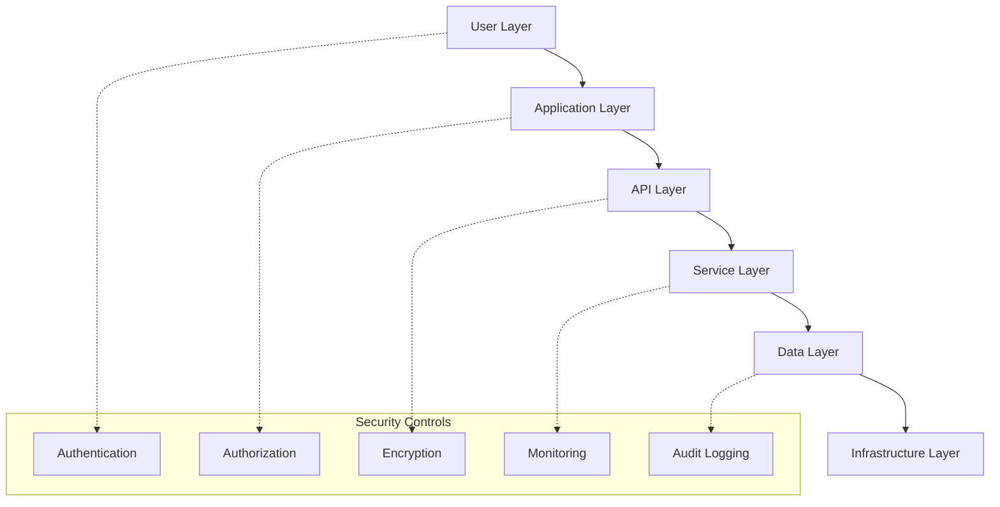

# Light on Campus - Security Documentation

**Document Version:** 1.0  
**Date:** January 2025  
**Classification:** Internal Use  
**Security Officer:** [Name]  
**Review Cycle:** Quarterly

---

## Table of Contents

1. [Security Overview](#1-security-overview)
2. [Authentication & Authorization](#2-authentication--authorization)
3. [Data Security](#3-data-security)
4. [Infrastructure Security](#4-infrastructure-security)
5. [Application Security](#5-application-security)
6. [API Security](#6-api-security)
7. [Compliance & Privacy](#7-compliance--privacy)
8. [Security Monitoring](#8-security-monitoring)
9. [Incident Response](#9-incident-response)
10. [Security Policies](#10-security-policies)
11. [Security Training](#11-security-training)
12. [Audit & Assessment](#12-audit--assessment)

---

## 1. Security Overview

### 1.1 Security Framework

Light on Campus implements a **Defense in Depth** security strategy with multiple layers of protection:



### 1.2 Security Principles

#### Core Principles
1. **Least Privilege**: Users and systems have minimum necessary access
2. **Defense in Depth**: Multiple security layers and controls
3. **Zero Trust**: Verify everything, trust nothing
4. **Data Minimization**: Collect only necessary data
5. **Privacy by Design**: Security and privacy built into system design
6. **Fail Secure**: Systems fail to a secure state
7. **Security Transparency**: Clear security practices and communication

#### Security Objectives
- **Confidentiality**: Protect user data and system information
- **Integrity**: Ensure data accuracy and system reliability
- **Availability**: Maintain system uptime and accessibility
- **Accountability**: Track and audit all security-relevant actions
- **Non-repudiation**: Ensure actions cannot be denied

### 1.3 Threat Model

#### Primary Threats
1. **Unauthorized Access**: Account takeover, privilege escalation
2. **Data Breaches**: Exposure of personal or academic information
3. **Injection Attacks**: SQL injection, XSS, code injection
4. **API Abuse**: Rate limiting bypass, unauthorized API access
5. **Social Engineering**: Phishing, impersonation attacks
6. **Insider Threats**: Malicious or negligent internal users
7. **Supply Chain**: Third-party service vulnerabilities

#### Risk Assessment Matrix
| Threat | Likelihood | Impact | Risk Level | Mitigation Priority |
|--------|------------|--------|------------|-------------------|
| Data Breach | Medium | High | High | 1 |
| Account Takeover | Medium | Medium | Medium | 2 |
| API Abuse | High | Low | Medium | 3 |
| XSS Attacks | Low | Medium | Low | 4 |
| Insider Threat | Low | High | Medium | 2 |

---

## 2. Authentication & Authorization

### 2.1 Authentication Architecture

#### Firebase Authentication
```typescript
// Authentication Configuration
const firebaseConfig = {
  apiKey: process.env.NEXT_PUBLIC_FIREBASE_API_KEY,
  authDomain: process.env.NEXT_PUBLIC_FIREBASE_AUTH_DOMAIN,
  projectId: process.env.NEXT_PUBLIC_FIREBASE_PROJECT_ID,
  // Additional config...
};

// Security Settings
const authSettings = {
  signInOptions: [
    EmailAuthProvider.PROVIDER_ID,
    GoogleAuthProvider.PROVIDER_ID, // Optional
  ],
  passwordPolicy: {
    minLength: 12,
    requireUppercase: true,
    requireLowercase: true,
    requireNumbers: true,
    requireSpecialChars: true,
  },
  sessionTimeout: 24 * 60 * 60 * 1000, // 24 hours
  maxLoginAttempts: 5,
  lockoutDuration: 30 * 60 * 1000, // 30 minutes
};
```

#### Password Requirements
- **Minimum Length**: 12 characters
- **Complexity**: Must include uppercase, lowercase, numbers, special characters
- **History**: Cannot reuse last 5 passwords
- **Expiration**: Passwords expire after 90 days (for admin accounts)
- **Strength Validation**: Real-time password strength checking

#### Multi-Factor Authentication
```typescript
// MFA Implementation (Future)
interface MFAConfig {
  methods: ['sms', 'email', 'authenticator'];
  required: boolean;
  backupCodes: number;
  challengeTimeout: number;
}

const mfaConfig: MFAConfig = {
  methods: ['email', 'authenticator'],
  required: false, // Optional for students, required for admins
  backupCodes: 10,
  challengeTimeout: 5 * 60 * 1000, // 5 minutes
};
```

### 2.2 Authorization Model

#### Role-Based Access Control (RBAC)
```typescript
// User Roles
enum UserRole {
  STUDENT = 'student',
  MODERATOR = 'moderator',
  ADMIN = 'admin',
  SUPER_ADMIN = 'super_admin'
}

// Permissions
enum Permission {
  // User permissions
  READ_PROFILE = 'user:read_profile',
  UPDATE_PROFILE = 'user:update_profile',
  DELETE_ACCOUNT = 'user:delete_account',
  
  // Content permissions
  CREATE_POST = 'content:create_post',
  EDIT_POST = 'content:edit_post',
  DELETE_POST = 'content:delete_post',
  MODERATE_CONTENT = 'content:moderate',
  
  // Admin permissions
  MANAGE_USERS = 'admin:manage_users',
  MANAGE_EVENTS = 'admin:manage_events',
  VIEW_ANALYTICS = 'admin:view_analytics',
  SYSTEM_CONFIG = 'admin:system_config',
}

// Role Permission Mapping
const rolePermissions: Record<UserRole, Permission[]> = {
  [UserRole.STUDENT]: [
    Permission.READ_PROFILE,
    Permission.UPDATE_PROFILE,
    Permission.DELETE_ACCOUNT,
    Permission.CREATE_POST,
    Permission.EDIT_POST,
  ],
  [UserRole.MODERATOR]: [
    ...rolePermissions[UserRole.STUDENT],
    Permission.MODERATE_CONTENT,
    Permission.DELETE_POST,
  ],
  [UserRole.ADMIN]: [
    ...rolePermissions[UserRole.MODERATOR],
    Permission.MANAGE_USERS,
    Permission.MANAGE_EVENTS,
    Permission.VIEW_ANALYTICS,
  ],
  [UserRole.SUPER_ADMIN]: [
    ...rolePermissions[UserRole.ADMIN],
    Permission.SYSTEM_CONFIG,
  ],
};
```

#### Authorization Middleware
```typescript
// Server-side Authorization
export async function requirePermission(
  request: Request,
  permission: Permission
): Promise<AuthenticatedUser> {
  const user = await getAuthenticatedUser(request);
  
  if (!user) {
    throw new UnauthorizedError('Authentication required');
  }
  
  const userPermissions = await getUserPermissions(user.uid);
  
  if (!userPermissions.includes(permission)) {
    throw new ForbiddenError(`Missing permission: ${permission}`);
  }
  
  return user;
}

// Usage in API routes
export async function DELETE(
  request: Request,
  { params }: { params: { postId: string } }
) {
  const user = await requirePermission(request, Permission.DELETE_POST);
  
  // Check if user owns the post or is moderator
  const post = await getPost(params.postId);
  
  if (post.authorId !== user.uid && !isModeratorOrAbove(user)) {
    throw new ForbiddenError('Cannot delete others\' posts');
  }
  
  await deletePost(params.postId);
  return Response.json({ success: true });
}
```

### 2.3 Session Management

#### Session Security
```typescript
// Session Configuration
const sessionConfig = {
  // Session duration
  maxAge: 24 * 60 * 60 * 1000, // 24 hours
  
  // Session refresh
  refreshThreshold: 30 * 60 * 1000, // Refresh if expires in 30 mins
  
  // Security settings
  httpOnly: true,
  secure: process.env.NODE_ENV === 'production',
  sameSite: 'strict' as const,
  
  // Session storage
  store: 'firebase', // Firebase sessions
  
  // Cleanup
  cleanupInterval: 60 * 60 * 1000, // 1 hour
};

// Session Validation
export async function validateSession(sessionToken: string) {
  try {
    const decodedToken = await admin.auth().verifyIdToken(sessionToken);
    
    // Check if token is not expired
    const now = Date.now() / 1000;
    if (decodedToken.exp < now) {
      throw new Error('Token expired');
    }
    
    // Check if user is still active
    const userRecord = await admin.auth().getUser(decodedToken.uid);
    if (userRecord.disabled) {
      throw new Error('User account disabled');
    }
    
    return {
      uid: decodedToken.uid,
      email: decodedToken.email,
      emailVerified: decodedToken.email_verified,
    };
  } catch (error) {
    throw new UnauthorizedError('Invalid session');
  }
}
```

---

## 3. Data Security

### 3.1 Data Classification

#### Data Categories
```typescript
enum DataClassification {
  PUBLIC = 'public',           // Publicly available information
  INTERNAL = 'internal',       // Internal platform data
  CONFIDENTIAL = 'confidential', // User personal data
  RESTRICTED = 'restricted'    // Highly sensitive data
}

// Data Classification Mapping
const dataClassifications = {
  // Public data
  eventInfo: DataClassification.PUBLIC,
  blogPosts: DataClassification.PUBLIC,
  publicResources: DataClassification.PUBLIC,
  
  // Internal data
  userActivity: DataClassification.INTERNAL,
  systemMetrics: DataClassification.INTERNAL,
  
  // Confidential data
  userProfiles: DataClassification.CONFIDENTIAL,
  forumPosts: DataClassification.CONFIDENTIAL,
  aiRequests: DataClassification.CONFIDENTIAL,
  
  // Restricted data
  authTokens: DataClassification.RESTRICTED,
  apiKeys: DataClassification.RESTRICTED,
  auditLogs: DataClassification.RESTRICTED,
};
```

#### Data Handling Requirements
| Classification | Storage | Transmission | Access | Retention |
|----------------|---------|--------------|--------|-----------|
| **Public** | Standard | HTTPS | Anyone | Indefinite |
| **Internal** | Encrypted | HTTPS | Employees | 3 years |
| **Confidential** | Encrypted | HTTPS + Auth | Authorized users | 2 years |
| **Restricted** | Encrypted + Isolated | HTTPS + MFA | Admin only | 1 year |

### 3.2 Data Encryption

#### Encryption at Rest
```typescript
// Firebase Firestore (automatic encryption)
// - All data encrypted with AES-256
// - Google-managed encryption keys
// - Automatic key rotation

// Additional encryption for sensitive fields
import { encrypt, decrypt } from '@/lib/encryption';

interface EncryptedField {
  data: string;      // Encrypted data
  iv: string;        // Initialization vector
  tag: string;       // Authentication tag
}

// Encrypt sensitive user data
export async function encryptSensitiveData(data: string): Promise<EncryptedField> {
  const key = await getEncryptionKey();
  return encrypt(data, key);
}

// Example: Encrypting PII in user profiles
const userProfile = {
  uid: user.uid,
  email: user.email,
  displayName: user.displayName,
  // Encrypt sensitive academic information
  academicInfo: await encryptSensitiveData(JSON.stringify(academicData)),
  preferences: user.preferences,
};
```

#### Encryption in Transit
```typescript
// HTTPS Configuration
const httpsConfig = {
  // TLS version
  minVersion: 'TLSv1.2',
  maxVersion: 'TLSv1.3',
  
  // Cipher suites
  ciphers: [
    'ECDHE-RSA-AES128-GCM-SHA256',
    'ECDHE-RSA-AES256-GCM-SHA384',
    'ECDHE-RSA-CHACHA20-POLY1305',
  ],
  
  // Certificate validation
  rejectUnauthorized: true,
  
  // HSTS
  hsts: {
    maxAge: 31536000, // 1 year
    includeSubDomains: true,
    preload: true,
  },
};

// Security Headers
const securityHeaders = {
  'Strict-Transport-Security': 'max-age=31536000; includeSubDomains; preload',
  'Content-Security-Policy': `
    default-src 'self';
    script-src 'self' 'unsafe-eval' *.googleapis.com;
    style-src 'self' 'unsafe-inline' *.googleapis.com;
    img-src 'self' blob: data: *.placehold.co;
    connect-src 'self' *.googleapis.com *.firebase.com;
  `.replace(/\s+/g, ' ').trim(),
  'X-Content-Type-Options': 'nosniff',
  'X-Frame-Options': 'DENY',
  'X-XSS-Protection': '1; mode=block',
  'Referrer-Policy': 'strict-origin-when-cross-origin',
};
```

### 3.3 Data Loss Prevention (DLP)

#### Data Access Controls
```typescript
// Firestore Security Rules
const firestoreRules = `
rules_version = '2';
service cloud.firestore {
  match /databases/{database}/documents {
    // User data - only accessible by the user
    match /users/{userId} {
      allow read, write: if request.auth != null && request.auth.uid == userId;
      allow read: if request.auth != null && hasRole('admin');
    }
    
    // Audit logs - admin read only
    match /audit_logs/{logId} {
      allow read: if request.auth != null && hasRole('admin');
      allow write: if false; // Only system can write
    }
    
    // Forum posts - public read, authenticated write
    match /forum_posts/{postId} {
      allow read: if true;
      allow create: if request.auth != null && validatePostData();
      allow update, delete: if request.auth != null && 
        (request.auth.uid == resource.data.authorId || hasRole('moderator'));
    }
    
    // Helper functions
    function hasRole(role) {
      return request.auth != null && 
        get(/databases/$(database)/documents/users/$(request.auth.uid)).data.roles[role] == true;
    }
    
    function validatePostData() {
      return request.resource.data.keys().hasAll(['title', 'content', 'authorId']) &&
        request.resource.data.authorId == request.auth.uid &&
        request.resource.data.title.size() <= 200 &&
        request.resource.data.content.size() <= 10000;
    }
  }
}`;
```

#### Data Masking
```typescript
// Sensitive data masking for logs and analytics
export function maskSensitiveData(data: any): any {
  const sensitiveFields = ['email', 'phone', 'ssn', 'creditCard'];
  
  return Object.keys(data).reduce((masked, key) => {
    if (sensitiveFields.includes(key)) {
      // Mask email: user@example.com -> u***@e***.com
      if (key === 'email') {
        const email = data[key];
        const [local, domain] = email.split('@');
        masked[key] = `${local[0]}***@${domain[0]}***.${domain.split('.').pop()}`;
      } else {
        // Mask other fields
        masked[key] = '***';
      }
    } else {
      masked[key] = data[key];
    }
    return masked;
  }, {});
}

// Usage in logging
export function logUserActivity(userId: string, activity: string, data: any) {
  const maskedData = maskSensitiveData(data);
  
  logger.info('User activity', {
    userId: hashUserId(userId), // Hash user ID for privacy
    activity,
    data: maskedData,
    timestamp: new Date().toISOString(),
  });
}
```

---

## 4. Infrastructure Security

### 4.1 Firebase Security

#### Project Configuration
```yaml
# Firebase project security settings
firebase_config:
  # Authentication
  auth:
    domain_verification: true
    authorized_domains:
      - lightoncampus.com
      - staging.lightoncampus.com
    
    # Password policy
    password_policy:
      min_length: 12
      require_uppercase: true
      require_lowercase: true
      require_numeric: true
      require_special: true
    
    # Account lockout
    account_lockout:
      enabled: true
      max_attempts: 5
      lockout_duration: 1800 # 30 minutes
  
  # Firestore
  firestore:
    rules_version: '2'
    security_rules_file: 'firestore.rules'
    
  # Storage
  storage:
    rules_version: '2'
    security_rules_file: 'storage.rules'
    
  # Hosting
  hosting:
    ssl_certificate: managed
    hsts_enabled: true
    redirect_http_to_https: true
```

#### Network Security
```typescript
// Firebase App Hosting security configuration
const hostingConfig = {
  // SSL/TLS
  ssl: {
    certificate: 'managed', // Google-managed SSL certificates
    minTlsVersion: '1.2',
    cipherSuites: 'modern',
  },
  
  // Headers
  headers: securityHeaders,
  
  // Redirects
  redirects: [
    {
      source: 'http://lightoncampus.com/**',
      destination: 'https://lightoncampus.com/**',
      type: 301, // Permanent redirect
    },
  ],
  
  // Rate limiting (via Cloud Armor - future)
  rateLimiting: {
    requestsPerMinute: 1000,
    burstCapacity: 2000,
    blockDuration: 600, // 10 minutes
  },
};
```

### 4.2 API Security

#### API Gateway Protection
```typescript
// Rate limiting implementation
import { Ratelimit } from '@upstash/ratelimit';
import { Redis } from '@upstash/redis';

const rateLimits = {
  // General API limits
  general: new Ratelimit({
    redis: Redis.fromEnv(),
    limiter: Ratelimit.slidingWindow(1000, '1 h'),
    analytics: true,
  }),
  
  // AI service limits
  aiServices: new Ratelimit({
    redis: Redis.fromEnv(),
    limiter: Ratelimit.slidingWindow(50, '1 h'),
    analytics: true,
  }),
  
  // Authentication limits
  auth: new Ratelimit({
    redis: Redis.fromEnv(),
    limiter: Ratelimit.slidingWindow(10, '15 m'),
    analytics: true,
  }),
};

// API security middleware
export async function securityMiddleware(request: Request) {
  const ip = request.headers.get('x-forwarded-for') || 'unknown';
  const userAgent = request.headers.get('user-agent') || 'unknown';
  
  // Rate limiting
  const { success, limit, reset, remaining } = await rateLimits.general.limit(ip);
  
  if (!success) {
    return new Response('Rate limit exceeded', {
      status: 429,
      headers: {
        'X-RateLimit-Limit': limit.toString(),
        'X-RateLimit-Remaining': remaining.toString(),
        'X-RateLimit-Reset': reset.toString(),
        'Retry-After': Math.round((reset - Date.now()) / 1000).toString(),
      },
    });
  }
  
  // Request validation
  await validateRequest(request);
  
  // Log security events
  await logSecurityEvent('api_request', {
    ip,
    userAgent,
    path: new URL(request.url).pathname,
    method: request.method,
    timestamp: new Date().toISOString(),
  });
  
  return null; // Continue processing
}
```

#### Input Validation & Sanitization
```typescript
import { z } from 'zod';
import DOMPurify from 'isomorphic-dompurify';

// Input validation schemas
const userInputSchemas = {
  resumeBuilder: z.object({
    resumeText: z.string()
      .min(100, 'Resume text too short')
      .max(50000, 'Resume text too long')
      .refine(text => !containsSqlInjection(text), 'Invalid content detected'),
    jobDescription: z.string()
      .max(10000, 'Job description too long')
      .optional(),
  }),
  
  forumPost: z.object({
    title: z.string()
      .min(5, 'Title too short')
      .max(200, 'Title too long')
      .refine(title => !containsXSS(title), 'Invalid title content'),
    content: z.string()
      .min(10, 'Content too short')
      .max(10000, 'Content too long'),
    category: z.enum(['academic', 'career', 'social', 'general']),
    tags: z.array(z.string().max(50)).max(10),
  }),
};

// Security validation functions
function containsSqlInjection(input: string): boolean {
  const sqlPatterns = [
    /(\b(SELECT|INSERT|UPDATE|DELETE|DROP|CREATE|ALTER|EXEC|UNION)\b)/i,
    /(\b(OR|AND)\s+\d+\s*=\s*\d+)/i,
    /(--|\/\*|\*\/)/,
    /(\b(SCRIPT|JAVASCRIPT|VBSCRIPT)\b)/i,
  ];
  
  return sqlPatterns.some(pattern => pattern.test(input));
}

function containsXSS(input: string): boolean {
  const xssPatterns = [
    /<script\b[^<]*(?:(?!<\/script>)<[^<]*)*<\/script>/gi,
    /javascript:/gi,
    /on\w+\s*=/gi,
    /<iframe\b[^<]*(?:(?!<\/iframe>)<[^<]*)*<\/iframe>/gi,
  ];
  
  return xssPatterns.some(pattern => pattern.test(input));
}

// Content sanitization
export function sanitizeContent(content: string): string {
  return DOMPurify.sanitize(content, {
    ALLOWED_TAGS: ['b', 'i', 'u', 'strong', 'em', 'p', 'br', 'ul', 'ol', 'li'],
    ALLOWED_ATTR: [],
    FORBID_SCRIPT: true,
    FORBID_TAGS: ['script', 'object', 'embed', 'form', 'input'],
  });
}

// Validation middleware
export async function validateAndSanitize<T>(
  data: unknown,
  schema: z.ZodSchema<T>
): Promise<T> {
  // Validate structure
  const validatedData = schema.parse(data);
  
  // Sanitize string fields
  const sanitizedData = JSON.parse(JSON.stringify(validatedData), (key, value) => {
    if (typeof value === 'string') {
      return sanitizeContent(value);
    }
    return value;
  });
  
  return sanitizedData;
}
```

---

## 5. Application Security

### 5.1 Frontend Security

#### Content Security Policy (CSP)
```typescript
// Comprehensive CSP configuration
const cspDirectives = {
  'default-src': ["'self'"],
  'script-src': [
    "'self'",
    "'unsafe-eval'", // Required for Next.js
    'https://apis.google.com',
    'https://www.google.com',
    'https://cdn.jsdelivr.net',
  ],
  'style-src': [
    "'self'",
    "'unsafe-inline'", // Required for styled-components
    'https://fonts.googleapis.com',
  ],
  'img-src': [
    "'self'",
    'blob:',
    'data:',
    'https:',
  ],
  'font-src': [
    "'self'",
    'https://fonts.gstatic.com',
  ],
  'connect-src': [
    "'self'",
    'https://api.openai.com',
    'https://generativelanguage.googleapis.com',
    'https://*.firebase.com',
    'https://*.googleapis.com',
  ],
  'frame-ancestors': ["'none'"],
  'form-action': ["'self'"],
  'base-uri': ["'self'"],
  'object-src': ["'none'"],
  'media-src': ["'self'"],
};

// Generate CSP header
const cspHeader = Object.entries(cspDirectives)
  .map(([directive, sources]) => `${directive} ${sources.join(' ')}`)
  .join('; ');
```

#### Client-side Security
```typescript
// Secure local storage handling
class SecureStorage {
  private static readonly PREFIX = 'loc_';
  private static readonly ENCRYPTION_KEY = 'user-session-key';
  
  static setItem(key: string, value: any): void {
    try {
      const encrypted = this.encrypt(JSON.stringify(value));
      localStorage.setItem(this.PREFIX + key, encrypted);
    } catch (error) {
      console.error('Failed to store secure item:', error);
    }
  }
  
  static getItem<T>(key: string): T | null {
    try {
      const encrypted = localStorage.getItem(this.PREFIX + key);
      if (!encrypted) return null;
      
      const decrypted = this.decrypt(encrypted);
      return JSON.parse(decrypted);
    } catch (error) {
      console.error('Failed to retrieve secure item:', error);
      return null;
    }
  }
  
  static removeItem(key: string): void {
    localStorage.removeItem(this.PREFIX + key);
  }
  
  static clear(): void {
    Object.keys(localStorage)
      .filter(key => key.startsWith(this.PREFIX))
      .forEach(key => localStorage.removeItem(key));
  }
  
  private static encrypt(data: string): string {
    // Simple encryption for demo - use proper encryption in production
    return btoa(data);
  }
  
  private static decrypt(data: string): string {
    return atob(data);
  }
}

// Secure form handling
export class SecureForm {
  private static validateCSRF(token: string): boolean {
    // CSRF token validation
    const storedToken = SecureStorage.getItem<string>('csrf_token');
    return storedToken === token;
  }
  
  static async submitSecurely(
    formData: FormData,
    endpoint: string,
    options: RequestInit = {}
  ) {
    // Add CSRF token
    const csrfToken = SecureStorage.getItem<string>('csrf_token');
    if (csrfToken) {
      formData.append('csrf_token', csrfToken);
    }
    
    // Add security headers
    const headers = {
      'X-Requested-With': 'XMLHttpRequest',
      'X-Content-Type-Options': 'nosniff',
      ...options.headers,
    };
    
    return fetch(endpoint, {
      method: 'POST',
      body: formData,
      headers,
      credentials: 'same-origin',
      ...options,
    });
  }
}
```

### 5.2 Server-side Security

#### Server Actions Security
```typescript
// Secure server action wrapper
export function secureServerAction<T extends any[], R>(
  action: (...args: T) => Promise<R>,
  options: {
    requireAuth?: boolean;
    requiredPermissions?: Permission[];
    rateLimitKey?: string;
    validateInput?: z.ZodSchema;
  } = {}
) {
  return async (...args: T): Promise<R> => {
    const startTime = Date.now();
    let user: AuthenticatedUser | null = null;
    
    try {
      // Authentication check
      if (options.requireAuth) {
        user = await getAuthenticatedUser();
        if (!user) {
          throw new UnauthorizedError('Authentication required');
        }
      }
      
      // Permission check
      if (options.requiredPermissions && user) {
        const userPermissions = await getUserPermissions(user.uid);
        const hasAllPermissions = options.requiredPermissions.every(
          permission => userPermissions.includes(permission)
        );
        
        if (!hasAllPermissions) {
          throw new ForbiddenError('Insufficient permissions');
        }
      }
      
      // Rate limiting
      if (options.rateLimitKey && user) {
        const rateLimitResult = await checkRateLimit(options.rateLimitKey, user.uid);
        if (!rateLimitResult.allowed) {
          throw new RateLimitError('Rate limit exceeded');
        }
      }
      
      // Input validation
      if (options.validateInput && args.length > 0) {
        args[0] = options.validateInput.parse(args[0]);
      }
      
      // Execute action
      const result = await action(...args);
      
      // Audit logging
      await logAuditEvent('server_action', {
        action: action.name,
        userId: user?.uid,
        success: true,
        duration: Date.now() - startTime,
        timestamp: new Date().toISOString(),
      });
      
      return result;
    } catch (error) {
      // Error logging
      await logSecurityEvent('server_action_error', {
        action: action.name,
        userId: user?.uid,
        error: error.message,
        duration: Date.now() - startTime,
        timestamp: new Date().toISOString(),
      });
      
      throw error;
    }
  };
}

// Usage example
export const secureAIResumeBuilder = secureServerAction(
  aiResumeBuilder,
  {
    requireAuth: true,
    rateLimitKey: 'ai_resume_builder',
    validateInput: userInputSchemas.resumeBuilder,
  }
);
```

---

## 6. API Security

### 6.1 API Authentication

#### JWT Token Security
```typescript
// Token configuration
const jwtConfig = {
  issuer: 'https://lightoncampus.com',
  audience: ['lightoncampus-api'],
  algorithm: 'RS256' as const,
  expiresIn: '1h',
  refreshExpiresIn: '7d',
  
  // Security settings
  clockTolerance: 30, // 30 seconds
  maxAge: '1h',
  issueAt: true,
  notBefore: true,
};

// Token validation middleware
export async function validateAPIToken(request: Request): Promise<TokenPayload> {
  const authHeader = request.headers.get('Authorization');
  const token = authHeader?.startsWith('Bearer ') ? authHeader.slice(7) : null;
  
  if (!token) {
    throw new UnauthorizedError('Missing authorization token');
  }
  
  try {
    // Verify Firebase ID token
    const decodedToken = await admin.auth().verifyIdToken(token);
    
    // Additional security checks
    if (!decodedToken.email_verified) {
      throw new UnauthorizedError('Email not verified');
    }
    
    // Check for token hijacking
    await validateTokenSecurity(decodedToken, request);
    
    return {
      uid: decodedToken.uid,
      email: decodedToken.email,
      roles: decodedToken.roles || ['student'],
      permissions: await getUserPermissions(decodedToken.uid),
    };
  } catch (error) {
    throw new UnauthorizedError('Invalid token');
  }
}

// Token security validation
async function validateTokenSecurity(
  token: any,
  request: Request
): Promise<void> {
  const clientIP = request.headers.get('x-forwarded-for') || 'unknown';
  const userAgent = request.headers.get('user-agent') || 'unknown';
  
  // Check for suspicious activity
  const lastActivity = await getLastUserActivity(token.uid);
  
  if (lastActivity) {
    // Check for IP address changes
    if (lastActivity.ip !== clientIP) {
      await logSecurityEvent('ip_change', {
        userId: token.uid,
        oldIP: lastActivity.ip,
        newIP: clientIP,
        timestamp: new Date().toISOString(),
      });
    }
    
    // Check for user agent changes
    if (lastActivity.userAgent !== userAgent) {
      await logSecurityEvent('user_agent_change', {
        userId: token.uid,
        oldUserAgent: lastActivity.userAgent,
        newUserAgent: userAgent,
        timestamp: new Date().toISOString(),
      });
    }
  }
  
  // Update last activity
  await updateLastUserActivity(token.uid, {
    ip: clientIP,
    userAgent,
    timestamp: new Date().toISOString(),
  });
}
```

### 6.2 API Rate Limiting

#### Advanced Rate Limiting
```typescript
// Multi-tier rate limiting
class AdvancedRateLimit {
  private redis: Redis;
  
  constructor() {
    this.redis = Redis.fromEnv();
  }
  
  async checkLimit(
    identifier: string,
    limits: RateLimitTier[]
  ): Promise<RateLimitResult> {
    const results = await Promise.all(
      limits.map(limit => this.checkSingleLimit(identifier, limit))
    );
    
    // Return the most restrictive result
    const blocked = results.find(result => !result.allowed);
    return blocked || results[0];
  }
  
  private async checkSingleLimit(
    identifier: string,
    limit: RateLimitTier
  ): Promise<RateLimitResult> {
    const key = `ratelimit:${limit.name}:${identifier}`;
    const window = limit.windowMs;
    const maxRequests = limit.maxRequests;
    
    const current = await this.redis.incr(key);
    
    if (current === 1) {
      await this.redis.expire(key, Math.ceil(window / 1000));
    }
    
    const ttl = await this.redis.ttl(key);
    const resetTime = Date.now() + (ttl * 1000);
    
    return {
      allowed: current <= maxRequests,
      limit: maxRequests,
      remaining: Math.max(0, maxRequests - current),
      resetTime,
      retryAfter: current > maxRequests ? ttl : 0,
    };
  }
}

// Rate limit tiers
const rateLimitTiers: Record<string, RateLimitTier[]> = {
  general: [
    { name: 'burst', windowMs: 60 * 1000, maxRequests: 100 }, // 100/minute
    { name: 'sustained', windowMs: 60 * 60 * 1000, maxRequests: 1000 }, // 1000/hour
  ],
  ai_services: [
    { name: 'burst', windowMs: 60 * 1000, maxRequests: 5 }, // 5/minute
    { name: 'sustained', windowMs: 60 * 60 * 1000, maxRequests: 50 }, // 50/hour
  ],
  auth: [
    { name: 'login_attempts', windowMs: 15 * 60 * 1000, maxRequests: 10 }, // 10/15min
    { name: 'password_reset', windowMs: 60 * 60 * 1000, maxRequests: 3 }, // 3/hour
  ],
};
```

---

## 7. Compliance & Privacy

### 7.1 Data Privacy Compliance

#### GDPR Compliance
```typescript
// GDPR data processing record
interface DataProcessingRecord {
  purpose: string;
  legalBasis: 'consent' | 'contract' | 'legal_obligation' | 'vital_interests' | 'public_task' | 'legitimate_interests';
  dataCategories: string[];
  dataSubjects: string[];
  recipients: string[];
  transfers: ThirdCountryTransfer[];
  retentionPeriod: string;
  securityMeasures: string[];
}

const dataProcessingRecords: DataProcessingRecord[] = [
  {
    purpose: 'User account management',
    legalBasis: 'contract',
    dataCategories: ['identity_data', 'contact_data', 'academic_data'],
    dataSubjects: ['students', 'faculty'],
    recipients: ['internal_staff'],
    transfers: [],
    retentionPeriod: '2_years_after_graduation',
    securityMeasures: ['encryption', 'access_controls', 'audit_logging'],
  },
  {
    purpose: 'AI service provision',
    legalBasis: 'consent',
    dataCategories: ['academic_content', 'usage_data'],
    dataSubjects: ['students'],
    recipients: ['google_ai_services'],
    transfers: [
      {
        country: 'United States',
        adequacyDecision: false,
        safeguards: 'standard_contractual_clauses',
      },
    ],
    retentionPeriod: '30_days',
    securityMeasures: ['encryption', 'pseudonymization', 'data_minimization'],
  },
];

// Privacy controls implementation
export class PrivacyControls {
  // Right to access
  static async exportUserData(userId: string): Promise<UserDataExport> {
    const userData = await getUserData(userId);
    const forumPosts = await getUserForumPosts(userId);
    const aiRequests = await getUserAIRequests(userId);
    
    return {
      userData: this.maskSensitiveExportData(userData),
      forumPosts: forumPosts.map(post => ({
        id: post.id,
        title: post.title,
        content: post.content,
        createdAt: post.createdAt,
      })),
      aiRequests: aiRequests.map(request => ({
        service: request.service,
        createdAt: request.createdAt,
        // Exclude actual content for privacy
      })),
      exportDate: new Date().toISOString(),
    };
  }
  
  // Right to rectification
  static async updateUserData(
    userId: string,
    updates: Partial<UserProfile>
  ): Promise<void> {
    // Validate updates
    const validatedUpdates = userProfileUpdateSchema.parse(updates);
    
    // Update data
    await updateUserProfile(userId, validatedUpdates);
    
    // Log the update
    await logPrivacyEvent('data_rectification', {
      userId,
      updatedFields: Object.keys(validatedUpdates),
      timestamp: new Date().toISOString(),
    });
  }
  
  // Right to erasure (right to be forgotten)
  static async deleteUserData(userId: string): Promise<void> {
    const deleteOperations = [
      // Delete user profile
      deleteUserProfile(userId),
      
      // Anonymize forum posts (preserve content, remove attribution)
      anonymizeUserForumPosts(userId),
      
      // Delete AI requests and results
      deleteUserAIRequests(userId),
      
      // Delete audit logs older than legal requirement
      deleteOldAuditLogs(userId),
      
      // Delete authentication data
      admin.auth().deleteUser(userId),
    ];
    
    await Promise.all(deleteOperations);
    
    // Log the deletion
    await logPrivacyEvent('data_erasure', {
      userId,
      timestamp: new Date().toISOString(),
    });
  }
  
  // Data portability
  static async generateDataPortabilityExport(userId: string): Promise<string> {
    const userData = await this.exportUserData(userId);
    
    // Generate machine-readable format
    const portabilityData = {
      ...userData,
      format: 'json',
      version: '1.0',
      generatedAt: new Date().toISOString(),
    };
    
    return JSON.stringify(portabilityData, null, 2);
  }
}
```

#### FERPA Compliance
```typescript
// FERPA educational records handling
interface EducationalRecord {
  studentId: string;
  recordType: 'academic' | 'disciplinary' | 'financial' | 'health';
  content: any;
  accessLevel: 'student' | 'parent' | 'school_official' | 'authorized_third_party';
  consentRequired: boolean;
  retentionPeriod: number; // years
}

// FERPA compliance controls
export class FERPAControls {
  // Directory information disclosure
  static readonly DIRECTORY_INFO = [
    'name',
    'major',
    'year_of_study',
    'enrollment_status',
    'degrees_received',
  ];
  
  // Authorized disclosure without consent
  static canDiscloseWithoutConsent(
    record: EducationalRecord,
    recipient: string,
    purpose: string
  ): boolean {
    const authorizedPurposes = [
      'school_officials_legitimate_interest',
      'other_schools_transfer',
      'audit_evaluation',
      'financial_aid',
      'accrediting_organizations',
      'court_order_subpoena',
      'health_safety_emergency',
    ];
    
    return authorizedPurposes.includes(purpose) ||
           this.DIRECTORY_INFO.every(field => 
             !Object.keys(record.content).includes(field)
           );
  }
  
  // Student consent management
  static async getStudentConsent(
    studentId: string,
    purpose: string,
    recipient: string
  ): Promise<boolean> {
    const consent = await getStoredConsent(studentId, purpose, recipient);
    return consent?.granted && !consent.expired;
  }
  
  // Access logging for FERPA compliance
  static async logEducationalRecordAccess(
    studentId: string,
    accessedBy: string,
    purpose: string,
    recordsAccessed: string[]
  ): Promise<void> {
    await logAuditEvent('ferpa_record_access', {
      studentId,
      accessedBy,
      purpose,
      recordsAccessed,
      timestamp: new Date().toISOString(),
      retentionPeriod: '7_years', // FERPA requirement
    });
  }
}
```

### 7.2 Cookie Policy

```typescript
// Cookie classification and management
enum CookieCategory {
  NECESSARY = 'necessary',
  FUNCTIONAL = 'functional',
  ANALYTICS = 'analytics',
  MARKETING = 'marketing',
}

interface CookieDefinition {
  name: string;
  category: CookieCategory;
  purpose: string;
  duration: string;
  thirdParty: boolean;
  consentRequired: boolean;
}

const cookieDefinitions: CookieDefinition[] = [
  {
    name: 'session_token',
    category: CookieCategory.NECESSARY,
    purpose: 'Maintain user authentication session',
    duration: '24 hours',
    thirdParty: false,
    consentRequired: false,
  },
  {
    name: 'csrf_token',
    category: CookieCategory.NECESSARY,
    purpose: 'Prevent cross-site request forgery attacks',
    duration: 'Session',
    thirdParty: false,
    consentRequired: false,
  },
  {
    name: 'preferences',
    category: CookieCategory.FUNCTIONAL,
    purpose: 'Store user preferences and settings',
    duration: '1 year',
    thirdParty: false,
    consentRequired: true,
  },
  {
    name: '_ga',
    category: CookieCategory.ANALYTICS,
    purpose: 'Google Analytics tracking',
    duration: '2 years',
    thirdParty: true,
    consentRequired: true,
  },
];

// Cookie consent management
export class CookieConsent {
  static async recordConsent(
    userId: string,
    consentedCategories: CookieCategory[]
  ): Promise<void> {
    const consent = {
      userId,
      categories: consentedCategories,
      timestamp: new Date().toISOString(),
      version: '1.0',
      ipAddress: await getClientIP(),
    };
    
    await storeConsent(consent);
    await this.applyCookieSettings(consentedCategories);
  }
  
  static async applyCookieSettings(
    allowedCategories: CookieCategory[]
  ): Promise<void> {
    // Remove cookies for non-consented categories
    cookieDefinitions
      .filter(cookie => 
        cookie.consentRequired && 
        !allowedCategories.includes(cookie.category)
      )
      .forEach(cookie => {
        document.cookie = `${cookie.name}=; expires=Thu, 01 Jan 1970 00:00:00 GMT; path=/`;
      });
    
    // Initialize allowed tracking
    if (allowedCategories.includes(CookieCategory.ANALYTICS)) {
      this.initializeAnalytics();
    }
  }
  
  private static initializeAnalytics(): void {
    // Initialize Google Analytics only with consent
    if (typeof window !== 'undefined' && window.gtag) {
      window.gtag('consent', 'update', {
        analytics_storage: 'granted',
      });
    }
  }
}
```

---

## 8. Security Monitoring

### 8.1 Security Event Logging

#### Centralized Logging
```typescript
// Security event types
enum SecurityEventType {
  LOGIN_SUCCESS = 'login_success',
  LOGIN_FAILURE = 'login_failure',
  PASSWORD_CHANGE = 'password_change',
  PERMISSION_DENIED = 'permission_denied',
  SUSPICIOUS_ACTIVITY = 'suspicious_activity',
  DATA_ACCESS = 'data_access',
  API_ABUSE = 'api_abuse',
  INJECTION_ATTEMPT = 'injection_attempt',
  XSS_ATTEMPT = 'xss_attempt',
  CSRF_ATTEMPT = 'csrf_attempt',
}

interface SecurityEvent {
  type: SecurityEventType;
  userId?: string;
  sessionId?: string;
  ipAddress: string;
  userAgent: string;
  details: Record<string, any>;
  severity: 'low' | 'medium' | 'high' | 'critical';
  timestamp: string;
  source: string;
}

// Security logger
export class SecurityLogger {
  private static async log(event: SecurityEvent): Promise<void> {
    // Log to multiple destinations
    await Promise.all([
      this.logToFirestore(event),
      this.logToCloudLogging(event),
      this.logToSIEM(event), // Future: SIEM integration
    ]);
    
    // Real-time alerting for critical events
    if (event.severity === 'critical') {
      await this.sendAlert(event);
    }
  }
  
  static async logSecurityEvent(
    type: SecurityEventType,
    details: Record<string, any>,
    severity: SecurityEvent['severity'] = 'medium',
    request?: Request
  ): Promise<void> {
    const event: SecurityEvent = {
      type,
      userId: details.userId,
      sessionId: details.sessionId,
      ipAddress: request?.headers.get('x-forwarded-for') || 'unknown',
      userAgent: request?.headers.get('user-agent') || 'unknown',
      details,
      severity,
      timestamp: new Date().toISOString(),
      source: 'application',
    };
    
    await this.log(event);
  }
  
  private static async logToFirestore(event: SecurityEvent): Promise<void> {
    const db = getFirestore();
    await db.collection('security_events').add(event);
  }
  
  private static async logToCloudLogging(event: SecurityEvent): Promise<void> {
    console.log('SECURITY_EVENT', JSON.stringify(event));
  }
  
  private static async sendAlert(event: SecurityEvent): Promise<void> {
    // Send alerts via multiple channels
    await Promise.all([
      this.sendEmailAlert(event),
      this.sendSlackAlert(event),
      this.triggerPagerDuty(event),
    ]);
  }
}

// Automated threat detection
export class ThreatDetection {
  // Detect brute force attacks
  static async detectBruteForce(
    identifier: string,
    eventType: SecurityEventType
  ): Promise<boolean> {
    const timeWindow = 15 * 60 * 1000; // 15 minutes
    const threshold = 10;
    
    const recentEvents = await getRecentSecurityEvents(
      identifier,
      eventType,
      timeWindow
    );
    
    if (recentEvents.length >= threshold) {
      await SecurityLogger.logSecurityEvent(
        SecurityEventType.SUSPICIOUS_ACTIVITY,
        {
          identifier,
          eventType,
          eventCount: recentEvents.length,
          pattern: 'brute_force',
        },
        'high'
      );
      
      return true;
    }
    
    return false;
  }
  
  // Detect unusual access patterns
  static async detectAnomalousActivity(userId: string): Promise<void> {
    const userActivity = await getUserActivityProfile(userId);
    const recentActivity = await getRecentUserActivity(userId, 24 * 60 * 60 * 1000);
    
    // Check for unusual login times
    if (this.isUnusualLoginTime(userActivity.typicalLoginHours, recentActivity)) {
      await SecurityLogger.logSecurityEvent(
        SecurityEventType.SUSPICIOUS_ACTIVITY,
        {
          userId,
          pattern: 'unusual_login_time',
          details: recentActivity,
        },
        'medium'
      );
    }
    
    // Check for unusual locations
    if (this.isUnusualLocation(userActivity.typicalLocations, recentActivity)) {
      await SecurityLogger.logSecurityEvent(
        SecurityEventType.SUSPICIOUS_ACTIVITY,
        {
          userId,
          pattern: 'unusual_location',
          details: recentActivity,
        },
        'high'
      );
    }
  }
}
```

### 8.2 Real-time Monitoring

#### Security Dashboard
```typescript
// Security metrics collection
interface SecurityMetrics {
  authenticationEvents: {
    successful: number;
    failed: number;
    rate: number;
  };
  apiSecurity: {
    totalRequests: number;
    rateLimitedRequests: number;
    suspiciousRequests: number;
  };
  dataAccess: {
    totalAccess: number;
    unauthorizedAttempts: number;
    sensitiveDataAccess: number;
  };
  threats: {
    detectedThreats: number;
    blockedAttacks: number;
    falsePositives: number;
  };
}

// Real-time security monitoring
export class SecurityMonitor {
  private static metrics: SecurityMetrics = {
    authenticationEvents: { successful: 0, failed: 0, rate: 0 },
    apiSecurity: { totalRequests: 0, rateLimitedRequests: 0, suspiciousRequests: 0 },
    dataAccess: { totalAccess: 0, unauthorizedAttempts: 0, sensitiveDataAccess: 0 },
    threats: { detectedThreats: 0, blockedAttacks: 0, falsePositives: 0 },
  };
  
  static async updateMetrics(): Promise<void> {
    const timeWindow = 60 * 60 * 1000; // 1 hour
    const now = Date.now();
    
    // Authentication metrics
    const authEvents = await getSecurityEvents(
      [SecurityEventType.LOGIN_SUCCESS, SecurityEventType.LOGIN_FAILURE],
      now - timeWindow
    );
    
    this.metrics.authenticationEvents = {
      successful: authEvents.filter(e => e.type === SecurityEventType.LOGIN_SUCCESS).length,
      failed: authEvents.filter(e => e.type === SecurityEventType.LOGIN_FAILURE).length,
      rate: authEvents.length / 60, // events per minute
    };
    
    // API security metrics
    const apiEvents = await getAPIMetrics(now - timeWindow);
    this.metrics.apiSecurity = apiEvents;
    
    // Data access metrics
    const dataEvents = await getDataAccessMetrics(now - timeWindow);
    this.metrics.dataAccess = dataEvents;
    
    // Threat detection metrics
    const threatEvents = await getThreatMetrics(now - timeWindow);
    this.metrics.threats = threatEvents;
  }
  
  static getMetrics(): SecurityMetrics {
    return { ...this.metrics };
  }
  
  // Health check for security systems
  static async performSecurityHealthCheck(): Promise<SecurityHealthStatus> {
    const checks = await Promise.allSettled([
      this.checkAuthenticationSystem(),
      this.checkRateLimiting(),
      this.checkDataEncryption(),
      this.checkAuditLogging(),
      this.checkThreatDetection(),
    ]);
    
    const results = checks.map((check, index) => ({
      component: ['auth', 'rate_limiting', 'encryption', 'audit', 'threat_detection'][index],
      status: check.status === 'fulfilled' ? 'healthy' : 'unhealthy',
      details: check.status === 'rejected' ? check.reason : 'OK',
    }));
    
    const overallHealth = results.every(r => r.status === 'healthy') ? 'healthy' : 'degraded';
    
    return {
      status: overallHealth,
      components: results,
      timestamp: new Date().toISOString(),
    };
  }
}
```

---

## 9. Incident Response

### 9.1 Incident Response Plan

#### Incident Classification
```typescript
enum IncidentSeverity {
  LOW = 'low',           // Minor security event, no immediate risk
  MEDIUM = 'medium',     // Potential security risk, monitoring required
  HIGH = 'high',         // Active security threat, immediate response needed
  CRITICAL = 'critical', // Severe security breach, emergency response
}

enum IncidentType {
  DATA_BREACH = 'data_breach',
  UNAUTHORIZED_ACCESS = 'unauthorized_access',
  MALWARE = 'malware',
  DDOS_ATTACK = 'ddos_attack',
  INSIDER_THREAT = 'insider_threat',
  PHISHING = 'phishing',
  SYSTEM_COMPROMISE = 'system_compromise',
  API_ABUSE = 'api_abuse',
}

interface SecurityIncident {
  id: string;
  type: IncidentType;
  severity: IncidentSeverity;
  description: string;
  affectedSystems: string[];
  affectedUsers: string[];
  detectedAt: string;
  reportedBy: string;
  status: 'open' | 'investigating' | 'contained' | 'resolved' | 'closed';
  responseTeam: string[];
  timeline: IncidentTimelineEvent[];
  evidence: Evidence[];
  impact: IncidentImpact;
  resolution: string;
}

// Incident response procedures
export class IncidentResponse {
  // Incident detection and reporting
  static async reportIncident(
    type: IncidentType,
    severity: IncidentSeverity,
    description: string,
    evidence: Evidence[]
  ): Promise<string> {
    const incident: SecurityIncident = {
      id: generateIncidentId(),
      type,
      severity,
      description,
      affectedSystems: [],
      affectedUsers: [],
      detectedAt: new Date().toISOString(),
      reportedBy: 'automated_system',
      status: 'open',
      responseTeam: [],
      timeline: [{
        timestamp: new Date().toISOString(),
        event: 'incident_reported',
        description: 'Incident automatically reported by security system',
        actor: 'system',
      }],
      evidence,
      impact: {
        confidentiality: 'unknown',
        integrity: 'unknown',
        availability: 'unknown',
        scope: 'unknown',
      },
      resolution: '',
    };
    
    // Store incident
    await storeIncident(incident);
    
    // Trigger response procedures
    await this.triggerResponse(incident);
    
    return incident.id;
  }
  
  // Automated response procedures
  private static async triggerResponse(incident: SecurityIncident): Promise<void> {
    // Immediate containment for critical incidents
    if (incident.severity === IncidentSeverity.CRITICAL) {
      await this.emergencyContainment(incident);
    }
    
    // Notify response team
    await this.notifyResponseTeam(incident);
    
    // Start investigation
    await this.initiateInvestigation(incident);
    
    // Begin evidence collection
    await this.collectEvidence(incident);
  }
  
  // Emergency containment procedures
  private static async emergencyContainment(incident: SecurityIncident): Promise<void> {
    const containmentActions = [];
    
    switch (incident.type) {
      case IncidentType.DATA_BREACH:
        containmentActions.push(
          this.isolateAffectedSystems(incident.affectedSystems),
          this.revokeUserAccess(incident.affectedUsers),
          this.enableDataLossPreventionMode()
        );
        break;
        
      case IncidentType.DDOS_ATTACK:
        containmentActions.push(
          this.enableDDoSProtection(),
          this.implementRateLimiting(),
          this.activateFailover()
        );
        break;
        
      case IncidentType.SYSTEM_COMPROMISE:
        containmentActions.push(
          this.isolateAffectedSystems(incident.affectedSystems),
          this.preserveForensicEvidence(),
          this.notifyLawEnforcement()
        );
        break;
    }
    
    await Promise.all(containmentActions);
    
    // Log containment actions
    await this.updateIncidentTimeline(incident.id, {
      timestamp: new Date().toISOString(),
      event: 'emergency_containment',
      description: 'Emergency containment procedures executed',
      actor: 'system',
    });
  }
}
```

### 9.2 Incident Communication

#### Communication Templates
```typescript
// Incident notification templates
const incidentNotificationTemplates = {
  internal: {
    critical: `
      🚨 CRITICAL SECURITY INCIDENT 🚨
      
      Incident ID: {incidentId}
      Type: {incidentType}
      Detected: {detectedAt}
      
      Description: {description}
      
      Affected Systems: {affectedSystems}
      Affected Users: {affectedUsers}
      
      IMMEDIATE ACTIONS REQUIRED:
      - Join incident response channel: #incident-{incidentId}
      - Review containment procedures
      - Standby for further instructions
      
      Response Team Lead: {responseTeamLead}
    `,
    high: `
      ⚠️ HIGH SEVERITY SECURITY INCIDENT
      
      Incident ID: {incidentId}
      Type: {incidentType}
      Detected: {detectedAt}
      
      Description: {description}
      
      Response Status: {status}
      Next Review: {nextReview}
      
      Response Team: {responseTeam}
    `,
  },
  
  external: {
    dataBreachNotification: `
      Subject: Important Security Notice - Light on Campus
      
      Dear {userName},
      
      We are writing to inform you of a security incident that may have affected your personal information stored in our Light on Campus platform.
      
      What Happened:
      {incidentDescription}
      
      Information Involved:
      {affectedDataTypes}
      
      What We Are Doing:
      • Immediately secured the affected systems
      • Launched a comprehensive investigation
      • Notified law enforcement and relevant authorities
      • Implemented additional security measures
      
      What You Should Do:
      • Monitor your accounts for unusual activity
      • Consider changing your password
      • Review your account settings and privacy preferences
      
      We sincerely apologize for this incident and any inconvenience it may cause. Your trust is important to us, and we are committed to protecting your information.
      
      For questions, please contact our support team at security@lightoncampus.com
      
      Light on Campus Security Team
    `,
  },
};

// Communication coordinator
export class IncidentCommunication {
  static async sendNotification(
    incident: SecurityIncident,
    audience: 'internal' | 'external',
    template: string
  ): Promise<void> {
    const notification = this.renderTemplate(
      incidentNotificationTemplates[audience][template],
      incident
    );
    
    switch (audience) {
      case 'internal':
        await this.notifyInternalTeam(notification, incident.severity);
        break;
      case 'external':
        await this.notifyAffectedUsers(notification, incident.affectedUsers);
        break;
    }
  }
  
  private static renderTemplate(template: string, incident: SecurityIncident): string {
    return template
      .replace(/{incidentId}/g, incident.id)
      .replace(/{incidentType}/g, incident.type)
      .replace(/{detectedAt}/g, incident.detectedAt)
      .replace(/{description}/g, incident.description)
      .replace(/{affectedSystems}/g, incident.affectedSystems.join(', '))
      .replace(/{affectedUsers}/g, incident.affectedUsers.length.toString())
      .replace(/{status}/g, incident.status);
  }
}
```

---

## 10. Security Policies

### 10.1 Access Control Policy

#### User Access Management
```typescript
// Access control policy definitions
interface AccessControlPolicy {
  resource: string;
  permissions: Permission[];
  conditions: AccessCondition[];
  approval: ApprovalRequirement;
  review: ReviewRequirement;
}

const accessControlPolicies: AccessControlPolicy[] = [
  {
    resource: 'user_personal_data',
    permissions: [Permission.READ_PROFILE, Permission.UPDATE_PROFILE],
    conditions: [
      { type: 'owner', value: 'self' },
      { type: 'authentication', value: 'required' },
    ],
    approval: { required: false },
    review: { frequency: 'annual', lastReview: '2024-01-01' },
  },
  {
    resource: 'admin_dashboard',
    permissions: [Permission.VIEW_ANALYTICS, Permission.MANAGE_USERS],
    conditions: [
      { type: 'role', value: 'admin' },
      { type: 'mfa', value: 'required' },
      { type: 'ip_whitelist', value: 'admin_networks' },
    ],
    approval: { required: true, approver: 'security_team' },
    review: { frequency: 'quarterly', lastReview: '2024-01-01' },
  },
  {
    resource: 'ai_service_data',
    permissions: [Permission.CREATE_POST, Permission.EDIT_POST],
    conditions: [
      { type: 'authentication', value: 'required' },
      { type: 'rate_limit', value: '50_per_hour' },
      { type: 'content_validation', value: 'required' },
    ],
    approval: { required: false },
    review: { frequency: 'monthly', lastReview: '2024-01-01' },
  },
];

// Access decision engine
export class AccessDecisionEngine {
  static async evaluateAccess(
    subject: string,
    resource: string,
    action: Permission,
    context: AccessContext
  ): Promise<AccessDecision> {
    const policy = accessControlPolicies.find(p => p.resource === resource);
    
    if (!policy) {
      return { allowed: false, reason: 'No policy found for resource' };
    }
    
    // Check if action is permitted
    if (!policy.permissions.includes(action)) {
      return { allowed: false, reason: 'Action not permitted by policy' };
    }
    
    // Evaluate conditions
    for (const condition of policy.conditions) {
      const conditionResult = await this.evaluateCondition(condition, subject, context);
      if (!conditionResult.satisfied) {
        return { 
          allowed: false, 
          reason: `Condition not met: ${condition.type}`,
          details: conditionResult.details 
        };
      }
    }
    
    return { allowed: true, reason: 'All conditions satisfied' };
  }
  
  private static async evaluateCondition(
    condition: AccessCondition,
    subject: string,
    context: AccessContext
  ): Promise<ConditionResult> {
    switch (condition.type) {
      case 'owner':
        return {
          satisfied: subject === context.resourceOwner,
          details: `Subject: ${subject}, Owner: ${context.resourceOwner}`,
        };
        
      case 'role':
        const userRoles = await getUserRoles(subject);
        return {
          satisfied: userRoles.includes(condition.value),
          details: `Required: ${condition.value}, User roles: ${userRoles.join(', ')}`,
        };
        
      case 'mfa':
        const mfaStatus = await getMFAStatus(subject);
        return {
          satisfied: condition.value === 'required' ? mfaStatus.enabled : true,
          details: `MFA required: ${condition.value}, MFA enabled: ${mfaStatus.enabled}`,
        };
        
      case 'ip_whitelist':
        const allowedIPs = await getIPWhitelist(condition.value);
        return {
          satisfied: allowedIPs.includes(context.clientIP),
          details: `Client IP: ${context.clientIP}, Allowed: ${allowedIPs.join(', ')}`,
        };
        
      default:
        return {
          satisfied: false,
          details: `Unknown condition type: ${condition.type}`,
        };
    }
  }
}
```

### 10.2 Data Retention Policy

```typescript
// Data retention policy
interface RetentionPolicy {
  dataType: string;
  retentionPeriod: number; // days
  archiveAfter?: number; // days
  deleteAfter: number; // days
  legalHold?: boolean;
  exemptions: string[];
}

const dataRetentionPolicies: RetentionPolicy[] = [
  {
    dataType: 'user_profiles',
    retentionPeriod: 730, // 2 years
    archiveAfter: 365, // 1 year
    deleteAfter: 730,
    exemptions: ['active_users', 'legal_hold'],
  },
  {
    dataType: 'forum_posts',
    retentionPeriod: 1095, // 3 years
    archiveAfter: 365,
    deleteAfter: 1095,
    exemptions: ['public_posts'],
  },
  {
    dataType: 'ai_requests',
    retentionPeriod: 30, // 30 days
    deleteAfter: 30,
    exemptions: ['research_consent'],
  },
  {
    dataType: 'audit_logs',
    retentionPeriod: 2555, // 7 years (compliance requirement)
    archiveAfter: 365,
    deleteAfter: 2555,
    legalHold: true,
    exemptions: [],
  },
  {
    dataType: 'security_events',
    retentionPeriod: 1095, // 3 years
    archiveAfter: 365,
    deleteAfter: 1095,
    exemptions: ['active_investigations'],
  },
];

// Data lifecycle management
export class DataLifecycleManager {
  // Schedule retention actions
  static async scheduleRetentionActions(): Promise<void> {
    for (const policy of dataRetentionPolicies) {
      // Schedule archiving
      if (policy.archiveAfter) {
        await this.scheduleArchiving(policy);
      }
      
      // Schedule deletion
      await this.scheduleDeletion(policy);
    }
  }
  
  // Execute data archiving
  private static async scheduleArchiving(policy: RetentionPolicy): Promise<void> {
    const archiveDate = new Date();
    archiveDate.setDate(archiveDate.getDate() - policy.archiveAfter!);
    
    const dataToArchive = await this.findDataForArchiving(
      policy.dataType,
      archiveDate,
      policy.exemptions
    );
    
    for (const data of dataToArchive) {
      await this.archiveData(data, policy.dataType);
    }
  }
  
  // Execute data deletion
  private static async scheduleDeletion(policy: RetentionPolicy): Promise<void> {
    const deleteDate = new Date();
    deleteDate.setDate(deleteDate.getDate() - policy.deleteAfter);
    
    const dataToDelete = await this.findDataForDeletion(
      policy.dataType,
      deleteDate,
      policy.exemptions
    );
    
    for (const data of dataToDelete) {
      // Legal hold check
      if (policy.legalHold && await this.hasLegalHold(data.id)) {
        continue;
      }
      
      await this.securelyDeleteData(data, policy.dataType);
    }
  }
  
  // Secure data deletion
  private static async securelyDeleteData(
    data: any,
    dataType: string
  ): Promise<void> {
    // Log deletion for compliance
    await logAuditEvent('data_deletion', {
      dataType,
      dataId: data.id,
      deletionReason: 'retention_policy',
      timestamp: new Date().toISOString(),
    });
    
    // Perform secure deletion
    await deleteData(dataType, data.id);
    
    // Verify deletion
    const verificationResult = await verifyDeletion(dataType, data.id);
    if (!verificationResult.deleted) {
      throw new Error(`Failed to delete ${dataType} with ID ${data.id}`);
    }
  }
}
```

---

## 11. Security Training

### 11.1 Security Awareness Program

#### Training Modules
```typescript
// Security training curriculum
interface TrainingModule {
  id: string;
  title: string;
  duration: number; // minutes
  requiredFor: UserRole[];
  frequency: 'onboarding' | 'annual' | 'quarterly' | 'as_needed';
  content: TrainingContent[];
  assessment: Assessment;
}

const securityTrainingModules: TrainingModule[] = [
  {
    id: 'security_fundamentals',
    title: 'Security Fundamentals',
    duration: 45,
    requiredFor: [UserRole.STUDENT, UserRole.MODERATOR, UserRole.ADMIN],
    frequency: 'onboarding',
    content: [
      {
        type: 'video',
        title: 'Introduction to Cybersecurity',
        duration: 15,
        url: '/training/security-intro.mp4',
      },
      {
        type: 'interactive',
        title: 'Password Security Quiz',
        duration: 10,
        url: '/training/password-quiz',
      },
      {
        type: 'reading',
        title: 'Platform Security Guidelines',
        duration: 20,
        url: '/training/security-guidelines.pdf',
      },
    ],
    assessment: {
      passingScore: 80,
      questions: 20,
      timeLimit: 30, // minutes
    },
  },
  {
    id: 'phishing_awareness',
    title: 'Phishing and Social Engineering',
    duration: 30,
    requiredFor: [UserRole.STUDENT, UserRole.MODERATOR, UserRole.ADMIN],
    frequency: 'quarterly',
    content: [
      {
        type: 'interactive',
        title: 'Spot the Phish Simulation',
        duration: 20,
        url: '/training/phishing-sim',
      },
      {
        type: 'video',
        title: 'Social Engineering Tactics',
        duration: 10,
        url: '/training/social-engineering.mp4',
      },
    ],
    assessment: {
      passingScore: 85,
      questions: 15,
      timeLimit: 20,
    },
  },
  {
    id: 'data_privacy',
    title: 'Data Privacy and Protection',
    duration: 60,
    requiredFor: [UserRole.MODERATOR, UserRole.ADMIN],
    frequency: 'annual',
    content: [
      {
        type: 'reading',
        title: 'GDPR and FERPA Compliance',
        duration: 30,
        url: '/training/privacy-laws.pdf',
      },
      {
        type: 'case_study',
        title: 'Data Breach Scenarios',
        duration: 20,
        url: '/training/breach-scenarios',
      },
      {
        type: 'interactive',
        title: 'Privacy Impact Assessment',
        duration: 10,
        url: '/training/pia-tool',
      },
    ],
    assessment: {
      passingScore: 90,
      questions: 25,
      timeLimit: 45,
    },
  },
];

// Training management system
export class SecurityTrainingManager {
  // Track training completion
  static async trackTrainingCompletion(
    userId: string,
    moduleId: string,
    score: number,
    completedAt: string
  ): Promise<void> {
    const completion: TrainingCompletion = {
      userId,
      moduleId,
      score,
      passed: score >= this.getPassingScore(moduleId),
      completedAt,
      expiresAt: this.calculateExpirationDate(moduleId),
      certificateId: score >= this.getPassingScore(moduleId) 
        ? generateCertificateId() 
        : undefined,
    };
    
    await storeTrainingCompletion(completion);
    
    // Update user training status
    await this.updateUserTrainingStatus(userId);
  }
  
  // Check training compliance
  static async checkTrainingCompliance(userId: string): Promise<TrainingComplianceStatus> {
    const userRoles = await getUserRoles(userId);
    const requiredModules = securityTrainingModules.filter(module =>
      module.requiredFor.some(role => userRoles.includes(role))
    );
    
    const completions = await getUserTrainingCompletions(userId);
    const complianceStatus: ModuleComplianceStatus[] = [];
    
    for (const module of requiredModules) {
      const completion = completions.find(c => c.moduleId === module.id);
      const isCompliant = completion && 
        completion.passed && 
        new Date(completion.expiresAt) > new Date();
      
      complianceStatus.push({
        moduleId: module.id,
        title: module.title,
        required: true,
        completed: !!completion,
        passed: completion?.passed || false,
        score: completion?.score,
        completedAt: completion?.completedAt,
        expiresAt: completion?.expiresAt,
        isCompliant,
      });
    }
    
    const overallCompliance = complianceStatus.every(status => status.isCompliant);
    
    return {
      userId,
      overallCompliant: overallCompliance,
      modules: complianceStatus,
      lastChecked: new Date().toISOString(),
    };
  }
  
  // Automated training reminders
  static async sendTrainingReminders(): Promise<void> {
    const users = await getAllUsers();
    
    for (const user of users) {
      const compliance = await this.checkTrainingCompliance(user.uid);
      
      // Send reminders for non-compliant training
      const nonCompliantModules = compliance.modules.filter(m => !m.isCompliant);
      
      if (nonCompliantModules.length > 0) {
        await this.sendTrainingReminder(user, nonCompliantModules);
      }
      
      // Send expiration warnings (30 days before expiry)
      const expiringModules = compliance.modules.filter(m => {
        if (!m.expiresAt) return false;
        const daysUntilExpiry = Math.ceil(
          (new Date(m.expiresAt).getTime() - Date.now()) / (1000 * 60 * 60 * 24)
        );
        return daysUntilExpiry <= 30 && daysUntilExpiry > 0;
      });
      
      if (expiringModules.length > 0) {
        await this.sendExpirationWarning(user, expiringModules);
      }
    }
  }
}
```

---

## 12. Audit & Assessment

### 12.1 Security Auditing

#### Automated Security Audits
```typescript
// Security audit framework
interface SecurityAuditResult {
  auditId: string;
  auditType: 'vulnerability' | 'compliance' | 'penetration' | 'configuration';
  scope: string[];
  findings: SecurityFinding[];
  overallRisk: 'low' | 'medium' | 'high' | 'critical';
  completedAt: string;
  nextAudit: string;
}

interface SecurityFinding {
  id: string;
  category: string;
  severity: 'low' | 'medium' | 'high' | 'critical';
  title: string;
  description: string;
  impact: string;
  recommendation: string;
  cve?: string;
  affectedComponents: string[];
  evidence: Evidence[];
  status: 'open' | 'in_progress' | 'resolved' | 'accepted_risk';
}

// Automated vulnerability scanning
export class SecurityAuditor {
  // Dependency vulnerability scanning
  static async scanDependencies(): Promise<SecurityFinding[]> {
    const findings: SecurityFinding[] = [];
    
    // Scan package.json for vulnerable dependencies
    const packageJson = await readPackageJson();
    const vulnerabilities = await scanPackageVulnerabilities(packageJson);
    
    for (const vuln of vulnerabilities) {
      findings.push({
        id: generateFindingId(),
        category: 'dependency_vulnerability',
        severity: this.mapCVSSToSeverity(vuln.cvss),
        title: `Vulnerable dependency: ${vuln.package}`,
        description: vuln.description,
        impact: `Affected versions: ${vuln.affectedVersions}`,
        recommendation: `Update to version ${vuln.fixedVersion} or higher`,
        cve: vuln.cve,
        affectedComponents: [vuln.package],
        evidence: [{ type: 'scan_result', data: vuln }],
        status: 'open',
      });
    }
    
    return findings;
  }
  
  // Configuration security assessment
  static async auditConfiguration(): Promise<SecurityFinding[]> {
    const findings: SecurityFinding[] = [];
    
    // Check security headers
    const headerCheck = await this.checkSecurityHeaders();
    if (!headerCheck.compliant) {
      findings.push({
        id: generateFindingId(),
        category: 'configuration',
        severity: 'medium',
        title: 'Missing security headers',
        description: 'Some recommended security headers are not configured',
        impact: 'Increased risk of XSS and other attacks',
        recommendation: 'Implement missing security headers',
        affectedComponents: ['web_server'],
        evidence: [{ type: 'header_scan', data: headerCheck.results }],
        status: 'open',
      });
    }
    
    // Check Firebase security rules
    const rulesCheck = await this.auditFirebaseRules();
    findings.push(...rulesCheck);
    
    // Check API security
    const apiCheck = await this.auditAPIEndpoints();
    findings.push(...apiCheck);
    
    return findings;
  }
  
  // Compliance assessment
  static async assessCompliance(framework: 'gdpr' | 'ferpa' | 'sox'): Promise<SecurityFinding[]> {
    const findings: SecurityFinding[] = [];
    
    switch (framework) {
      case 'gdpr':
        findings.push(...await this.assessGDPRCompliance());
        break;
      case 'ferpa':
        findings.push(...await this.assessFERPACompliance());
        break;
      case 'sox':
        findings.push(...await this.assessSOXCompliance());
        break;
    }
    
    return findings;
  }
  
  // Generate comprehensive audit report
  static async generateAuditReport(): Promise<SecurityAuditResult> {
    const auditId = generateAuditId();
    const startTime = Date.now();
    
    // Run all audit checks
    const [
      dependencyFindings,
      configFindings,
      gdprFindings,
      ferpaFindings,
    ] = await Promise.all([
      this.scanDependencies(),
      this.auditConfiguration(),
      this.assessCompliance('gdpr'),
      this.assessCompliance('ferpa'),
    ]);
    
    // Combine all findings
    const allFindings = [
      ...dependencyFindings,
      ...configFindings,
      ...gdprFindings,
      ...ferpaFindings,
    ];
    
    // Calculate overall risk
    const overallRisk = this.calculateOverallRisk(allFindings);
    
    const auditResult: SecurityAuditResult = {
      auditId,
      auditType: 'vulnerability',
      scope: ['dependencies', 'configuration', 'compliance'],
      findings: allFindings,
      overallRisk,
      completedAt: new Date().toISOString(),
      nextAudit: this.calculateNextAuditDate().toISOString(),
    };
    
    // Store audit results
    await storeAuditResult(auditResult);
    
    // Generate notifications for critical findings
    const criticalFindings = allFindings.filter(f => f.severity === 'critical');
    if (criticalFindings.length > 0) {
      await this.notifyCriticalFindings(criticalFindings);
    }
    
    return auditResult;
  }
  
  // Remediation tracking
  static async trackRemediation(findingId: string, action: string): Promise<void> {
    const finding = await getSecurityFinding(findingId);
    
    if (!finding) {
      throw new Error(`Finding ${findingId} not found`);
    }
    
    // Update finding status
    finding.status = 'in_progress';
    finding.evidence.push({
      type: 'remediation_action',
      data: {
        action,
        timestamp: new Date().toISOString(),
        actor: 'security_team',
      },
    });
    
    await updateSecurityFinding(finding);
    
    // Log remediation activity
    await logAuditEvent('security_remediation', {
      findingId,
      action,
      severity: finding.severity,
      timestamp: new Date().toISOString(),
    });
  }
}
```

### 12.2 Penetration Testing

```typescript
// Penetration testing framework
export class PenetrationTesting {
  // Automated penetration testing suite
  static async runAutomatedPenTest(): Promise<PenTestResult> {
    const testSuite = [
      this.testAuthenticationBypass,
      this.testSQLInjection,
      this.testXSSVulnerabilities,
      this.testCSRFProtection,
      this.testDirectObjectReferences,
      this.testAPIEndpointSecurity,
      this.testSessionManagement,
      this.testInputValidation,
    ];
    
    const results: PenTestFinding[] = [];
    
    for (const test of testSuite) {
      try {
        const testResults = await test();
        results.push(...testResults);
      } catch (error) {
        console.error(`Pen test failed: ${test.name}`, error);
      }
    }
    
    return {
      testId: generateTestId(),
      testType: 'automated',
      findings: results,
      overallScore: this.calculateSecurityScore(results),
      completedAt: new Date().toISOString(),
      recommendations: this.generateRecommendations(results),
    };
  }
  
  // Test authentication bypass attempts
  private static async testAuthenticationBypass(): Promise<PenTestFinding[]> {
    const findings: PenTestFinding[] = [];
    
    // Test 1: Direct endpoint access without authentication
    const protectedEndpoints = [
      '/api/users/profile',
      '/api/admin/dashboard',
      '/api/ai/usage',
    ];
    
    for (const endpoint of protectedEndpoints) {
      const response = await fetch(`${process.env.BASE_URL}${endpoint}`, {
        method: 'GET',
      });
      
      if (response.status !== 401) {
        findings.push({
          category: 'authentication',
          severity: 'high',
          title: `Unauthenticated access to ${endpoint}`,
          description: `Endpoint ${endpoint} returned status ${response.status} without authentication`,
          recommendation: 'Ensure all protected endpoints require valid authentication',
          evidence: {
            endpoint,
            status: response.status,
            headers: Object.fromEntries(response.headers.entries()),
          },
        });
      }
    }
    
    return findings;
  }
  
  // Test for SQL injection vulnerabilities
  private static async testSQLInjection(): Promise<PenTestFinding[]> {
    const findings: PenTestFinding[] = [];
    
    const sqlPayloads = [
      "' OR '1'='1",
      "'; DROP TABLE users; --",
      "' UNION SELECT * FROM users --",
      "1' AND (SELECT COUNT(*) FROM users) > 0 --",
    ];
    
    const testEndpoints = [
      '/api/search',
      '/api/forum/posts',
      '/api/events',
    ];
    
    for (const endpoint of testEndpoints) {
      for (const payload of sqlPayloads) {
        const response = await fetch(`${process.env.BASE_URL}${endpoint}?q=${encodeURIComponent(payload)}`, {
          method: 'GET',
        });
        
        const responseText = await response.text();
        
        // Check for SQL error messages
        if (this.containsSQLError(responseText)) {
          findings.push({
            category: 'injection',
            severity: 'critical',
            title: `Potential SQL injection in ${endpoint}`,
            description: `SQL injection payload triggered error response`,
            recommendation: 'Use parameterized queries and input validation',
            evidence: {
              endpoint,
              payload,
              response: responseText.substring(0, 500),
            },
          });
        }
      }
    }
    
    return findings;
  }
  
  // Test for XSS vulnerabilities
  private static async testXSSVulnerabilities(): Promise<PenTestFinding[]> {
    const findings: PenTestFinding[] = [];
    
    const xssPayloads = [
      '<script>alert("XSS")</script>',
      '',
      '<svg onload="alert(document.domain)">',
      'javascript:alert("XSS")',
    ];
    
    // Test reflected XSS in search parameters
    for (const payload of xssPayloads) {
      const response = await fetch(`${process.env.BASE_URL}/search?q=${encodeURIComponent(payload)}`, {
        method: 'GET',
      });
      
      const responseText = await response.text();
      
      if (responseText.includes(payload)) {
        findings.push({
          category: 'xss',
          severity: 'high',
          title: 'Reflected XSS vulnerability',
          description: 'User input is reflected in response without proper sanitization',
          recommendation: 'Implement proper output encoding and CSP headers',
          evidence: {
            payload,
            reflected: true,
          },
        });
      }
    }
    
    return findings;
  }
}
```

---

## Security Metrics & KPIs

### Key Performance Indicators
| Metric | Target | Current | Status |
|--------|--------|---------|--------|
| **Security Incidents** | <5 per month | TBD | 🟡 |
| **Mean Time to Detection** | <4 hours | TBD | 🟡 |
| **Mean Time to Response** | <2 hours | TBD | 🟡 |
| **Vulnerability Remediation** | <30 days | TBD | 🟡 |
| **Security Training Compliance** | 100% | TBD | 🟡 |
| **Authentication Success Rate** | >99% | TBD | 🟡 |
| **False Positive Rate** | <10% | TBD | 🟡 |

---

## Emergency Contacts

### Security Team
- **Security Officer**: security-officer@lightoncampus.com
- **Incident Response**: incident-response@lightoncampus.com
- **Emergency Hotline**: [Emergency Phone Number]

### External Contacts
- **Legal Counsel**: [Legal Contact]
- **Law Enforcement**: [Contact Information]
- **Forensics Provider**: [Contact Information]

---

**Document Classification**: Internal Use  
**Last Updated**: January 2025  
**Version**: 1.0  
**Next Review**: Q2 2025  
**Approval**: Security Officer, CISO 