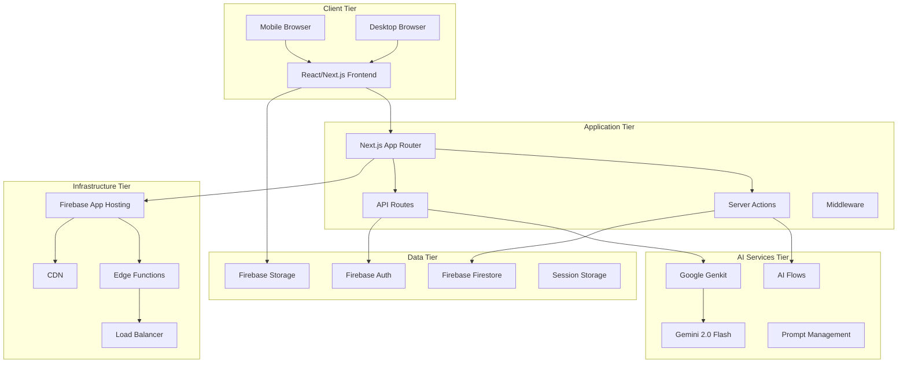
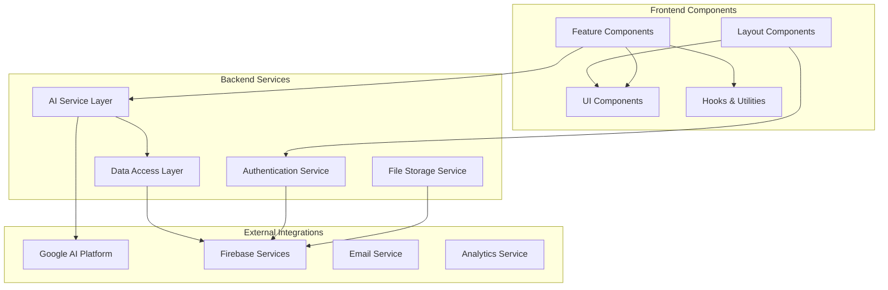
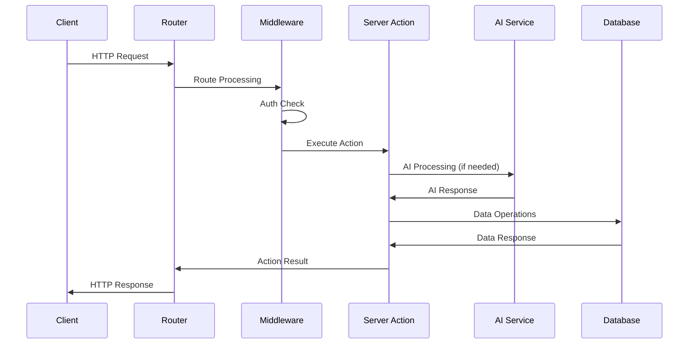

# Light on Campus - Technical Specification

**Document Version:** 1.0  
**Date:** January 2025  
**Technical Lead:** [Name]  
**Architecture Review:** [Name]  
**Security Review:** [Name]

---

## Table of Contents

1. [System Architecture](#1-system-architecture)
2. [Technology Stack](#2-technology-stack)
3. [API Specifications](#3-api-specifications)
4. [Data Models & Schemas](#4-data-models--schemas)
5. [AI Integration Architecture](#5-ai-integration-architecture)
6. [Authentication & Security](#6-authentication--security)
7. [Database Design](#7-database-design)
8. [Frontend Architecture](#8-frontend-architecture)
9. [Deployment Architecture](#9-deployment-architecture)
10. [Performance Requirements](#10-performance-requirements)
11. [Monitoring & Observability](#11-monitoring--observability)

---

## 1. System Architecture

### 1.1 High-Level Architecture



### 1.2 Component Architecture



### 1.3 Request Flow Architecture



---

## 2. Technology Stack

### 2.1 Frontend Stack

| Component | Technology | Version | Purpose |
|-----------|------------|---------|---------|
| **Framework** | Next.js | 15.3.3 | React-based full-stack framework |
| **Runtime** | React | 18.3.1 | UI component library |
| **Language** | TypeScript | 5.x | Type-safe JavaScript |
| **Styling** | Tailwind CSS | 3.4.1 | Utility-first CSS framework |
| **Components** | shadcn/ui | Latest | Pre-built component library |
| **Icons** | Lucide React | 0.475.0 | Icon library |
| **Forms** | React Hook Form | 7.54.2 | Form state management |
| **Validation** | Zod | 3.24.2 | Schema validation |

### 2.2 Backend Stack

| Component | Technology | Version | Purpose |
|-----------|------------|---------|---------|
| **Runtime** | Node.js | 20.x | JavaScript runtime |
| **Framework** | Next.js | 15.3.3 | Server-side rendering & API |
| **AI Platform** | Google Genkit | 1.13.0 | AI orchestration framework |
| **LLM** | Gemini 2.0 Flash | Latest | Large language model |
| **Database** | Firebase Firestore | 11.9.1 | NoSQL document database |
| **Authentication** | Firebase Auth | 11.9.1 | User authentication service |
| **Storage** | Firebase Storage | 11.9.1 | File storage service |
| **Hosting** | Firebase App Hosting | Latest | Deployment platform |

### 2.3 Development Tools

| Category | Tool | Version | Purpose |
|----------|------|---------|---------|
| **Build Tool** | Turbopack | Built-in | Fast development builds |
| **Package Manager** | npm | 10.x | Dependency management |
| **Linting** | ESLint | 8.x | Code quality enforcement |
| **Type Checking** | TypeScript | 5.x | Static type analysis |
| **CSS Processing** | PostCSS | 8.x | CSS transformation |

---

## 3. API Specifications

### 3.1 Server Actions API

#### 3.1.1 AI Resume Builder

```typescript
/**
 * AI Resume Builder Server Action
 * Processes resume text and optional job description to generate improvements
 */
export async function aiResumeBuilder(
  input: AiResumeBuilderInput
): Promise<AiResumeBuilderOutput>

// Input Schema
interface AiResumeBuilderInput {
  resumeText: string;           // Min 100 characters, required
  jobDescription?: string;      // Optional job posting text
}

// Output Schema
interface AiResumeBuilderOutput {
  improvedResume: string;       // Enhanced resume content
  suggestions?: string[];       // Optional improvement suggestions
  keywords?: string[];          // Identified important keywords
}

// Error Handling
type AiResumeBuilderError = {
  code: 'INVALID_INPUT' | 'AI_SERVICE_ERROR' | 'RATE_LIMIT_EXCEEDED';
  message: string;
  details?: unknown;
}
```

#### 3.1.2 Flashcard Generator

```typescript
/**
 * Flashcard Generator Server Action
 * Converts topic text into structured flashcards
 */
export async function generateFlashcards(
  input: GenerateFlashcardsInput
): Promise<GenerateFlashcardsOutput>

// Input Schema
interface GenerateFlashcardsInput {
  topic: string;                // Text content to process
  count?: number;               // Desired number of cards (default: 5-10)
  difficulty?: 'basic' | 'intermediate' | 'advanced';
}

// Output Schema
interface GenerateFlashcardsOutput {
  flashcards: Flashcard[];      // Generated flashcard array
  processingTime: number;       // Generation time in ms
}

interface Flashcard {
  id: string;                   // Unique identifier
  term: string;                 // Front of card (key concept)
  definition: string;           // Back of card (explanation)
  category?: string;            // Subject categorization
}
```

### 3.2 REST API Endpoints

#### 3.2.1 User Management

```typescript
// GET /api/users/profile
interface UserProfile {
  id: string;
  email: string;
  displayName?: string;
  academicInfo?: {
    major?: string;
    year?: string;
    university?: string;
  };
  preferences?: {
    notifications: boolean;
    emailUpdates: boolean;
  };
  createdAt: string;
  lastActive: string;
}

// PUT /api/users/profile
interface UpdateUserProfile {
  displayName?: string;
  academicInfo?: Partial<UserProfile['academicInfo']>;
  preferences?: Partial<UserProfile['preferences']>;
}

// DELETE /api/users/account
// Soft delete user account and data
```

#### 3.2.2 Events Management

```typescript
// GET /api/events
interface EventsResponse {
  events: Event[];
  pagination: {
    page: number;
    limit: number;
    total: number;
    hasNext: boolean;
  };
}

interface Event {
  id: string;
  title: string;
  description: string;
  startDate: string;          // ISO 8601 format
  endDate: string;
  location: string;
  category: EventCategory;
  capacity: number;
  registeredCount: number;
  isRegistrationOpen: boolean;
  organizer: {
    id: string;
    name: string;
  };
  tags: string[];
}

type EventCategory = 
  | 'academic' 
  | 'social' 
  | 'professional' 
  | 'wellness' 
  | 'workshop';

// POST /api/events/:id/register
interface EventRegistration {
  eventId: string;
  userId: string;
  registrationDate: string;
  status: 'confirmed' | 'waitlist' | 'cancelled';
}
```

#### 3.2.3 Resources Management

```typescript
// GET /api/resources
interface ResourcesResponse {
  resources: Resource[];
  categories: string[];
  filters: ResourceFilters;
}

interface Resource {
  id: string;
  title: string;
  description: string;
  category: string;
  subcategory?: string;
  fileUrl?: string;
  contentType: 'pdf' | 'doc' | 'template' | 'guide' | 'video';
  downloadCount: number;
  rating: number;
  tags: string[];
  uploadedBy: string;
  uploadedAt: string;
  lastUpdated: string;
}

interface ResourceFilters {
  categories: string[];
  contentTypes: string[];
  academic_levels: string[];
}
```

### 3.3 WebSocket API (Future)

```typescript
// Real-time features for forum and mentorship
interface WebSocketMessage {
  type: 'forum_reply' | 'mentor_message' | 'event_update';
  payload: unknown;
  timestamp: string;
  userId: string;
}

// Connection endpoint: /api/ws
// Authentication via JWT token in query parameter
```

---

## 4. Data Models & Schemas

### 4.1 User Data Models

```typescript
// Firebase Firestore User Document
interface UserDocument {
  uid: string;                  // Firebase Auth UID
  email: string;
  emailVerified: boolean;
  profile: {
    displayName?: string;
    firstName?: string;
    lastName?: string;
    avatar?: string;            // Storage URL
    bio?: string;
  };
  academic: {
    university?: string;
    major?: string;
    year?: 'freshman' | 'sophomore' | 'junior' | 'senior' | 'graduate';
    gpa?: number;
    interests: string[];
  };
  preferences: {
    notifications: {
      email: boolean;
      push: boolean;
      forum: boolean;
      events: boolean;
    };
    privacy: {
      profileVisible: boolean;
      contactable: boolean;
    };
  };
  activity: {
    lastLogin: FirebaseFirestore.Timestamp;
    loginCount: number;
    featuresUsed: string[];
  };
  metadata: {
    createdAt: FirebaseFirestore.Timestamp;
    updatedAt: FirebaseFirestore.Timestamp;
    version: number;
  };
}
```

### 4.2 Event Data Models

```typescript
// Firebase Firestore Event Document
interface EventDocument {
  id: string;
  title: string;
  description: string;
  longDescription?: string;
  
  // Scheduling
  startDateTime: FirebaseFirestore.Timestamp;
  endDateTime: FirebaseFirestore.Timestamp;
  timezone: string;
  
  // Location
  location: {
    type: 'physical' | 'virtual' | 'hybrid';
    address?: string;
    room?: string;
    virtualLink?: string;
    instructions?: string;
  };
  
  // Registration
  registration: {
    isOpen: boolean;
    capacity: number;
    registeredCount: number;
    waitlistCount: number;
    requiresApproval: boolean;
    deadline?: FirebaseFirestore.Timestamp;
  };
  
  // Organization
  organizer: {
    userId: string;
    name: string;
    contact: string;
  };
  
  // Categorization
  category: EventCategory;
  tags: string[];
  targetAudience: string[];
  
  // Content
  agenda?: AgendaItem[];
  speakers?: Speaker[];
  resources?: ResourceLink[];
  
  // Metadata
  status: 'draft' | 'published' | 'cancelled' | 'completed';
  createdAt: FirebaseFirestore.Timestamp;
  updatedAt: FirebaseFirestore.Timestamp;
}

interface AgendaItem {
  time: string;
  title: string;
  description?: string;
  speaker?: string;
}

interface Speaker {
  name: string;
  title: string;
  bio?: string;
  photo?: string;
}

interface ResourceLink {
  title: string;
  url: string;
  type: 'document' | 'video' | 'website';
}
```

### 4.3 AI Service Data Models

```typescript
// AI Processing Request
interface AIRequest {
  id: string;
  userId: string;
  service: 'resume_builder' | 'flashcard_generator';
  input: unknown;               // Service-specific input
  status: 'pending' | 'processing' | 'completed' | 'failed';
  
  // Processing details
  startedAt: FirebaseFirestore.Timestamp;
  completedAt?: FirebaseFirestore.Timestamp;
  processingTime?: number;      // milliseconds
  
  // Results
  output?: unknown;             // Service-specific output
  error?: {
    code: string;
    message: string;
    details?: unknown;
  };
  
  // Usage tracking
  tokensUsed?: number;
  cost?: number;
  
  // Metadata
  createdAt: FirebaseFirestore.Timestamp;
}

// AI Usage Analytics
interface AIUsageDocument {
  userId: string;
  service: string;
  date: string;                 // YYYY-MM-DD format
  
  // Usage counts
  requestsCount: number;
  successfulRequests: number;
  failedRequests: number;
  
  // Performance metrics
  averageProcessingTime: number;
  totalTokensUsed: number;
  totalCost: number;
  
  // Feature usage
  featuresUsed: string[];
  
  updatedAt: FirebaseFirestore.Timestamp;
}
```

### 4.4 Forum Data Models

```typescript
// Forum Post Document
interface ForumPostDocument {
  id: string;
  title: string;
  content: string;
  
  // Author information
  author: {
    userId: string;
    displayName: string;
    avatar?: string;
  };
  
  // Categorization
  category: string;
  tags: string[];
  subject?: string;
  
  // Engagement
  votes: {
    up: number;
    down: number;
    userVotes: { [userId: string]: 'up' | 'down' };
  };
  replies: number;
  views: number;
  
  // Status
  status: 'active' | 'closed' | 'pinned' | 'deleted';
  isPinned: boolean;
  isFeatured: boolean;
  
  // Moderation
  flags: number;
  moderatedBy?: string;
  moderationReason?: string;
  
  // Metadata
  createdAt: FirebaseFirestore.Timestamp;
  updatedAt: FirebaseFirestore.Timestamp;
  lastActivity: FirebaseFirestore.Timestamp;
}

// Forum Reply Document
interface ForumReplyDocument {
  id: string;
  postId: string;
  parentReplyId?: string;       // For nested replies
  content: string;
  
  // Author information
  author: {
    userId: string;
    displayName: string;
    avatar?: string;
  };
  
  // Engagement
  votes: {
    up: number;
    down: number;
    userVotes: { [userId: string]: 'up' | 'down' };
  };
  
  // Status
  isAcceptedAnswer: boolean;
  isEdited: boolean;
  editHistory?: EditHistory[];
  
  // Moderation
  flags: number;
  moderatedBy?: string;
  moderationReason?: string;
  
  // Metadata
  createdAt: FirebaseFirestore.Timestamp;
  updatedAt: FirebaseFirestore.Timestamp;
}
```

---

## 5. AI Integration Architecture

### 5.1 Google Genkit Configuration

```typescript
// src/ai/genkit.ts
import { genkit } from 'genkit';
import { googleAI } from '@genkit-ai/googleai';

export const ai = genkit({
  plugins: [
    googleAI({
      apiKey: process.env.GOOGLE_AI_API_KEY,
      location: 'us-central1',
    }),
  ],
  model: 'googleai/gemini-2.0-flash',
  telemetry: {
    instrumentation: 'genkit',
    logger: 'winston',
  },
});
```

### 5.2 AI Flow Architecture

```typescript
// Flow Definition Pattern
export const aiFlow = ai.defineFlow(
  {
    name: 'flowName',
    inputSchema: InputSchema,
    outputSchema: OutputSchema,
    authPolicy: (auth, input) => {
      // Authentication and authorization logic
      return auth.uid !== null;
    },
  },
  async (input, context) => {
    // Flow implementation
    const prompt = await ai.prompt('promptName', input);
    const result = await prompt(input);
    
    // Post-processing and validation
    return result.output;
  }
);
```

### 5.3 Prompt Management

```typescript
// Prompt Definition Pattern
export const resumeBuilderPrompt = ai.definePrompt({
  name: 'resumeBuilderPrompt',
  input: {
    schema: AiResumeBuilderInputSchema,
  },
  output: {
    schema: AiResumeBuilderOutputSchema,
  },
  prompt: `
    You are an expert resume writer and career counselor specializing in ATS optimization.
    
    Context:
    - The user is a college student seeking to improve their resume
    - Focus on ATS-friendly formatting and keyword optimization
    - Provide specific, actionable improvements
    
    Resume Content:
    {{resumeText}}
    
    {{#if jobDescription}}
    Target Job Description:
    {{jobDescription}}
    
    Please tailor the resume improvements to match this specific role.
    {{/if}}
    
    Requirements:
    1. Maintain the original structure and personal information
    2. Enhance content with relevant keywords
    3. Improve bullet points for impact and clarity
    4. Ensure ATS compatibility
    5. Provide the complete improved resume
    
    Return the enhanced resume with your improvements incorporated.
  `,
  config: {
    temperature: 0.7,
    maxOutputTokens: 2000,
    topK: 40,
    topP: 0.95,
  },
});
```

### 5.4 AI Error Handling

```typescript
// AI Service Error Types
export type AIServiceError = 
  | 'RATE_LIMIT_EXCEEDED'
  | 'INVALID_INPUT'
  | 'MODEL_UNAVAILABLE'
  | 'PROCESSING_TIMEOUT'
  | 'CONTENT_POLICY_VIOLATION'
  | 'UNKNOWN_ERROR';

// Error Handling Wrapper
export async function withAIErrorHandling<T>(
  operation: () => Promise<T>
): Promise<{ data?: T; error?: AIServiceError }> {
  try {
    const data = await operation();
    return { data };
  } catch (error) {
    const aiError = mapErrorToAIServiceError(error);
    console.error('AI Service Error:', aiError, error);
    return { error: aiError };
  }
}

// Retry Logic for Transient Failures
export async function withRetry<T>(
  operation: () => Promise<T>,
  maxRetries: number = 3,
  backoffMs: number = 1000
): Promise<T> {
  let lastError: Error;
  
  for (let attempt = 0; attempt <= maxRetries; attempt++) {
    try {
      return await operation();
    } catch (error) {
      lastError = error as Error;
      
      if (attempt < maxRetries && isRetryableError(error)) {
        await new Promise(resolve => 
          setTimeout(resolve, backoffMs * Math.pow(2, attempt))
        );
        continue;
      }
      
      throw error;
    }
  }
  
  throw lastError!;
}
```

---

## 6. Authentication & Security

### 6.1 Firebase Authentication Setup

```typescript
// Firebase Auth Configuration
import { initializeApp } from 'firebase/app';
import { getAuth, connectAuthEmulator } from 'firebase/auth';

const firebaseConfig = {
  apiKey: process.env.NEXT_PUBLIC_FIREBASE_API_KEY,
  authDomain: process.env.NEXT_PUBLIC_FIREBASE_AUTH_DOMAIN,
  projectId: process.env.NEXT_PUBLIC_FIREBASE_PROJECT_ID,
  storageBucket: process.env.NEXT_PUBLIC_FIREBASE_STORAGE_BUCKET,
  messagingSenderId: process.env.NEXT_PUBLIC_FIREBASE_MESSAGING_SENDER_ID,
  appId: process.env.NEXT_PUBLIC_FIREBASE_APP_ID,
};

const app = initializeApp(firebaseConfig);
export const auth = getAuth(app);

// Development emulator connection
if (process.env.NODE_ENV === 'development') {
  connectAuthEmulator(auth, 'http://localhost:9099');
}
```

### 6.2 Authentication Middleware

```typescript
// Next.js Middleware for Route Protection
import { NextRequest, NextResponse } from 'next/server';
import { verifyIdToken } from '@/lib/firebase-admin';

export async function middleware(request: NextRequest) {
  const token = request.cookies.get('auth-token')?.value;
  
  // Protected routes
  const protectedPaths = ['/dashboard', '/profile', '/admin'];
  const isProtectedRoute = protectedPaths.some(path => 
    request.nextUrl.pathname.startsWith(path)
  );
  
  if (isProtectedRoute) {
    if (!token) {
      return NextResponse.redirect(new URL('/login', request.url));
    }
    
    try {
      const decodedToken = await verifyIdToken(token);
      
      // Add user context to request headers
      const requestHeaders = new Headers(request.headers);
      requestHeaders.set('x-user-id', decodedToken.uid);
      requestHeaders.set('x-user-email', decodedToken.email || '');
      
      return NextResponse.next({
        request: {
          headers: requestHeaders,
        },
      });
    } catch (error) {
      return NextResponse.redirect(new URL('/login', request.url));
    }
  }
  
  return NextResponse.next();
}

export const config = {
  matcher: [
    '/((?!api|_next/static|_next/image|favicon.ico).*)',
  ],
};
```

### 6.3 Server-Side Authentication

```typescript
// Server Action Authentication Helper
import { cookies } from 'next/headers';
import { verifyIdToken } from '@/lib/firebase-admin';

export async function getAuthenticatedUser() {
  const cookieStore = cookies();
  const token = cookieStore.get('auth-token')?.value;
  
  if (!token) {
    throw new Error('Authentication required');
  }
  
  try {
    const decodedToken = await verifyIdToken(token);
    return {
      uid: decodedToken.uid,
      email: decodedToken.email,
      emailVerified: decodedToken.email_verified,
    };
  } catch (error) {
    throw new Error('Invalid authentication token');
  }
}

// Usage in Server Actions
export async function protectedServerAction(input: unknown) {
  const user = await getAuthenticatedUser();
  
  // Proceed with authenticated logic
  // user.uid, user.email available
}
```

### 6.4 Security Headers

```typescript
// next.config.ts security configuration
const securityHeaders = [
  {
    key: 'X-DNS-Prefetch-Control',
    value: 'on'
  },
  {
    key: 'Strict-Transport-Security',
    value: 'max-age=63072000; includeSubDomains; preload'
  },
  {
    key: 'X-XSS-Protection',
    value: '1; mode=block'
  },
  {
    key: 'X-Frame-Options',
    value: 'DENY'
  },
  {
    key: 'X-Content-Type-Options',
    value: 'nosniff'
  },
  {
    key: 'Referrer-Policy',
    value: 'origin-when-cross-origin'
  },
  {
    key: 'Content-Security-Policy',
    value: `
      default-src 'self';
      script-src 'self' 'unsafe-eval' 'unsafe-inline' *.googleapis.com;
      style-src 'self' 'unsafe-inline' *.googleapis.com;
      img-src 'self' blob: data: *.placehold.co;
      font-src 'self' *.gstatic.com;
      connect-src 'self' *.googleapis.com *.firebase.com;
    `.replace(/\s{2,}/g, ' ').trim()
  }
];

export default {
  async headers() {
    return [
      {
        source: '/(.*)',
        headers: securityHeaders,
      },
    ];
  },
};
```

---

## 7. Database Design

### 7.1 Firebase Firestore Structure

```
/users/{userId}
  - profile data
  - preferences
  - activity logs

/events/{eventId}
  - event details
  - registration info
  
/events/{eventId}/registrations/{userId}
  - user registration data

/forum/posts/{postId}
  - forum post content
  
/forum/posts/{postId}/replies/{replyId}
  - reply content

/resources/{resourceId}
  - resource metadata
  
/ai-requests/{requestId}
  - AI processing logs

/user-analytics/{userId}/daily/{date}
  - daily usage statistics
```

### 7.2 Firestore Security Rules

```javascript
// firestore.rules
rules_version = '2';
service cloud.firestore {
  match /databases/{database}/documents {
    
    // Users can read/write their own profile
    match /users/{userId} {
      allow read, write: if request.auth != null && request.auth.uid == userId;
    }
    
    // Events are publicly readable, admin writable
    match /events/{eventId} {
      allow read: if true;
      allow write: if request.auth != null && hasRole('admin');
      
      // Event registrations
      match /registrations/{userId} {
        allow read, write: if request.auth != null && request.auth.uid == userId;
        allow read: if request.auth != null && hasRole('admin');
      }
    }
    
    // Forum posts
    match /forum/posts/{postId} {
      allow read: if true;
      allow create: if request.auth != null && validPostData();
      allow update: if request.auth != null && 
        (request.auth.uid == resource.data.author.userId || hasRole('moderator'));
      allow delete: if request.auth != null && hasRole('moderator');
      
      // Forum replies
      match /replies/{replyId} {
        allow read: if true;
        allow create: if request.auth != null && validReplyData();
        allow update: if request.auth != null && 
          (request.auth.uid == resource.data.author.userId || hasRole('moderator'));
        allow delete: if request.auth != null && hasRole('moderator');
      }
    }
    
    // AI requests - users can only access their own
    match /ai-requests/{requestId} {
      allow read, write: if request.auth != null && 
        request.auth.uid == resource.data.userId;
    }
    
    // Helper functions
    function hasRole(role) {
      return request.auth != null && 
        get(/databases/$(database)/documents/users/$(request.auth.uid)).data.roles[role] == true;
    }
    
    function validPostData() {
      return request.resource.data.keys().hasAll(['title', 'content', 'author', 'category']) &&
        request.resource.data.author.userId == request.auth.uid;
    }
    
    function validReplyData() {
      return request.resource.data.keys().hasAll(['content', 'author', 'postId']) &&
        request.resource.data.author.userId == request.auth.uid;
    }
  }
}
```

### 7.3 Data Access Layer

```typescript
// Database Service Interface
export interface DatabaseService {
  // User operations
  createUser(userData: Partial<UserDocument>): Promise<void>;
  getUserById(userId: string): Promise<UserDocument | null>;
  updateUser(userId: string, updates: Partial<UserDocument>): Promise<void>;
  
  // Event operations
  getEvents(filters?: EventFilters): Promise<Event[]>;
  getEventById(eventId: string): Promise<Event | null>;
  registerForEvent(eventId: string, userId: string): Promise<void>;
  
  // Forum operations
  createPost(postData: Omit<ForumPostDocument, 'id'>): Promise<string>;
  getPosts(filters?: PostFilters): Promise<ForumPostDocument[]>;
  getPostById(postId: string): Promise<ForumPostDocument | null>;
  
  // AI request tracking
  logAIRequest(request: Omit<AIRequest, 'id'>): Promise<string>;
  updateAIRequest(requestId: string, updates: Partial<AIRequest>): Promise<void>;
}

// Firestore Implementation
export class FirestoreService implements DatabaseService {
  private db = getFirestore();
  
  async createUser(userData: Partial<UserDocument>): Promise<void> {
    const userRef = doc(this.db, 'users', userData.uid!);
    await setDoc(userRef, {
      ...userData,
      metadata: {
        createdAt: serverTimestamp(),
        updatedAt: serverTimestamp(),
        version: 1,
      },
    });
  }
  
  async getUserById(userId: string): Promise<UserDocument | null> {
    const userRef = doc(this.db, 'users', userId);
    const userSnap = await getDoc(userRef);
    
    if (userSnap.exists()) {
      return userSnap.data() as UserDocument;
    }
    
    return null;
  }
  
  // Additional implementation methods...
}
```

---

## 8. Frontend Architecture

### 8.1 Component Architecture Patterns

```typescript
// Component Structure Pattern
interface ComponentProps {
  className?: string;
  children?: React.ReactNode;
}

// Base Component Pattern
export function BaseComponent({ className, children, ...props }: ComponentProps) {
  return (
    <div className={cn("base-styles", className)} {...props}>
      {children}
    </div>
  );
}

// Compound Component Pattern
export function Card({ className, ...props }: ComponentProps) {
  return (
    <div className={cn("card-base-styles", className)} {...props} />
  );
}

Card.Header = function CardHeader({ className, ...props }: ComponentProps) {
  return (
    <div className={cn("card-header-styles", className)} {...props} />
  );
};

Card.Content = function CardContent({ className, ...props }: ComponentProps) {
  return (
    <div className={cn("card-content-styles", className)} {...props} />
  );
};
```

### 8.2 State Management Patterns

```typescript
// React Hook Form Pattern
export function FormComponent() {
  const form = useForm<FormData>({
    resolver: zodResolver(formSchema),
    defaultValues: {
      field1: '',
      field2: '',
    },
  });
  
  const onSubmit = async (data: FormData) => {
    try {
      const result = await serverAction(data);
      toast.success('Success!');
    } catch (error) {
      toast.error('Error occurred');
    }
  };
  
  return (
    <Form {...form}>
      <form onSubmit={form.handleSubmit(onSubmit)}>
        {/* Form fields */}
      </form>
    </Form>
  );
}

// Custom Hook Pattern
export function useAIProcessor<TInput, TOutput>(
  processor: (input: TInput) => Promise<TOutput>
) {
  const [isLoading, setIsLoading] = useState(false);
  const [result, setResult] = useState<TOutput | null>(null);
  const [error, setError] = useState<string | null>(null);
  
  const process = useCallback(async (input: TInput) => {
    setIsLoading(true);
    setError(null);
    
    try {
      const output = await processor(input);
      setResult(output);
    } catch (err) {
      setError(err instanceof Error ? err.message : 'Unknown error');
    } finally {
      setIsLoading(false);
    }
  }, [processor]);
  
  return {
    process,
    isLoading,
    result,
    error,
    reset: () => {
      setResult(null);
      setError(null);
    },
  };
}
```

### 8.3 Error Boundary Implementation

```typescript
// Error Boundary Component
interface ErrorBoundaryState {
  hasError: boolean;
  error?: Error;
}

export class ErrorBoundary extends Component<
  PropsWithChildren<{}>,
  ErrorBoundaryState
> {
  constructor(props: PropsWithChildren<{}>) {
    super(props);
    this.state = { hasError: false };
  }
  
  static getDerivedStateFromError(error: Error): ErrorBoundaryState {
    return { hasError: true, error };
  }
  
  componentDidCatch(error: Error, errorInfo: ErrorInfo) {
    console.error('Error caught by boundary:', error, errorInfo);
    // Log to error reporting service
  }
  
  render() {
    if (this.state.hasError) {
      return (
        <div className="error-boundary">
          <h2>Something went wrong</h2>
          <p>We're sorry, but something unexpected happened.</p>
          <button onClick={() => this.setState({ hasError: false })}>
            Try again
          </button>
        </div>
      );
    }
    
    return this.props.children;
  }
}
```

---

## 9. Deployment Architecture

### 9.1 Firebase App Hosting Configuration

```yaml
# apphosting.yaml
runConfig:
  # Resource allocation
  cpu: 1
  memory: 2Gi
  maxInstances: 10
  minInstances: 1
  
  # Scaling configuration
  concurrency: 100
  maxRequestTimeout: 60s
  
  # Environment variables
  env:
    - variable: NODE_ENV
      value: production
    - variable: GOOGLE_AI_API_KEY
      secret: google-ai-api-key
    - variable: FIREBASE_PROJECT_ID
      value: light-on-campus-prod

# Build configuration
buildConfig:
  runtime: nodejs20
  
  # Build environment
  buildEnv:
    - variable: NODE_ENV
      value: production
  
  # Build steps
  buildScript: |
    npm ci
    npm run build
  
  # Output directory
  outputDir: .next
```

### 9.2 Environment Configuration

```typescript
// Environment Variables Schema
const envSchema = z.object({
  // Firebase Configuration
  NEXT_PUBLIC_FIREBASE_API_KEY: z.string(),
  NEXT_PUBLIC_FIREBASE_AUTH_DOMAIN: z.string(),
  NEXT_PUBLIC_FIREBASE_PROJECT_ID: z.string(),
  NEXT_PUBLIC_FIREBASE_STORAGE_BUCKET: z.string(),
  NEXT_PUBLIC_FIREBASE_MESSAGING_SENDER_ID: z.string(),
  NEXT_PUBLIC_FIREBASE_APP_ID: z.string(),
  
  // Server-side Firebase
  FIREBASE_SERVICE_ACCOUNT_KEY: z.string(),
  
  // AI Services
  GOOGLE_AI_API_KEY: z.string(),
  
  // Application
  NEXTAUTH_SECRET: z.string(),
  NEXTAUTH_URL: z.string(),
  
  // Optional
  ANALYTICS_ID: z.string().optional(),
  SENTRY_DSN: z.string().optional(),
});

export const env = envSchema.parse(process.env);
```

### 9.3 CI/CD Pipeline

```yaml
# .github/workflows/deploy.yml
name: Deploy to Firebase App Hosting

on:
  push:
    branches: [main]
  pull_request:
    branches: [main]

jobs:
  test:
    runs-on: ubuntu-latest
    steps:
      - uses: actions/checkout@v4
      - uses: actions/setup-node@v4
        with:
          node-version: '20'
          cache: 'npm'
      
      - run: npm ci
      - run: npm run lint
      - run: npm run typecheck
      - run: npm run test
      - run: npm run build

  deploy:
    needs: test
    runs-on: ubuntu-latest
    if: github.ref == 'refs/heads/main'
    
    steps:
      - uses: actions/checkout@v4
      - uses: actions/setup-node@v4
        with:
          node-version: '20'
          cache: 'npm'
      
      - run: npm ci
      - run: npm run build
      
      - uses: firebase-tools-action@v13.11.1
        with:
          args: hosting:channel:deploy live
        env:
          FIREBASE_TOKEN: ${{ secrets.FIREBASE_TOKEN }}
          GOOGLE_AI_API_KEY: ${{ secrets.GOOGLE_AI_API_KEY }}
```

---

## 10. Performance Requirements

### 10.1 Performance Metrics

| Metric | Target | Measurement |
|--------|--------|-------------|
| **Page Load Time** | <3 seconds | First Contentful Paint |
| **API Response Time** | <1 second | 95th percentile |
| **AI Processing** | <30 seconds | Resume/Flashcard generation |
| **Database Queries** | <500ms | 95th percentile |
| **Image Loading** | <2 seconds | Largest Contentful Paint |
| **Bundle Size** | <500KB | Initial JavaScript bundle |

### 10.2 Optimization Strategies

```typescript
// Code Splitting & Lazy Loading
const ResumeBuilderForm = lazy(() => import('@/components/resume-builder-form'));
const FlashcardGenerator = lazy(() => import('@/components/flashcard-generator'));

// Dynamic Imports
export async function getStaticProps() {
  const { processMarkdown } = await import('@/lib/markdown-processor');
  // ... rest of function
}

// Image Optimization
import Image from 'next/image';

export function OptimizedImage({ src, alt, ...props }) {
  return (
    <Image
      src={src}
      alt={alt}
      priority={false}
      placeholder="blur"
      blurDataURL="data:image/jpeg;base64,..."
      sizes="(max-width: 768px) 100vw, (max-width: 1200px) 50vw, 33vw"
      {...props}
    />
  );
}
```

### 10.3 Caching Strategy

```typescript
// Next.js App Router Caching
export async function generateStaticParams() {
  // Pre-generate static routes at build time
  return [
    { slug: 'about' },
    { slug: 'contact' },
    // ... other static pages
  ];
}

// Revalidation Strategy
export const revalidate = 3600; // 1 hour

// Dynamic Caching
import { unstable_cache } from 'next/cache';

export const getCachedEvents = unstable_cache(
  async () => {
    return await fetchEvents();
  },
  ['events'],
  {
    revalidate: 300, // 5 minutes
    tags: ['events'],
  }
);
```

---

## 11. Monitoring & Observability

### 11.1 Application Monitoring

```typescript
// Error Tracking with Sentry
import * as Sentry from '@sentry/nextjs';

Sentry.init({
  dsn: process.env.SENTRY_DSN,
  tracesSampleRate: 0.1,
  environment: process.env.NODE_ENV,
  
  beforeSend(event) {
    // Filter out known non-critical errors
    if (event.exception) {
      const error = event.exception.values?.[0];
      if (error?.type === 'ChunkLoadError') {
        return null; // Don't report chunk load errors
      }
    }
    return event;
  },
});

// Performance Monitoring
export function trackPerformance(name: string, fn: () => Promise<any>) {
  return Sentry.withProfiler(fn, { name });
}
```

### 11.2 AI Service Monitoring

```typescript
// AI Usage Tracking
export async function trackAIUsage(
  userId: string,
  service: string,
  requestData: {
    inputTokens: number;
    outputTokens: number;
    processingTime: number;
    success: boolean;
  }
) {
  const usageDoc = {
    userId,
    service,
    timestamp: new Date(),
    ...requestData,
  };
  
  await db.collection('ai-usage').add(usageDoc);
  
  // Update user quota
  await updateUserQuota(userId, service, requestData.inputTokens + requestData.outputTokens);
}

// Quota Management
export async function checkUserQuota(userId: string, service: string): Promise<boolean> {
  const quotaDoc = await db
    .collection('user-quotas')
    .doc(`${userId}-${service}`)
    .get();
    
  if (!quotaDoc.exists) {
    return true; // First time user
  }
  
  const quota = quotaDoc.data();
  const dailyLimit = 10000; // tokens per day
  
  return quota.dailyUsage < dailyLimit;
}
```

### 11.3 Health Checks

```typescript
// Health Check Endpoint
// app/api/health/route.ts
export async function GET() {
  const checks = await Promise.allSettled([
    checkDatabaseConnection(),
    checkAIServiceHealth(),
    checkFirebaseServices(),
  ]);
  
  const results = checks.map((check, index) => ({
    service: ['database', 'ai-service', 'firebase'][index],
    status: check.status === 'fulfilled' ? 'healthy' : 'unhealthy',
    details: check.status === 'rejected' ? check.reason : 'OK',
  }));
  
  const allHealthy = results.every(result => result.status === 'healthy');
  
  return Response.json(
    { status: allHealthy ? 'healthy' : 'degraded', checks: results },
    { status: allHealthy ? 200 : 503 }
  );
}

async function checkDatabaseConnection() {
  const testDoc = await db.collection('health').doc('test').get();
  return testDoc !== null;
}

async function checkAIServiceHealth() {
  // Simple ping to AI service
  const testPrompt = ai.definePrompt({
    name: 'healthCheck',
    input: { schema: z.object({ test: z.string() }) },
    output: { schema: z.object({ response: z.string() }) },
    prompt: 'Respond with "OK"'
  });
  
  const result = await testPrompt({ test: 'ping' });
  return result.output?.response === 'OK';
}
```

---

## Conclusion

This technical specification provides a comprehensive blueprint for implementing the Light on Campus platform. The architecture emphasizes:

1. **Scalability**: Microservices-like modular design
2. **Security**: Multi-layer authentication and authorization
3. **Performance**: Optimized for fast loading and responsive interactions
4. **Maintainability**: Clear separation of concerns and type safety
5. **Observability**: Comprehensive monitoring and error tracking

The specification should be reviewed and updated as the platform evolves and new requirements emerge.

---

**Document Maintenance:**
- Review quarterly for technology updates
- Update API specifications with new endpoints
- Maintain data model documentation
- Keep security measures current with best practices 