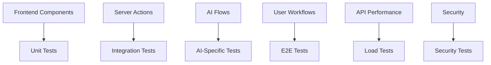
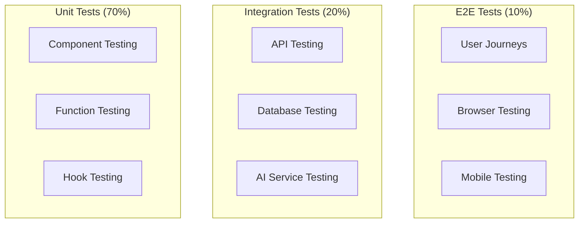

# Light on Campus - Testing Strategy

**Document Version:** 1.0  
**Date:** January 2025  
**QA Lead:** [Name]  
**Engineering Lead:** [Name]  
**Test Automation Lead:** [Name]

---

## Table of Contents

1. [Testing Overview](#1-testing-overview)
2. [Test Types & Pyramid](#2-test-types--pyramid)
3. [Testing Tools & Framework](#3-testing-tools--framework)
4. [Unit Testing](#4-unit-testing)
5. [Integration Testing](#5-integration-testing)
6. [AI Testing Strategy](#6-ai-testing-strategy)
7. [End-to-End Testing](#7-end-to-end-testing)
8. [Performance Testing](#8-performance-testing)
9. [Security Testing](#9-security-testing)
10. [Test Data Management](#10-test-data-management)
11. [CI/CD Integration](#11-cicd-integration)
12. [Manual Testing](#12-manual-testing)

---

## 1. Testing Overview

### 1.1 Testing Philosophy

Our testing strategy follows the **Test Pyramid** approach, emphasizing:
- **70% Unit Tests**: Fast, isolated component testing
- **20% Integration Tests**: Service interaction validation
- **10% E2E Tests**: Complete user journey verification

### 1.2 Quality Goals

| Metric | Target | Current |
|--------|--------|---------|
| **Code Coverage** | 85%+ | TBD |
| **Test Execution Time** | <5 minutes | TBD |
| **Bug Escape Rate** | <2% | TBD |
| **Test Reliability** | 95%+ pass rate | TBD |

### 1.3 Testing Scope



---

## 2. Test Types & Pyramid

### 2.1 Test Pyramid Structure



### 2.2 Testing Responsibilities

| Test Type | Owner | Frequency | Environment |
|-----------|-------|-----------|-------------|
| **Unit** | Developers | Every commit | Local |
| **Integration** | Developers | Every PR | CI |
| **AI Testing** | AI Team | Every AI change | Staging |
| **E2E** | QA Team | Every release | Staging |
| **Performance** | DevOps | Weekly | Production-like |
| **Security** | Security Team | Monthly | All environments |

---

## 3. Testing Tools & Framework

### 3.1 Testing Stack

```typescript
// Testing Dependencies
{
  "devDependencies": {
    "@testing-library/react": "^14.0.0",
    "@testing-library/jest-dom": "^6.0.0",
    "@testing-library/user-event": "^14.0.0",
    "jest": "^29.0.0",
    "jest-environment-jsdom": "^29.0.0",
    "playwright": "^1.40.0",
    "msw": "^2.0.0",
    "vitest": "^1.0.0"
  }
}
```

### 3.2 Test Configuration

```typescript
// jest.config.js
const nextJest = require('next/jest');

const createJestConfig = nextJest({
  dir: './',
});

const customJestConfig = {
  setupFilesAfterEnv: ['<rootDir>/jest.setup.js'],
  testEnvironment: 'jest-environment-jsdom',
  moduleNameMapping: {
    '^@/(.*)$': '<rootDir>/src/$1',
  },
  collectCoverageFrom: [
    'src/**/*.{js,jsx,ts,tsx}',
    '!src/**/*.d.ts',
    '!src/**/index.ts',
  ],
  coverageThreshold: {
    global: {
      branches: 80,
      functions: 80,
      lines: 85,
      statements: 85,
    },
  },
};

module.exports = createJestConfig(customJestConfig);
```

---

## 4. Unit Testing

### 4.1 Component Testing

```typescript
// __tests__/components/resume-builder-form.test.tsx
import { render, screen, fireEvent, waitFor } from '@testing-library/react';
import userEvent from '@testing-library/user-event';
import { ResumeBuilderForm } from '@/components/resume-builder-form';

// Mock AI service
jest.mock('@/ai/flows/ai-resume-builder', () => ({
  aiResumeBuilder: jest.fn(),
}));

describe('ResumeBuilderForm', () => {
  const user = userEvent.setup();

  beforeEach(() => {
    jest.clearAllMocks();
  });

  it('renders form elements correctly', () => {
    render(<ResumeBuilderForm />);
    
    expect(screen.getByLabelText(/your resume/i)).toBeInTheDocument();
    expect(screen.getByLabelText(/job description/i)).toBeInTheDocument();
    expect(screen.getByRole('button', { name: /improve my resume/i })).toBeInTheDocument();
  });

  it('validates minimum resume text length', async () => {
    render(<ResumeBuilderForm />);
    
    const textarea = screen.getByLabelText(/your resume/i);
    const submitButton = screen.getByRole('button', { name: /improve my resume/i });
    
    await user.type(textarea, 'Short text');
    await user.click(submitButton);
    
    expect(screen.getByText(/at least 100 characters/i)).toBeInTheDocument();
  });

  it('submits form with valid data and displays results', async () => {
    const mockResult = { improvedResume: 'Enhanced resume content...' };
    (require('@/ai/flows/ai-resume-builder').aiResumeBuilder as jest.Mock)
      .mockResolvedValue(mockResult);
    
    render(<ResumeBuilderForm />);
    
    const textarea = screen.getByLabelText(/your resume/i);
    const validResume = 'A'.repeat(150);
    
    await user.type(textarea, validResume);
    await user.click(screen.getByRole('button', { name: /improve my resume/i }));
    
    await waitFor(() => {
      expect(screen.getByText(mockResult.improvedResume)).toBeInTheDocument();
    });
  });
});
```

### 4.2 Hook Testing

```typescript
// __tests__/hooks/use-ai-processor.test.ts
import { renderHook, act } from '@testing-library/react';
import { useAIProcessor } from '@/hooks/use-ai-processor';

const mockProcessor = jest.fn();

describe('useAIProcessor', () => {
  beforeEach(() => {
    jest.clearAllMocks();
  });

  it('initializes with correct default state', () => {
    const { result } = renderHook(() => useAIProcessor(mockProcessor));
    
    expect(result.current.isLoading).toBe(false);
    expect(result.current.result).toBe(null);
    expect(result.current.error).toBe(null);
  });

  it('handles successful processing', async () => {
    const mockResult = { data: 'processed result' };
    mockProcessor.mockResolvedValue(mockResult);
    
    const { result } = renderHook(() => useAIProcessor(mockProcessor));
    
    await act(async () => {
      await result.current.process('input data');
    });
    
    expect(result.current.result).toEqual(mockResult);
    expect(result.current.isLoading).toBe(false);
    expect(result.current.error).toBe(null);
  });

  it('handles processing errors', async () => {
    const errorMessage = 'Processing failed';
    mockProcessor.mockRejectedValue(new Error(errorMessage));
    
    const { result } = renderHook(() => useAIProcessor(mockProcessor));
    
    await act(async () => {
      await result.current.process('input data');
    });
    
    expect(result.current.error).toBe(errorMessage);
    expect(result.current.result).toBe(null);
    expect(result.current.isLoading).toBe(false);
  });
});
```

### 4.3 Utility Function Testing

```typescript
// __tests__/lib/utils.test.ts
import { cn, formatDate, validateEmail } from '@/lib/utils';

describe('Utility Functions', () => {
  describe('cn (className utility)', () => {
    it('combines classes correctly', () => {
      expect(cn('base', 'additional')).toBe('base additional');
      expect(cn('base', { conditional: true })).toBe('base conditional');
      expect(cn('base', { conditional: false })).toBe('base');
    });
  });

  describe('formatDate', () => {
    it('formats dates correctly', () => {
      const date = new Date('2025-01-15T10:30:00Z');
      expect(formatDate(date, 'short')).toBe('1/15/2025');
      expect(formatDate(date, 'long')).toBe('January 15, 2025');
    });
  });

  describe('validateEmail', () => {
    it('validates email addresses', () => {
      expect(validateEmail('test@example.com')).toBe(true);
      expect(validateEmail('invalid-email')).toBe(false);
      expect(validateEmail('')).toBe(false);
    });
  });
});
```

---

## 5. Integration Testing

### 5.1 API Testing

```typescript
// __tests__/integration/api.test.ts
import { createMocks } from 'node-mocks-http';
import handler from '@/app/api/users/profile/route';

describe('/api/users/profile', () => {
  it('returns user profile for authenticated user', async () => {
    const { req, res } = createMocks({
      method: 'GET',
      headers: {
        authorization: 'Bearer valid-token',
      },
    });

    await handler(req, res);

    expect(res._getStatusCode()).toBe(200);
    const data = JSON.parse(res._getData());
    expect(data).toHaveProperty('id');
    expect(data).toHaveProperty('email');
  });

  it('returns 401 for unauthenticated requests', async () => {
    const { req, res } = createMocks({
      method: 'GET',
    });

    await handler(req, res);

    expect(res._getStatusCode()).toBe(401);
  });
});
```

### 5.2 Database Integration Testing

```typescript
// __tests__/integration/database.test.ts
import { getFirestore } from 'firebase-admin/firestore';
import { createUser, getUserById } from '@/lib/database';

describe('Database Operations', () => {
  let testUserId: string;

  beforeAll(async () => {
    // Setup test database connection
    process.env.FIRESTORE_EMULATOR_HOST = 'localhost:8080';
  });

  afterEach(async () => {
    // Clean up test data
    if (testUserId) {
      await getFirestore().collection('users').doc(testUserId).delete();
    }
  });

  it('creates and retrieves user correctly', async () => {
    const userData = {
      email: 'test@example.com',
      displayName: 'Test User',
      academic: {
        major: 'Computer Science',
        year: 'junior',
      },
    };

    testUserId = await createUser(userData);
    const retrievedUser = await getUserById(testUserId);

    expect(retrievedUser).toMatchObject(userData);
    expect(retrievedUser.metadata.createdAt).toBeDefined();
  });
});
```

---

## 6. AI Testing Strategy

### 6.1 AI Flow Testing

```typescript
// __tests__/ai/resume-builder.test.ts
import { aiResumeBuilder } from '@/ai/flows/ai-resume-builder';

describe('AI Resume Builder Flow', () => {
  it('processes basic resume content', async () => {
    const input = {
      resumeText: `
        John Doe
        Software Engineer
        Experience: 2 years at Tech Company
        Skills: JavaScript, React, Node.js
      `,
    };

    const result = await aiResumeBuilder(input);

    expect(result.improvedResume).toBeDefined();
    expect(result.improvedResume.length).toBeGreaterThan(input.resumeText.length);
    expect(result.improvedResume).toContain('JavaScript');
  });

  it('tailors resume to job description', async () => {
    const input = {
      resumeText: 'Basic software engineer resume...',
      jobDescription: 'Looking for a React specialist with TypeScript experience...',
    };

    const result = await aiResumeBuilder(input);

    expect(result.improvedResume).toContain('React');
    expect(result.improvedResume).toContain('TypeScript');
  });

  it('handles error cases gracefully', async () => {
    const input = {
      resumeText: 'x'.repeat(10000), // Extremely long input
    };

    await expect(aiResumeBuilder(input)).rejects.toThrow();
  });
});
```

### 6.2 AI Service Mocking

```typescript
// __tests__/mocks/ai-service.ts
export const mockAIService = {
  aiResumeBuilder: jest.fn(),
  generateFlashcards: jest.fn(),
};

export const setupAIMocks = () => {
  mockAIService.aiResumeBuilder.mockImplementation(async (input) => ({
    improvedResume: `Improved version of: ${input.resumeText}`,
  }));

  mockAIService.generateFlashcards.mockImplementation(async (input) => ({
    flashcards: [
      { term: 'Sample Term', definition: 'Sample Definition' },
      { term: 'Another Term', definition: 'Another Definition' },
    ],
  }));
};
```

### 6.3 AI Performance Testing

```typescript
// __tests__/ai/performance.test.ts
describe('AI Performance Tests', () => {
  it('completes resume processing within time limit', async () => {
    const startTime = Date.now();
    
    await aiResumeBuilder({
      resumeText: 'Standard length resume content...',
    });
    
    const processingTime = Date.now() - startTime;
    expect(processingTime).toBeLessThan(30000); // 30 seconds
  });

  it('handles concurrent requests efficiently', async () => {
    const requests = Array(5).fill(null).map(() => 
      aiResumeBuilder({ resumeText: 'Test resume content...' })
    );

    const results = await Promise.all(requests);
    expect(results).toHaveLength(5);
    results.forEach(result => {
      expect(result.improvedResume).toBeDefined();
    });
  });
});
```

---

## 7. End-to-End Testing

### 7.1 Playwright Configuration

```typescript
// playwright.config.ts
import { defineConfig, devices } from '@playwright/test';

export default defineConfig({
  testDir: './e2e',
  fullyParallel: true,
  forbidOnly: !!process.env.CI,
  retries: process.env.CI ? 2 : 0,
  workers: process.env.CI ? 1 : undefined,
  reporter: 'html',
  
  use: {
    baseURL: process.env.BASE_URL || 'http://localhost:3000',
    trace: 'on-first-retry',
    screenshot: 'only-on-failure',
  },

  projects: [
    {
      name: 'chromium',
      use: { ...devices['Desktop Chrome'] },
    },
    {
      name: 'firefox',
      use: { ...devices['Desktop Firefox'] },
    },
    {
      name: 'Mobile Chrome',
      use: { ...devices['Pixel 5'] },
    },
  ],

  webServer: {
    command: 'npm run start',
    url: 'http://localhost:3000',
    reuseExistingServer: !process.env.CI,
  },
});
```

### 7.2 User Journey Tests

```typescript
// e2e/resume-builder.spec.ts
import { test, expect } from '@playwright/test';

test.describe('Resume Builder Journey', () => {
  test('completes full resume improvement workflow', async ({ page }) => {
    await page.goto('/resume-builder');

    // Fill out resume form
    await page.fill('[data-testid="resume-text"]', 'John Doe\nSoftware Engineer\nExperience with JavaScript and React');
    await page.fill('[data-testid="job-description"]', 'Looking for a React developer with 2+ years experience');

    // Submit form
    await page.click('[data-testid="submit-button"]');

    // Wait for AI processing
    await expect(page.locator('[data-testid="loading-state"]')).toBeVisible();
    await expect(page.locator('[data-testid="loading-state"]')).not.toBeVisible({ timeout: 30000 });

    // Verify results
    await expect(page.locator('[data-testid="improved-resume"]')).toBeVisible();
    const improvedContent = await page.locator('[data-testid="improved-resume"]').textContent();
    expect(improvedContent).toContain('React');
  });

  test('handles form validation errors', async ({ page }) => {
    await page.goto('/resume-builder');

    // Submit empty form
    await page.click('[data-testid="submit-button"]');

    // Check for validation errors
    await expect(page.locator('[data-testid="error-message"]')).toBeVisible();
    await expect(page.locator('[data-testid="error-message"]')).toContainText('at least 100 characters');
  });
});
```

### 7.3 Cross-Browser Testing

```typescript
// e2e/cross-browser.spec.ts
import { test, expect, devices } from '@playwright/test';

const browsers = [
  devices['Desktop Chrome'],
  devices['Desktop Firefox'],
  devices['Desktop Safari'],
  devices['iPhone 12'],
  devices['Pixel 5'],
];

browsers.forEach(device => {
  test.describe(`Cross-browser: ${device.name}`, () => {
    test.use(device);

    test('navigation works correctly', async ({ page }) => {
      await page.goto('/');
      
      // Test main navigation
      await page.click('text=Resume Builder');
      await expect(page).toHaveURL('/resume-builder');
      
      await page.click('text=Flashcards');
      await expect(page).toHaveURL('/flashcards');
    });
  });
});
```

---

## 8. Performance Testing

### 8.1 Load Testing

```yaml
# performance/load-test.yml (Artillery.js)
config:
  target: 'https://light-on-campus.com'
  phases:
    - duration: 60
      arrivalRate: 10
    - duration: 120
      arrivalRate: 20
    - duration: 60
      arrivalRate: 10

scenarios:
  - name: "User Journey"
    weight: 70
    flow:
      - get:
          url: "/"
      - get:
          url: "/resume-builder"
      - post:
          url: "/api/ai/resume-builder"
          json:
            resumeText: "Sample resume content..."

  - name: "AI Services"
    weight: 30
    flow:
      - post:
          url: "/api/ai/flashcards"
          json:
            topic: "Computer Science fundamentals"
```

### 8.2 Performance Monitoring

```typescript
// __tests__/performance/metrics.test.ts
import { chromium } from 'playwright';

describe('Performance Metrics', () => {
  it('meets Core Web Vitals thresholds', async () => {
    const browser = await chromium.launch();
    const page = await browser.newPage();
    
    await page.goto('/');
    
    const metrics = await page.evaluate(() => {
      return new Promise((resolve) => {
        new PerformanceObserver((list) => {
          const entries = list.getEntries();
          const vitals = {};
          
          entries.forEach((entry) => {
            if (entry.name === 'first-contentful-paint') {
              vitals.fcp = entry.startTime;
            }
            if (entry.name === 'largest-contentful-paint') {
              vitals.lcp = entry.startTime;
            }
          });
          
          resolve(vitals);
        }).observe({ entryTypes: ['paint', 'largest-contentful-paint'] });
      });
    });
    
    expect(metrics.fcp).toBeLessThan(1500); // FCP < 1.5s
    expect(metrics.lcp).toBeLessThan(2500); // LCP < 2.5s
    
    await browser.close();
  });
});
```

---

## 9. Security Testing

### 9.1 Authentication Testing

```typescript
// __tests__/security/auth.test.ts
describe('Authentication Security', () => {
  it('rejects requests without valid tokens', async () => {
    const response = await fetch('/api/protected-endpoint', {
      method: 'GET',
      headers: {
        'Authorization': 'Bearer invalid-token',
      },
    });
    
    expect(response.status).toBe(401);
  });

  it('prevents token manipulation', async () => {
    const manipulatedToken = 'eyJ0eXAiOiJKV1QiLCJhbGciOiJIUzI1NiJ9.manipulated';
    
    const response = await fetch('/api/protected-endpoint', {
      method: 'GET',
      headers: {
        'Authorization': `Bearer ${manipulatedToken}`,
      },
    });
    
    expect(response.status).toBe(401);
  });
});
```

### 9.2 Input Validation Testing

```typescript
// __tests__/security/validation.test.ts
describe('Input Validation Security', () => {
  it('sanitizes user input', async () => {
    const maliciousInput = '<script>alert("xss")</script>';
    
    const response = await fetch('/api/ai/resume-builder', {
      method: 'POST',
      headers: { 'Content-Type': 'application/json' },
      body: JSON.stringify({ resumeText: maliciousInput }),
    });
    
    const result = await response.json();
    expect(result.improvedResume).not.toContain('<script>');
  });

  it('rejects oversized payloads', async () => {
    const oversizedInput = 'x'.repeat(1000000); // 1MB
    
    const response = await fetch('/api/ai/resume-builder', {
      method: 'POST',
      headers: { 'Content-Type': 'application/json' },
      body: JSON.stringify({ resumeText: oversizedInput }),
    });
    
    expect(response.status).toBe(413); // Payload Too Large
  });
});
```

---

## 10. Test Data Management

### 10.1 Test Data Strategy

```typescript
// __tests__/fixtures/test-data.ts
export const testUsers = {
  validUser: {
    email: 'test@example.com',
    displayName: 'Test User',
    academic: {
      major: 'Computer Science',
      year: 'junior',
    },
  },
  adminUser: {
    email: 'admin@example.com',
    displayName: 'Admin User',
    roles: ['admin'],
  },
};

export const testResumes = {
  basic: `
    John Doe
    Software Engineer
    Email: john.doe@email.com
    Phone: (555) 123-4567
    
    Experience:
    - Software Developer at Tech Corp (2022-2024)
    - Intern at Startup Inc (2021-2022)
    
    Skills: JavaScript, React, Node.js
  `,
  advanced: `
    Jane Smith
    Senior Full Stack Developer
    jane.smith@email.com | (555) 987-6543
    
    Professional Experience:
    Senior Full Stack Developer | Tech Giants Inc | 2020-Present
    • Led development of microservices architecture serving 1M+ users
    • Reduced API response time by 40% through optimization
    
    Full Stack Developer | Innovation Labs | 2018-2020
    • Built responsive web applications using React and Node.js
    • Implemented CI/CD pipelines improving deployment frequency by 60%
    
    Technical Skills:
    Languages: JavaScript, TypeScript, Python, Java
    Frontend: React, Vue.js, HTML5, CSS3
    Backend: Node.js, Express, Django, Spring Boot
    Databases: MongoDB, PostgreSQL, Redis
    Cloud: AWS, Azure, Docker, Kubernetes
  `,
};
```

### 10.2 Database Seeding

```typescript
// scripts/seed-test-data.ts
import { getFirestore } from 'firebase-admin/firestore';
import { testUsers } from '../__tests__/fixtures/test-data';

export async function seedTestData() {
  const db = getFirestore();
  
  // Seed test users
  for (const [key, userData] of Object.entries(testUsers)) {
    await db.collection('users').doc(`test-${key}`).set({
      ...userData,
      metadata: {
        createdAt: new Date(),
        updatedAt: new Date(),
        version: 1,
      },
    });
  }
  
  console.log('Test data seeded successfully');
}

export async function cleanupTestData() {
  const db = getFirestore();
  
  // Clean up test users
  const testUserDocs = await db.collection('users')
    .where('email', '>=', 'test@')
    .where('email', '<', 'test@\uf8ff')
    .get();
    
  const batch = db.batch();
  testUserDocs.docs.forEach(doc => batch.delete(doc.ref));
  await batch.commit();
  
  console.log('Test data cleaned up');
}
```

---

## 11. CI/CD Integration

### 11.1 GitHub Actions Test Workflow

```yaml
# .github/workflows/test.yml
name: Test Suite

on:
  push:
    branches: [main, develop]
  pull_request:
    branches: [main, develop]

jobs:
  unit-tests:
    runs-on: ubuntu-latest
    
    steps:
      - uses: actions/checkout@v4
      - uses: actions/setup-node@v4
        with:
          node-version: '20'
          cache: 'npm'
          
      - run: npm ci
      - run: npm run test:unit
      - run: npm run test:coverage
      
      - name: Upload coverage to Codecov
        uses: codecov/codecov-action@v3

  integration-tests:
    runs-on: ubuntu-latest
    
    services:
      firestore:
        image: gcr.io/google.com/cloudsdktool/cloud-sdk
        ports:
          - 8080:8080
    
    steps:
      - uses: actions/checkout@v4
      - uses: actions/setup-node@v4
        with:
          node-version: '20'
          cache: 'npm'
          
      - run: npm ci
      - run: npm run test:integration

  e2e-tests:
    runs-on: ubuntu-latest
    
    steps:
      - uses: actions/checkout@v4
      - uses: actions/setup-node@v4
        with:
          node-version: '20'
          cache: 'npm'
          
      - run: npm ci
      - run: npx playwright install
      - run: npm run build
      - run: npm run test:e2e
      
      - uses: actions/upload-artifact@v4
        if: failure()
        with:
          name: playwright-report
          path: playwright-report/
```

### 11.2 Test Quality Gates

```typescript
// Quality gate configuration
const qualityGates = {
  coverage: {
    branches: 80,
    functions: 80,
    lines: 85,
    statements: 85,
  },
  performance: {
    unitTestTime: 60000, // 1 minute
    e2eTestTime: 600000, // 10 minutes
  },
  reliability: {
    flakyTestThreshold: 5, // % of flaky tests allowed
    passRate: 95, // % of tests that must pass
  },
};
```

---

## 12. Manual Testing

### 12.1 Exploratory Testing

#### Test Charter Template
```markdown
**Mission**: Explore [feature/area] to discover [information/issues]
**Time**: [duration]
**Tester**: [name]

**Test Notes**:
- What did you test?
- What did you find?
- What questions arose?

**Issues Found**:
- [Issue 1]: Description, severity, steps to reproduce
- [Issue 2]: Description, severity, steps to reproduce

**Coverage Areas**:
- [ ] Happy path scenarios
- [ ] Edge cases
- [ ] Error conditions
- [ ] Performance
- [ ] Usability
```

### 12.2 Accessibility Testing

#### Accessibility Checklist
- [ ] **Keyboard Navigation**: All interactive elements accessible via keyboard
- [ ] **Screen Reader**: Content properly announced by screen readers
- [ ] **Color Contrast**: Meets WCAG 2.1 AA standards (4.5:1 ratio)
- [ ] **Focus Indicators**: Clear visual focus indicators
- [ ] **Form Labels**: All form inputs have associated labels
- [ ] **Alt Text**: Images have descriptive alt attributes
- [ ] **Semantic HTML**: Proper heading hierarchy and semantic elements

### 12.3 User Acceptance Testing

#### UAT Test Scenarios
```markdown
**Scenario 1: Student improves resume for job application**
1. Student navigates to resume builder
2. Pastes current resume (>100 characters)
3. Adds target job description
4. Submits for AI improvement
5. Reviews and uses improved resume

**Acceptance Criteria**:
- Process completes within 30 seconds
- Improved resume contains relevant keywords
- Student finds suggestions helpful
- Content maintains original personal information

**Scenario 2: Student creates flashcards for exam prep**
1. Student goes to flashcard generator
2. Pastes study material or textbook content
3. AI generates 5+ relevant flashcards
4. Student studies using flip interactions
5. Creates new set for different topic

**Acceptance Criteria**:
- Flashcards generated within 15 seconds
- Terms and definitions are accurate
- Flip animation works smoothly
- Reset functionality works correctly
```

---

## Testing Best Practices

### 12.4 Test Maintenance

1. **Regular Review**: Monthly review of test suite effectiveness
2. **Flaky Test Management**: Immediate investigation and fix of unreliable tests
3. **Test Data Updates**: Keep test data current with application changes
4. **Documentation**: Maintain clear test documentation and rationale

### 12.5 Test Metrics & Reporting

| Metric | Frequency | Target |
|--------|-----------|--------|
| Test Coverage | Every commit | 85%+ |
| Test Execution Time | Every run | <5 minutes |
| Flaky Test Rate | Weekly | <5% |
| Bug Detection Rate | Per release | 95%+ |

---

## Conclusion

This comprehensive testing strategy ensures the Light on Campus platform maintains high quality, reliability, and user satisfaction. The multi-layered approach covers all aspects from unit tests to user acceptance testing, with strong emphasis on AI-specific testing and automation.

### Success Metrics
- **Quality**: 85%+ code coverage, <2% bug escape rate
- **Efficiency**: <5 minute test execution, automated CI/CD
- **Reliability**: 95%+ test pass rate, minimal flaky tests
- **Coverage**: All user journeys tested, security validated

---

**Document Maintenance:**
- Review quarterly for test strategy updates
- Update tools and frameworks as needed
- Incorporate lessons learned from production issues
- Align with development workflow changes 